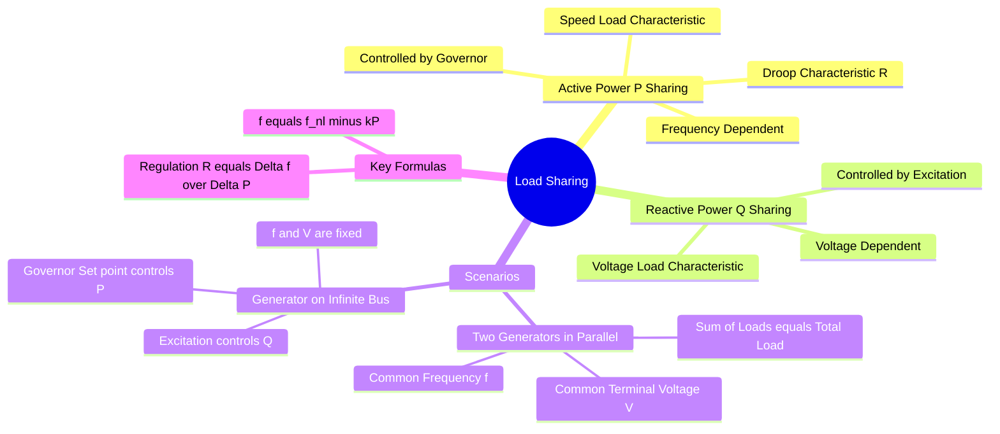

---
tags:
  - power-system
  - electrical-machines
  - synchronous-machine
  - gate
  - control-system
created: 2026-07-15
aliases:
  - Parallel Operation of Generators
  - Load Sharing of Alternators
  - Droop Characteristics
subject: "[[Power System]]"
parent: "[[Load Frequency Control (LFC)]]"
modified: 2026-07-15
---
### Load Sharing (Parallel Operation)
#power-system/control #electrical-machines

> **Load Sharing** refers to the distribution of active power ($P$) and reactive power ($Q$) among multiple synchronous generators operating in parallel. The sharing of **Active Power** is governed by the prime mover's [[Speed Regulation (Droop)|speed-droop characteristics]], while the sharing of **Reactive Power** is governed by the excitation system's voltage-droop characteristics.

> [!prerequisite] Prerequisite
> [[Parallel Operation of Alternators and Synchronization]]
> 
> *(Before load sharing can occur via droop control, the generators must be safely connected to the busbar. This requires matching voltage, frequency, phase sequence, and phase angle. For the physical procedures and synchroscope usage.)*

> [!examtip] GATE Focus
> While synchronization (Note 1) is largely theoretical, the governor droop characteristics ($R = \frac{\Delta f}{\Delta P}$) and finding individual load shares by equating $f_{sys}$ are heavy targets for GATE numericals. Always pay attention to whether the slope $k$ is in Hz/MW or per-unit.

---
#### Active Power Sharing ($P-f$ Control)
#power-system/frequency-control

The active power shared by a generator depends on its **Governor Characteristic** (Speed vs. Load curve). To ensure stable parallel operation, governors are designed with a **Droop Characteristic** (speed decreases as load increases).

**The Linear Droop Equation:**
For a generator with no-load frequency $f_{nl}$ and full-load frequency $f_{fl}$ at rated power $P_{rated}$:

$$\boxed{\quad f = f_{nl} - \left( \frac{f_{nl} - f_{fl}}{P_{rated}} \right) P \quad}$$

*   **Slope ($k$):** The rate of frequency drop.
*   **Speed Regulation ($R$):** Usually expressed in Per-Unit (Hz/MW or p.u./p.u.).
    $$R = \frac{\Delta f}{\Delta P} \quad \text{or} \quad P = \frac{1}{R}(f_{nl} - f_{sys})$$

**Parallel Operation of Two Generators:**
When two units are parallel, they must run at a **Common System Frequency ($f_{sys}$)**.
Condition:
1.  $f_1 = f_2 = f_{sys}$
2.  $P_1 + P_2 = P_{Total\_Load}$

From the droop equations:
$$f_{nl1} - k_1 P_1 = f_{nl2} - k_2 P_2$$
Solving this simultaneous system yields the individual load shares $P_1$ and $P_2$.

> **Control Action:** To increase the load share of Generator 1 ($P_1$) without changing the total load, the operator increases the **Governor Set Point** (raises $f_{nl1}$). This shifts the characteristic line upwards.

---
#### Generator Connected to Infinite Bus
#power-system/infinite-bus

An **Infinite Bus** is a system so large that its voltage ($V$) and frequency ($f$) remain constant regardless of the power injected or drawn by the machine connected to it.

*   **Fixed Parameters:** $f_{sys}$ and $V_{bus}$ are constant.
*   **Active Power ($P$):** Determined solely by the **Governor Setting** ($f_{nl}$).
    $$\boxed{\quad P_G = \frac{1}{R} (f_{nl} - f_{sys}) \quad}$$
    *   If $f_{nl} = f_{sys}$, the machine floats (Zero output).
    *   If $f_{nl} > f_{sys}$, the machine generates power.
*   **Reactive Power ($Q$):** Determined solely by the **Excitation** ($E_f$).
    *   If $E_f \cos\delta > V$, it supplies $Q$ (Lagging PF).

---
#### Reactive Power Sharing ($Q-V$ Control)
#power-system/voltage-control

Similar to frequency droop, automatic voltage regulators (AVR) have a **Voltage Droop Characteristic**. As reactive current ($I_Q$) increases, the terminal voltage drops slightly.

$$V_t = V_{nl} - m Q$$

**Parallel Operation:**
*   Two alternators in parallel will have a common terminal voltage $V_t$.
*   $Q_1 + Q_2 = Q_{Total}$.
*   The machine with the **Higher Excitation ($V_{nl}$)** or **Stiffer Slope** will take a larger share of the reactive load.

---
#### Isochronous vs. Droop Control
1.  **Droop Mode:** The standard mode for parallel units. Frequency varies with load. Allows stable load sharing.
2.  **Isochronous Mode (Flat Frequency):** The governor maintains constant frequency ($R=0$).
    *   *Limitation:* **Two isochronous generators cannot operate in parallel.** They would fight each other (hunt) because their speed settings can never be perfectly matched. One would try to take all the load while the other motors.
    *   *Configuration:* Typically, one large unit runs Isochronous (to fix system freq) and all others run on Droop (to share load).

---
#### GATE Problem Solving Tips
1.  **Slope Calculation:** Always check units. If Regulation is given in Hz/MW, use directly. If given in %, convert:
    $$\text{Slope } k = \frac{R_{pu} \times f_{base}}{P_{base}}$$
2.  **Intercept Method:** Write the equation of lines ($y = mx + c$) for both generators where $y=f$ and $x=P$. Equate $y$.
3.  **Frequency Limits:** Ensure the calculated $P$ does not exceed the rating of the machine.

---
### Related Concepts
#topic/related-concepts

> [[Governor Control System]]

[[Automatic Voltage Regulator (AVR)]]
[[Principle of Operation as a Generator (Alternator)|Synchronous Generator]]
[[Single Area Load Frequency Control (Uncontrolled and Controlled Case)]]
[[Machine Excitation Convention]]
[[Concept of Infinite Bus]]
