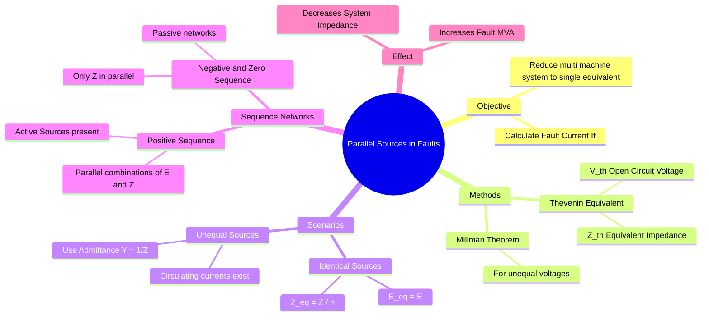

---
tags:
  - power-system
  - fault-analysis
  - circuit-theory
  - gate
  - thevenin-theorem
created: 2026-07-23T21:35:07
aliases:
  - Equivalent Generator
  - Millman's Theorem in Faults
  - Multi-Machine Fault Analysis
subject: "[[Power System]]"
parent:
  - "[[Analysis of Symmetrical Faults|Analysis of Symmetrical Faults (Three-Phase Faults)]]"
modified: 2026-07-23T21:35:07
---
### Parallel Sources in Fault Analysis
#power-system/fault-analysis #circuit-theory

> In a power system, a fault is rarely fed by a single generator. Usually, multiple synchronous generators operating in parallel feed the fault. To analyze such systems (especially for **[[Analysis of Symmetrical Faults|Symmetrical Faults]]**), the network must be reduced to a single equivalent source voltage ($V_{th}$) and a single equivalent impedance ($Z_{th}$) at the fault point using **[[Thevenin's Theorem|Thévenin's Theorem]]** or **[[Millman's Theorem]]**.

---
#### The General Model
#fault-analysis/modeling

Consider two generators connected in parallel to a bus, with a fault occurring at that bus.
*   **Generator 1:** EMF $E_1$, Reactance $X_1$.
*   **Generator 2:** EMF $E_2$, Reactance $X_2$.

The goal is to find the **Thévenin Equivalent** looking into the fault terminal.

---
#### Case A: Identical Sources (Equal EMFs)
If the generators are identical and operating at the same voltage and angle (No circulating current):
$$E_1 = E_2 = E \quad \text{and} \quad X_1 = X_2 = X$$

*   **Equivalent Voltage ($V_{th}$):**
    $$\boxed{\quad V_{th} = E \quad}$$
*   **Equivalent Impedance ($Z_{th}$):**
    $$\boxed{\quad Z_{th} = \frac{X}{2} \quad}$$
*   **Fault Current:** $I_f = \frac{V_{th}}{Z_{th}}$.

---
#### Case B: Unequal Sources (Millman's Theorem)
#circuit-theory/millman

If the generators have different internal voltages ($E_1 \neq E_2$) or reactances ($X_1 \neq X_2$), we use **Millman's Theorem** to find the equivalent voltage across the parallel combination.

Let $Y_1 = \frac{1}{jX_1}$ and $Y_2 = \frac{1}{jX_2}$ be the admittances.

**Equivalent Voltage ($V_{th}$ or $E_{eq}$):**
$$\boxed{\quad E_{eq} = \frac{E_1 Y_1 + E_2 Y_2 + \dots}{Y_1 + Y_2 + \dots} = \frac{\frac{E_1}{X_1} + \frac{E_2}{X_2}}{\frac{1}{X_1} + \frac{1}{X_2}} \quad}$$

**Equivalent Impedance ($Z_{th}$ or $Z_{eq}$):**
$$\boxed{\quad Z_{eq} = \frac{1}{Y_1 + Y_2 + \dots} = \frac{1}{\frac{1}{jX_1} + \frac{1}{jX_2}} = j \left( \frac{X_1 X_2}{X_1 + X_2} \right) \quad}$$

**Fault Current:**
$$I_f = \frac{E_{eq}}{Z_{eq}}$$

> [!warning] Important Note
> Even before the fault occurs, if $E_1 \neq E_2$, a **circulating current** flows between the generators:
> $$I_{circulating} = \frac{E_1 - E_2}{j(X_1 + X_2)}$$

---
#### Application to Sequence Networks
#fault-analysis/sequence-networks

When analyzing unsymmetrical faults involving parallel sources:

1.  **Positive Sequence Network:**
    *   Contains the EMF sources ($E_1, E_2$).
    *   You must combine the sources using Millman's theorem (or Thevenin) to find $V_{th(1)}$ and $Z_{1(eq)}$.
2.  **Negative and Zero Sequence Networks:**
    *   These are **Passive** (Contain no EMF sources).
    *   Generators are represented simply by their impedances ($X_2, X_0$).
    *   The equivalent is simply the parallel combination of impedances:
        $$Z_{2(eq)} = X_{2,gen1} || X_{2,gen2}$$

> [!warning]- Why “Parallel” Is Valid Even When a Generator Shares Only One Physical Terminal
> In sequence networks, **parallel connection is defined by electrical nodes, not by physical terminals**.
>
> For **positive and negative sequence**:
> - Generator currents are balanced:
>   $$I_a + I_b + I_c = 0$$
> - No neutral or ground return path is required.
> - Each generator is modeled as a **two-node Thevenin element**:
>   - External node → common faulted bus
>   - Internal node → generator’s internal sequence reference
>
> Hence, all generators connected to the same bus experience the **same sequence voltage** and supply current independently, so their impedances are **in parallel**:
> $$Z_{1,\text{eq}} = Z_1 \parallel Z_1,\qquad Z_{2,\text{eq}} = Z_2 \parallel Z_2$$
>
> Grounding affects **only the zero-sequence network**, because zero-sequence current requires a neutral/ground return path.

---
#### Impact on Short Circuit MVA
Adding generators in parallel reduces the system Thevenin impedance ($Z_{th}$).
Since Short Circuit MVA ($S_{sc}$) is inversely proportional to impedance:
$$S_{sc} = \frac{V_{rated}^2}{Z_{th}}$$
**More parallel sources $\rightarrow$ Lower $Z_{th}$ $\rightarrow$ Higher Fault Current $\rightarrow$ Higher SC MVA.**
*   Circuit breakers must be rated to handle this increased total fault level.

---
### Related Concepts
#topic/related-concepts

> [[Analysis of Symmetrical Faults|Analysis of Symmetrical Faults (Three-Phase Faults)]]
> [[Thevenin's Theorem]]

[[Short Circuit MVA]]
[[Sequence Impedances and Networks of Synchronous Machines]]
[[Test Source Method]] (Alternative for finding Z_th)
[[Per-Unit System]]