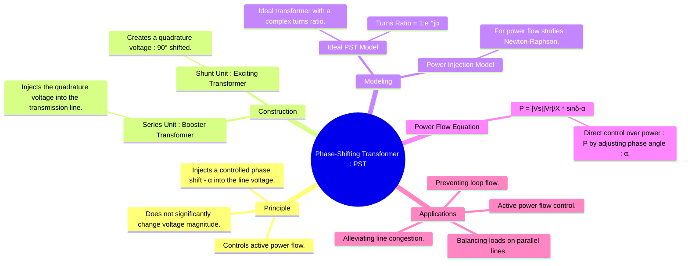

---
tags:
  - power-systems
  - transformer
  - power-flow-control
  - facts-devices
  - phase-shifter
created: 2025-09-08
aliases:
  - Phase Angle Regulator
  - PAR
  - PST
  - Quadrature Booster
  - Phase-Shifting Transformer
subject: "[[Power System]]"
parent: "[[Transformers]]"
modified: 2026-07-23T21:35:17
---
### Phase-Shifting Transformer (PST) Modeling
#phase-shifting-transformer #power-flow-control

> A Phase-Shifting Transformer (PST), also known as a Phase Angle Regulator (PAR), is a specialized transformer used in power systems to control the flow of **active power** along a specific transmission line. It achieves this by injecting a small voltage in series with the line, which introduces a controlled phase angle shift ($\alpha$) between the sending and receiving end voltages.

---
#### Principle of Operation
#pst/principle

The flow of active power between two buses in a lossless line is primarily determined by the phase angle difference between their voltages ($\delta$).
$$P = \frac{|V_s||V_r|}{X} \sin(\delta)$$
A PST works by adding a controllable angle $\alpha$ to this difference, thereby directly controlling the power flow. The transformer achieves this by taking a voltage from another phase (which is in quadrature, i.e., 90° shifted) and injecting a scaled version of it into the primary phase using a series transformer.

---
#### Ideal PST Model
#pst/model #equivalent-circuit

For power flow analysis, an ideal PST is modeled as a lossless component that only introduces a phase shift. It can be represented as an [[Ideal Transformer]] with a **complex turns ratio**.

If the PST is placed at the receiving end (bus 'r'), the relationship between the bus voltage $V_r$ and the line-side voltage $V_r'$ is:
$$V_r' = V_r e^{j\alpha}$$
The ideal transformer model can be placed in series with the transmission line impedance. The turns ratio 't' is complex:
$$\boxed{\quad t = e^{j\alpha} = \cos\alpha + j\sin\alpha \quad}$$
The admittance matrix of an ideal PST connecting bus 'k' to bus 'm' with the line admittance 'y' is:
$$\mathbf{Y_{bus,PST}} = \begin{bmatrix}
y & -y/t^* \\
-y/t & y
\end{bmatrix} = \begin{bmatrix}
y & -ye^{j\alpha} \\
-ye^{-j\alpha} & y
\end{bmatrix}$$

---
#### Power Flow Equation with PST
#power-flow-equation

The presence of a PST modifies the standard power flow equation. For a line with series reactance $X$ connecting bus 's' to bus 'r', with a PST at the sending end introducing a shift $\alpha$:
The total phase angle difference across the line becomes $(\delta_s - \delta_r - \alpha)$.
The active power flow is therefore:
$$\boxed{\quad P_{sr} = \frac{|V_s||V_r|}{X} \sin(\delta_s - \delta_r - \alpha) \quad}$$
*   A **positive $\alpha$** typically signifies a phase angle advance, which **increases** power flow in the specified direction.
*   A **negative $\alpha$** signifies a phase angle retard, which **decreases** power flow.
By adjusting the tap setting of the PST, the angle $\alpha$ can be controlled, thus providing direct control over the active power $P_{sr}$.

---
#### Calculation of Phase Shift Angle ($\alpha$)
#pst/phasor-diagram

The phase shift is created by injecting a quadrature voltage ($\Delta V$) in series with the phase voltage ($V_{ph}$). From the phasor diagram, for small angles:
$$\tan(\alpha) = \frac{|\Delta V|}{|V_{ph}|}$$
For small angles, which is typical for PSTs, we can use the approximation $\tan(\alpha) \approx \alpha$ (in radians).
$$\boxed{\quad \alpha \approx \frac{|\Delta V|}{|V_{ph}|} \quad}$$
The magnitude of the injected voltage $|\Delta V|$ is controlled by the tap changer on the transformer.

---
### Related Concepts
#related-concepts

> [[Power Flow Analysis]] (Where the PST model is used)

[[Transformers]] (The parent device category)
[[FACTS Devices]] (PSTs are considered slow-acting, mechanical FACTS controllers)
[[Power System Stability]]
[[AC Circuit Analysis]]