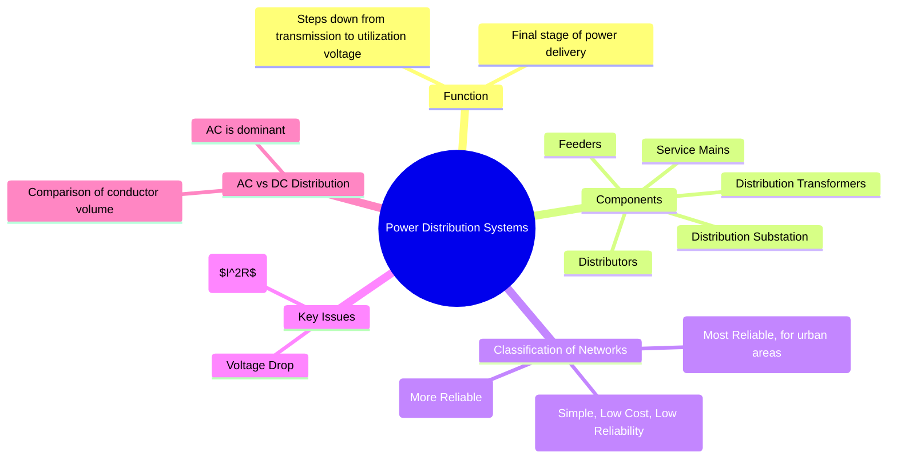

---
tags:
  - power-distribution
  - power-systems
  - feeders
  - radial-system
  - ring-main
created: 2025-09-08
aliases:
  - Distribution Systems
  - Electrical Distribution
subject: "[[Power System]]"
parent: "[[Power System]]"
formula:
  - "Distribution Feeder Voltage Drop : $$\\Delta V \\approx I(R\\cos\\phi + X\\sin\\phi)$$"
  - "Comparison of DC and AC Distribution : $$\\frac{\\text{Volume of AC conductor}}{\\text{Volume of DC conductor}} = \\frac{1}{\\cos^2\\phi}$$"
  - "Power Loss (in the line resistance) in Distribution : $$P_{loss} = I^2 R = \\frac{P^2 R}{V^2 \\cos^2\\phi}$$"
modified: 2026-07-23T21:35:40
---
### Power Distribution Systems
#power-distribution #power-systems

> The **power distribution system** is the final part of the electric power system that carries electricity from the transmission network to the end consumers. It begins at the distribution substation, where the voltage is stepped down from the transmission level (e.g., 132 kV) to a primary distribution level (e.g., 11 kV or 33 kV), and ends at the consumer's meter.

---
#### Components of a Distribution System
#distribution-components #feeders #distributors

1.  **Feeders**: A feeder is a conductor that connects the substation to the area where power is to be distributed.
    *   **Key Property**: No intermediate tappings are taken from the feeder. Therefore, the current along its entire length remains the same. The main design consideration for a feeder is its current-carrying capacity.

2.  **Distributors**: A distributor is a conductor from which numerous tappings are taken to supply power to the consumers.
    *   **Key Property**: The current through a distributor is not constant because tappings are taken at various points along its length. The main design consideration is the **voltage drop**, which must be kept within permissible limits ($\pm 6\%$ of the rated value).

3.  **Service Mains**: This is a small cable that connects the distributor to the consumer's meter.

---
#### Classification of Distribution Networks
#radial-system #ring-main-system #interconnected-system 

1.  **Radial System**: This is the simplest and least expensive system. A separate feeder radiates from a single substation to feed distributors.
    *   **Advantages**: Simple, low initial cost.
    *   **Disadvantages**: Least reliable. A fault in the feeder will cause a complete supply interruption to all consumers [[downstream]]. The end of the distributor is subject to the largest voltage fluctuations.

2.  **Ring Main System**: In this system, the primaries of distribution transformers form a loop. The loop circuit starts from the substation bus-bars, runs through the area to be served, and returns to the substation.
    *   **Advantages**: Much more reliable than a radial system. If a fault occurs on one section of the feeder, that section can be isolated, and the supply can be maintained from the alternate path.

3.  **Interconnected System**: This system is fed by two or more substations. It offers the highest reliability and is used in dense urban areas.

---
#### Key Calculation Parameters
#voltage-drop #power-loss

##### Voltage Drop

For an AC distributor with impedance $Z=R+jX$ per unit length, carrying a current $I$ at a lagging power factor of $\cos\phi$, the approximate voltage drop is:
$$\boxed{\quad \Delta V \approx I(R\cos\phi + X\sin\phi) \quad}$$

##### Power Loss

The main source of inefficiency in distribution is the $I^2R$ loss in the conductors. For a line transmitting power $P$ at voltage $V$ and power factor $\cos\phi$:
$$I = \frac{P}{V\cos\phi}$$
The power loss in the line resistance $R$ is:
$$\boxed{\quad P_{loss} = I^2 R = \frac{P^2 R}{V^2 \cos^2\phi} \quad}$$
This equation clearly shows that power loss is inversely proportional to the square of the voltage ($P_{loss} \propto 1/V^2$), which is why power is distributed at the highest practical voltage.

---
#### Comparison of DC and AC Distribution
#ac-vs-dc-distribution

A classic comparison is based on the volume of conductor material required for the same power, voltage, distance, and loss.

*   **DC 2-wire system vs. AC single-phase 2-wire system**:
    Let the voltage between conductors be $V$. For the same power $P$ and power factor $\cos\phi$ in the AC case, the ratio of the volume of conductor material required is:
    $$\boxed{\quad \frac{\text{Volume of AC conductor}}{\text{Volume of DC conductor}} = \frac{1}{\cos^2\phi} \quad}$$
    This shows that for any lagging power factor, the AC system requires more conductor material than the equivalent DC system.

---
### Related Concepts
#related-concepts

> [[Power System]]

[[Transmission Lines]]
[[Transformers]]
[[Voltage Regulation]]
[[Power Factor]]
[[Substations]]