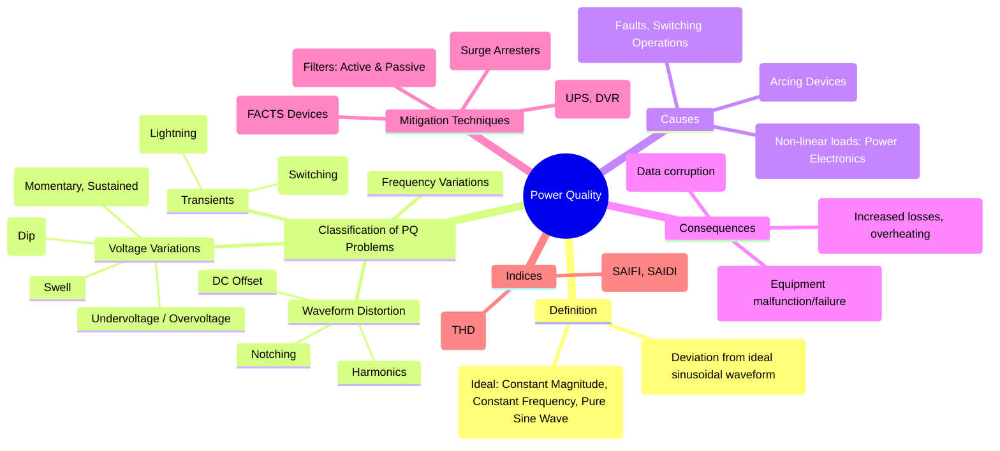

---
tags:
  - power-quality
  - power-systems
  - harmonics
  - voltage-stability
  - transients
created: 2025-09-18
aliases:
  - PQ
  - Electrical Power Quality
subject: "[[Power System]]"
parent: "[[Power System]]"
modified: 2026-07-23T21:36:28
---
### Power Quality
#power-quality #harmonics #voltage-sag

> **Power Quality (PQ)** refers to the set of electrical boundaries that allows a piece of equipment to function in its intended manner without loss of performance or life. In simple terms, it is a measure of how well a system supports reliable operation of its loads. Any significant deviation in the magnitude, frequency, or purity of the voltage waveform is considered a power quality problem.

An ideal power supply would be a pure, constant-magnitude, constant-frequency sine wave.

---

#### Classification of Power Quality Problems

##### 1. Voltage Magnitude Variations
These are deviations in the RMS value of the voltage.
* **Voltage Sag (or Dip)**: A short-duration (typically 0.5 cycles to 1 minute) decrease in the RMS voltage, usually to between 0.1 and 0.9 p.u. **Cause**: The most common cause is the starting of large induction motors or remote system faults.
* **Voltage Swell**: A short-duration increase in the RMS voltage. **Cause**: Switching off a large load or a single line-to-ground fault on a three-phase system.
* **Interruption**: A complete loss of supply voltage. Can be momentary (<2 sec), temporary, or sustained (>2 min). **Cause**: System faults, equipment failure, control malfunction.
* **Undervoltage/Overvoltage**: Long-duration decreases/increases in the RMS voltage.

##### 2. Waveform Distortion
This is the deviation of the waveform from a pure sine wave.
* **[[Harmonic Analysis|Harmonics]]**: The most common type of waveform distortion. Sinusoidal components with frequencies that are integer multiples of the fundamental frequency. **Cause**: Non-linear loads, primarily power electronic converters ([[Uncontrolled Rectifiers]], [[Inverters]], etc.).
* **Notching**: A periodic voltage disturbance caused by the commutation operation in power electronic converters.

##### 3. Transients
A transient is a short-duration, high-energy event that is superimposed on the normal waveform.
* **Impulsive Transients**: A sudden, non-power frequency change in the steady-state condition (e.g., a lightning strike).
* **Oscillatory Transients**: A sudden change followed by a decaying oscillation (e.g., capacitor bank switching).

##### 4. Frequency Variations
Deviations from the nominal system frequency (e.g., 50 or 60 Hz). **Cause**: Imbalance between the total generation and total load in the power system. This is a key indicator of [[Power System Stability]].

---
#### Causes and Consequences
* **Primary Cause**: The proliferation of **non-linear loads** (power electronics) is the single biggest cause of power quality problems, especially harmonics.
* **Consequences**:
    * **Malfunction or Damage**: Sensitive electronic equipment (computers, controllers) can malfunction, reset, or be damaged.
    * **Overheating**: Increased $I^2R$ losses due to harmonic currents can cause overheating and premature failure of transformers, motors, and cables.
    * **Nuisance Tripping**: Protective relays may trip unnecessarily.
    * **Reduced Efficiency**: Overall system efficiency is reduced due to increased losses.

---
#### Power Quality Indices and Measurement

* **[[Total Harmonic Distortion (THD)]]**: The primary index for quantifying waveform distortion due to harmonics.
    $$\boxed{\quad THD = \frac{\sqrt{\sum_{n=2}^{\infty} V_{n,rms}^2}}{V_{1,rms}} \quad}$$
* **Reliability Indices**: Used to measure interruptions.
    * **SAIFI** (System Average Interruption Frequency Index): How often the average customer experiences a sustained interruption.
    * **SAIDI** (System Average Interruption Duration Index): The total duration of interruption for the average customer.

---
#### Mitigation Techniques
#pq-mitigation

* **Harmonic Mitigation**:
    * **Passive Filters**: L-C circuits tuned to shunt specific harmonic frequencies.
    * **Active Power Filters (APF)**: Actively inject compensating currents to cancel out harmonics.
* **Sag/Swell/Interruption Mitigation**:
    * **Uninterruptible Power Supply (UPS)**: Provides backup power from batteries for critical loads.
    * **Dynamic Voltage Restorer (DVR)**: A series-connected device that injects a voltage to compensate for sags and swells.
* **Transient Mitigation**:
    * **Surge Arresters** and Transient Voltage Surge Suppressors (TVSS).
* **Advanced Solutions**:
    * **[[FACTS Devices]]**: Such as STATCOM, can provide comprehensive control over voltage, power flow, and stability.

---
### Related Concepts
#related-concepts

> [[Harmonic Analysis]] (The most significant PQ issue)

[[Fault Analysis]] (A primary cause of sags and interruptions)
[[Power Electronics]] (The primary source of harmonic distortion)
[[Power System Stability]] (Frequency variations are a stability concern)
[[Filters]] (A key mitigation technique)
[[FACTS Devices]] (Advanced mitigation solutions)