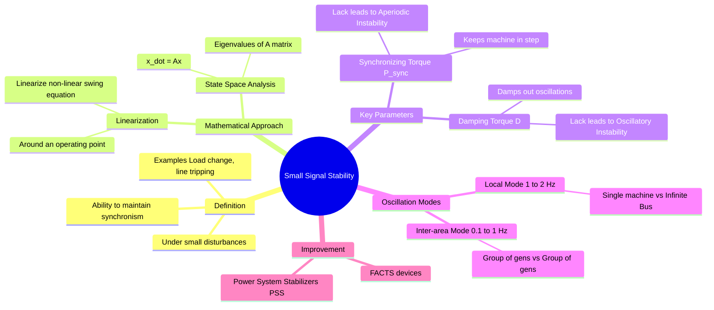

---
tags:
  - power-system
  - stability
  - control-system
  - gate
  - mathematical-modeling
created: 2026-07-23T21:37:20
aliases:
  - Dynamic Stability
  - Eigenvalue Analysis
  - Low Frequency Oscillations
subject: "[[Power System]]"
parent:
  - Stability Concepts
modified: 2026-07-23T21:37:20
---
### Small Signal Stability
#power-system/stability #dynamic-stability

> **Small Signal Stability** is the ability of a power system to maintain synchronism under **small disturbances** (such as normal load fluctuations). The disturbance is considered small enough that the non-linear equations of the system can be linearized around the operating point for analysis. Instability usually manifests as **increasing amplitude oscillations** or a non-oscillatory drift.

---
#### Linearized Swing Equation
#power-system/modeling

The standard non-linear [[Swing Equation]] is:
$$M \frac{d^2\delta}{dt^2} = P_m - P_e = P_m - P_{max} \sin \delta$$

For a small perturbation $\Delta \delta$ around an operating angle $\delta_0$, we linearize $P_e$:
$$P_e(\delta) \approx P_e(\delta_0) + \left. \frac{\partial P_e}{\partial \delta} \right|_{\delta_0} \Delta \delta$$
$$ \Delta P_e = P_{sync} \Delta \delta $$
Where $P_{sync}$ is the **[[Steady-State Stability Limit|Synchronizing Power Coefficient]]** ($\frac{dP}{d\delta} = P_{max} \cos \delta_0$).

Including a Damping Power component ($D \Delta \omega$), the linearized differential equation describes a second-order system:
$$\boxed{\quad M \frac{d^2(\Delta \delta)}{dt^2} + D \frac{d(\Delta \delta)}{dt} + P_{sync} (\Delta \delta) = 0 \quad}$$

In Laplace domain ($s$-domain):
$$(Ms^2 + Ds + P_{sync}) \Delta \delta(s) = 0$$

---
#### Characteristic Equation and Parameters
#control-system/analysis

The stability is determined by the roots of the characteristic equation:
$$\boxed{\quad s^2 + \frac{D}{M}s + \frac{P_{sync}}{M} = 0 \quad}$$

Comparing with the standard second-order form ($s^2 + 2\zeta\omega_n s + \omega_n^2 = 0$):

1.  **Natural Frequency of Oscillation ($\omega_n$):**
    $$\boxed{\quad \omega_n = \sqrt{\frac{P_{sync}}{M}} = \sqrt{\frac{P_{max} \cos \delta_0}{M}} \quad \text{rad/s} \quad}$$
    *(Note: $M = \frac{H}{\pi f}$ or $\frac{2H}{\omega_s}$ depending on unit conventions).*

2.  **Damping Ratio ($\zeta$):**
    $$\boxed{\quad \zeta = \frac{D}{2\sqrt{M P_{sync}}} \quad}$$

---
#### Criteria for Stability (Eigenvalue Analysis)
#stability/eigenvalues

Let the roots (eigenvalues) of the characteristic equation be $\lambda = \sigma \pm j\omega_d$.

| Eigenvalue Condition | Nature of Response | Stability Status | Cause |
| :--- | :--- | :--- | :--- |
| **Real part negative ($\sigma < 0$)** | Damped oscillations | **Stable** | Sufficient Damping & Synchronizing torque |
| **Real part positive ($\sigma > 0$)** | Growing oscillations | **Unstable** | **Negative Damping** |
| **Real positive root** | Non-oscillatory divergence | **Unstable** | **Negative Synchronizing Torque** ($\delta > 90^\circ$) |
| **Real part zero ($\sigma = 0$)** | Sustained oscillations | Marginally Stable | Zero Damping |

---
#### Torque Components and Instability
#power-system/torque

Stability depends on the existence of two torque components acting on the rotor:

1.  **Synchronizing Torque ($T_S \Delta \delta$):**
    *   In phase with rotor angle deviation $\Delta \delta$.
    *   **Lack of $T_S$** leads to **Non-oscillatory (Monotonic) Instability** (Rotor angle simply drifts away).
    *   Happens if operating beyond Steady State Stability Limit ($\delta > 90^\circ$).

2.  **Damping Torque ($T_D \Delta \omega$):**
    *   In phase with speed deviation $\Delta \omega$ (or $90^\circ$ lead wrt $\Delta \delta$).
    *   **Lack of $T_D$** (or negative damping) leads to **Oscillatory Instability** (Oscillations grow in magnitude).
    *   *Major Cause:* High-gain Automatic Voltage Regulators (AVR) improve synchronizing torque but often introduce phase lags that produce *negative* damping torque.

---
#### Modes of Oscillation
*   **Local Mode (0.7 to 2 Hz):** A single generator swinging against the rest of the power system.
*   **Inter-Area Mode (0.1 to 0.7 Hz):** A group of generators in one area swinging against a group in another area (via weak tie-lines).
*   **Torsional Mode (10 to 46 Hz):** Interaction between the turbine-generator mechanical shaft system and series-compensated lines ([[Sub-Synchronous Resonance]]).

---
#### Power System Stabilizer (PSS)
#power-system/pss

To fix the negative damping introduced by fast exciters (AVRs), a **Power System Stabilizer (PSS)** is used.
*   **Function:** It injects a supplementary signal into the voltage regulator input.
*   **Input Signal:** Usually Rotor Speed deviation ($\Delta \omega$), Frequency ($f$), or Power ($P$).
*   **Mechanism:** It provides phase lead compensation to produce a torque component in phase with speed ($\Delta \omega$), thus purely adding to the **Damping Torque**.

---
### Related Concepts
#topic/related-concepts

> [[Steady-State Stability Limit]] (The limit of synchronizing torque)

[[Transient Stability]] (Large disturbance stability)
[[Swing Equation]]
[[Automatic Voltage Regulator (AVR)]]
[[Sub-Synchronous Resonance]]
[[State Space Analysis]]
