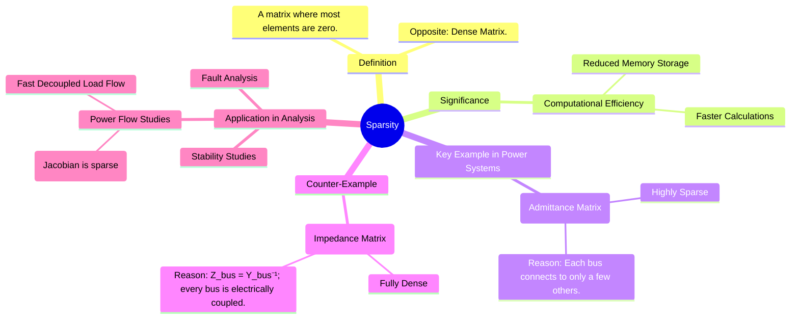

---
tags:
  - power-systems
  - numerical-methods
  - matrix-theory
  - y-bus
  - power-flow
created: 2025-09-08
aliases:
  - Sparse Matrix
  - Sparsity of Y-bus
subject: "[[Power System]]"
parent: "[[Y-bus Matrix]]"
modified: 2026-07-23T21:37:54
---
### Sparsity
#sparsity #sparse-matrix #y-bus

> ==Sparsity is a property of a matrix where the vast majority of its elements are zero.== A matrix that is not sparse is called a **dense matrix**. This property is of immense practical importance in engineering, particularly in the analysis of large-scale [[Power System|power systems]].

The primary significance of sparsity is the enormous gain in computational efficiency it allows.

> [!Hint] Point to Note
> Sparsity allows for significant savings in computer memory and computation time by storing and processing only the non-zero elements of a matrix.

---
#### Sparsity in Power Systems: The Y-bus Matrix
#y-bus #power-systems #admittance-matrix

The bus admittance matrix ($Y_{bus}$) is the most prominent example of a large, sparse matrix in power system analysis.
The reason for its sparsity is the physical structure of a power grid:
* In a large power system (e.g., 1000 buses), a typical bus is physically connected to only a very small number of other buses (e.g., 2 to 4).
* ==The off-diagonal element $Y_{ij}$ of the $Y_{bus}$ matrix is non-zero only if there is a direct physical connection (a transmission line or transformer) between bus $i$ and bus $j$.==
* ==Since most bus pairs are not directly connected, most off-diagonal elements of the $Y_{bus}$ matrix are zero.==

> [!pyq]-
> ![[ee_2018#^q22]]

For an N-bus system, the $Y_{bus}$ matrix is $N \times N$. In a typical row, only a few elements will be non-zero. The **sparsity factor** is a measure of this property.

$$\boxed{\quad \text{Sparsity Factor} = \frac{\text{Number of Zero Elements}}{\text{Total Number of Elements}} \quad}$$
For realistic power systems, the sparsity of the $Y_{bus}$ matrix is often greater than 95-99%.

---
#### Contrast with the Z-bus Matrix
#z-bus #impedance-matrix

In sharp contrast to the $Y_{bus}$ matrix, the **bus impedance matrix ($Z_{bus}$)** is a **fully dense matrix**.
$$Z_{bus} = (Y_{bus})^{-1}$$
The inverse of a large sparse matrix is generally a dense matrix.

> [!concept] Physical Reason
> A non-zero element $Z_{ij}$ represents the voltage at bus $i$ resulting from a current injection at bus $j$. Since all buses in a connected network are electrically coupled, injecting a current at any one bus will cause a voltage change at *every other bus*. Therefore, no element in the $Z_{bus}$ matrix is zero.

> [!IMPORTANT]
> $Y_{bus}$ is sparse because it represents **direct connections**. $Z_{bus}$ is dense because it represents the **system-wide voltage response** to a current injection.

---
#### Computational Advantages in Power Flow Studies
#power-flow #numerical-methods #newton-raphson

The sparsity of the $Y_{bus}$ is exploited in numerical algorithms used for power system analysis:
*   **Newton-Raphson Method**: The Jacobian matrix used in the Newton-Raphson power flow algorithm has the same sparsity pattern as the $Y_{bus}$ matrix. By using specialized sparse matrix techniques (like sparse LU decomposition), the solution can be found much faster and with significantly less memory than if the matrix were treated as dense.
*   **Fast Decoupled Load Flow (FDLF)**: This method's efficiency also relies on the sparse nature of the system.
*   **Fault Analysis**: While $Z_{bus}$ is dense, methods for building it (Z-bus building algorithms) often start from the sparse system data.

---
### Related Concepts
#related-concepts

> [[Y-bus Matrix]] (The prime example of a sparse matrix)

[[Z-bus Matrix]] (The dense counterpart)
[[Power Flow Analysis]] (The main application area)
[[Newton-Raphson Method for Load Flow]] (An algorithm that exploits sparsity)
[[Power System]]
