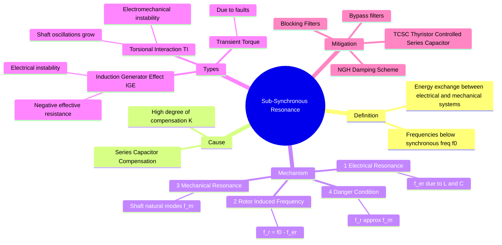

---
tags:
  - power-system
  - stability
  - transmission
  - gate
  - series-compensation
created: 2026-07-23T21:38:10
aliases:
  - SSR
  - Torsional Interaction
  - Induction Generator Effect
subject: "[[Power System]]"
parent: "[[Small Signal Stability]]"
modified: 2026-07-23T21:38:10
---
### Sub-Synchronous Resonance (SSR)
#power-system/stability #ssr

> **Sub-Synchronous Resonance (SSR)** is a dangerous phenomenon involving an interaction between the electrical system (specifically transmission lines with **Series Capacitors**) and the mechanical system (turbine-generator shaft). It occurs when the electrical network exchanges energy with the turbine-generator at one or more natural frequencies below the synchronous frequency ($f_0$).

---
#### The Physical Mechanism
#ssr/mechanism

The phenomenon involves a three-step frequency conversion:

1.  **Electrical Resonance ($f_{er}$):**
    In a series compensated line, the line inductance ($L$) and series capacitance ($C$) form a resonant circuit. The natural frequency of this electrical discharge is:
    $$f_{er} = f_0 \sqrt{\frac{X_C}{X_L}} = f_0 \sqrt{k}$$
    Where $k$ is the degree of compensation ($< 1$). Thus, **$f_{er} < f_0$** (Sub-synchronous).

2.  **Rotor Induced Frequency ($f_r$):**
    These sub-synchronous currents at $f_{er}$ flow in the stator. The rotor rotates at synchronous frequency $f_0$.
    The relative speed between the rotor ($f_0$) and the rotating magnetic field produced by the sub-synchronous currents ($f_{er}$) induces currents in the rotor windings and torque pulsations on the shaft at a complementary frequency:
    $$\boxed{\quad f_r = f_0 - f_{er} \quad}$$

3.  **Mechanical Resonance ($f_m$):**
    The turbine-generator shaft is a long mass-spring system with several masses (HP turbine, LP turbine, Generator, Exciter). It has specific natural torsional modes of oscillation ($f_{m1}, f_{m2}, \dots$), typically ranging from 10 Hz to 50 Hz.

**The Resonance Condition:**
If the induced rotor torque frequency coincides with one of the mechanical natural frequencies, **Resonance** occurs.
$$\boxed{\quad f_0 - f_{er} \approx f_m \quad}$$
This causes the torsional oscillations of the shaft to grow indefinitely, potentially snapping the shaft.

---
#### Types of SSR Interactions
#ssr/types

**A. Induction Generator Effect (IGE):**
*   **Nature:** Purely Electrical Instability.
*   **Mechanism:** At sub-synchronous frequencies, the slip $s$ is negative (relative to the sub-synchronous wave). The apparent rotor resistance viewed from the armature is $R_r/s$. Since $s$ is negative, the resistance is **negative**.
*   **Result:** If this negative resistance magnitude exceeds the network resistance ($R_{network} + R_r/s < 0$), the sub-synchronous currents self-excite and grow.

**B. Torsional Interaction (TI):**
*   **Nature:** Electromechanical Instability.
*   **Mechanism:** The interplay described in Section 1. Small shaft oscillations induce voltages, which create currents, which create torques that reinforce the original oscillation (Negative Damping).
*   **Result:** Mechanical fatigue or shaft failure.

**C. Transient Torque:**
*   Occurs when system faults trigger the resonance, causing high transient torques even if the system is stable in steady-state.

#### 3. Factors Affecting SSR
1.  **Degree of Compensation ($k$):** Higher compensation ($X_C$) increases $f_{er}$, which decreases the complementary frequency ($f_0 - f_{er}$), potentially scanning through various mechanical modes.
2.  **Network Resistance:** Higher resistance adds damping (helps prevent IGE).
3.  **Turbine Generator:** Thermal units are more susceptible than Hydro units (Hydro shafts are stiffer and have fewer torsional modes).

---
#### Mitigation and Countermeasures
#ssr/mitigation

1.  **TCSC (Thyristor Controlled Series Capacitor):**
    *   This is a **FACTS** device.
    *   At the fundamental frequency ($50$ Hz), it acts as a capacitor (compensation).
    *   At sub-synchronous frequencies, its control makes it appear **Inductive** or resistive, detuning the resonance.
2.  **NGH Damping Scheme:** A specific circuit across the capacitor to dissipate sub-synchronous energy.
3.  **Blocking Filters:** Parallel LC filters in series with the line to block specific frequencies.
4.  **Excitation Control:** Using the generator exciter to provide active damping (Supplementary Excitation Control).

---
### Related Concepts
#topic/related-concepts

> [[Small Signal Stability]]

[[Reactive Power Compensation]] (Series Compensation benefits vs risks)
[[FACTS Devices]] (TCSC)
[[Transient Stability]]
[[Transmission Line Parameters and Performance]]
