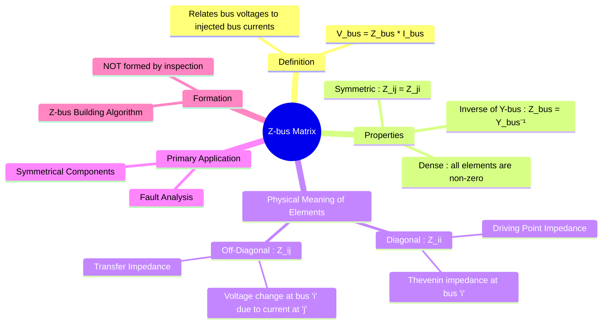

---
tags:
  - power-systems
  - z-bus
  - impedance-matrix
  - fault-analysis
  - network-modeling
created: 2025-09-08
aliases:
  - Z-bus
  - Impedance Matrix
  - How to find Post-Fault Voltage at a Bus from a given Impedance (Z) Matrix?
  - Coupled Transmission Lines (Mutual Impedance)
  - Transfer Impedance
  - Driving Point Impedance
  - Fault Analysis (Z-bus Matrix Application)
  - Bus Impedance Matrix
subject: "[[Power System]]"
parent:
  - Power System Analysis
formula:
  - "Coupled Transmission Line (2 Lines) Z-bus Matrix : $$\\begin{bmatrix} V_1 \\\\ V_2 \\end{bmatrix} = \\begin{bmatrix} Z_l & Z_m \\\\ Z_m & Z_l \\end{bmatrix} \\begin{bmatrix} I_1 \\\\ I_2 \\end{bmatrix} $$"
modified: 2026-07-23T21:38:35
---
### Z-bus Matrix
#z-bus #impedance-matrix #fault-analysis

> ==The bus impedance matrix, or **Z-bus**, is an $N \times N$ matrix that relates the bus voltage vector to the vector of injected bus currents in an $N$-bus power system.== It is the inverse of the [[Y-bus Matrix]] and is a cornerstone for fault analysis.

Unlike the sparse Y-bus, the Z-bus is a **fully dense matrix**.

---
#### Definition and Governing Equation
#z-bus/definition

The relationship defined by the Z-bus is:
$$\boxed{\quad \mathbf{V_{bus}} = \mathbf{Z_{bus}} \mathbf{I_{bus}} \quad}$$
Where:
*   $\mathbf{V_{bus}}$ is the column vector of bus voltages.
*   $\mathbf{Z_{bus}}$ is the $N \times N$ bus impedance matrix.
*   $\mathbf{I_{bus}}$ is the column vector of injected bus currents.

---
#### Physical Interpretation of Z-bus Elements
#z-bus/interpretation

The elements of the Z-bus have a direct and powerful physical meaning, which is why it is so useful for fault studies.

*   **Diagonal Elements ($Z_{ii}$)**: The **driving point impedance** of bus 'i'.
    $$\boxed{\quad Z_{ii} = \frac{V_i}{I_i} \quad \text{(when all other bus currents are zero)}}$$
> [!important]
> This is the **Thevenin impedance** of the network as seen from bus '$i$'. It determines the voltage change at bus '$i$' for a current injected at that same bus.

> [!examtip] Conceptual Link: The "Peephole" View
> Think of $Z_{ii}$ as looking into the entire interconnected grid through a single peephole at bus '$i$'. No matter how many hundreds of generators or lines exist in the network, Thévenin's theorem proves they all collapse into a single equivalent voltage source $V_i^0$ in series with the internal impedance $Z_{ii}$.

*   **Off-Diagonal Elements ($Z_{ij}$)**: The **transfer impedance** between bus 'i' and bus 'j'.
    $$\boxed{\quad Z_{ij} = \frac{V_i}{I_j} \quad \text{(when all other bus currents are zero)}}$$
> [!important]
> This represents the voltage change at bus 'i' due to a unit current injected at bus 'j'.

---
#### 🔥Properties of the Z-bus Matrix
#z-bus/properties

1. **Density**: The Z-bus is a **fully dense matrix**. This means that almost all of its elements are non-zero.
    * **Reason**: ==All buses in a connected power system are electrically coupled. A current injected at any single bus will cause a voltage change at *every other bus* in the system.== Therefore, the transfer impedance $Z_{ij}$ is non-zero for all $i, j$. This is in stark contrast to the sparse Y-bus.
2. **Symmetry**: For any network composed of [[bilateral]] elements, the matrix is symmetric: $Z_{ij} = Z_{ji}$.
3. **Relation to Y-bus**: The Z-bus is the matrix inverse of the Y-bus.
    $$\boxed{\quad \mathbf{Z_{bus}} = (\mathbf{Y_{bus}})^{-1} \quad}$$

---
#### 🔥Application in Fault Analysis
#fault-analysis

The Z-bus is the preferred tool for short-circuit or fault studies. A fault at a bus can be modeled as a current injection at that bus.
* ==**Pre-fault voltages** are typically assumed to be 1.0 p.u. ($V_f(0)$).==
* During a fault at bus 'k', a **fault current** $I_f$ flows.
* ==The change in voltage at any bus 'i' due to this fault is $\Delta V_i = -Z_{ik}I_f$.==
* ==The voltage at any bus 'i' **during the fault** is given by:==
    $$\boxed{\quad V_i(\text{fault}) = V_i(\text{pre-fault}) - Z_{ik} I_f \quad}$$
    This simple equation allows for the direct calculation of all bus voltages during a fault, once the fault current and Z-bus matrix are known. The framework of [[Concept of Symmetrical Components|Symmetrical Components]] is used to analyze unbalanced faults, requiring separate Z-bus matrices for the positive, negative, and zero sequence networks.

> [!mistake]- Sign Convention Trap (Inductors vs. Capacitors)
> When plugging reactive components into the loop equation $Z_{ii} + Z_c$:
> * **Inductive Reactance ($X_l$):** Enters the equation as a positive imaginary value ($+jX_l$). It **adds** to the inductive grid network.
> * **Capacitive Reactance ($X_c$):** Enters the equation as a negative imaginary value ($-jX_c$). Because it opposes the grid's natural inductive impedance, it **reduces** the net denominator impedance, increasing the current magnitude.

---
#### Formation of the Z-bus Matrix
#z-bus/formation

Because it is dense, the Z-bus is never formed by inspection like the Y-bus.
1.  **Matrix Inversion**: For small systems, it can be found by first forming the Y-bus and then calculating its inverse. This is computationally expensive and numerically unstable for large systems.
2.  **Z-bus Building Algorithm**: This is the standard, practical method. It is a step-by-step algorithm that adds one element (a branch or a bus) at a time and modifies the existing Z-bus matrix.

> [!mistake]- Coupled Transmission Lines (Mutual Impedance)
> When two transmission lines run parallel to each other, the magnetic field produced by current in one line links the other line. This interaction is called **mutual coupling** and is represented by **mutual impedance**.
>
> **Self impedance** $Z_l$  
> Voltage drop in a line due to its own current.
>
> **Mutual impedance** $Z_m$  
> Voltage induced in one line due to current in the adjacent line.
>
> For two identical coupled transmission lines:
> $$\begin{bmatrix} V_1 \\ V_2 \end{bmatrix} = \begin{bmatrix} Z_l & Z_m \\ Z_m & Z_l \end{bmatrix} \begin{bmatrix} I_1 \\ I_2 \end{bmatrix} $$
>
> **Special cases**
> - Same current flows in both lines ($I_1 = I_2$):
>   $$
>   Z_{\text{effective}} = Z_l + Z_m
>   $$
> - Equal and opposite currents ($I_1 = -I_2$):
>   $$
>   Z_{\text{effective}} = Z_l - Z_m
>   $$
>
> **Power-system note (GATE)**
> - Mutual coupling is significant for **parallel transmission lines**
> - For same-direction currents, mutual impedance **adds** to self impedance

---
### Related Concepts
#related-concepts

> [[Y-bus Matrix]] (The inverse of the Z-bus)

[[Fault Analysis]] (The primary application)
[[Sparsity]] (The property that Z-bus lacks)
[[Thevenin's Theorem]] (Used to interpret the diagonal elements)
[[Concept of Symmetrical Components]] (The framework in which Z-bus is used for unbalanced faults)
[[Analysis of Symmetrical Faults]]
[[Power System]]
[[Phase Impedance Matrix to Sequence Impedances (Transmission Line)]]