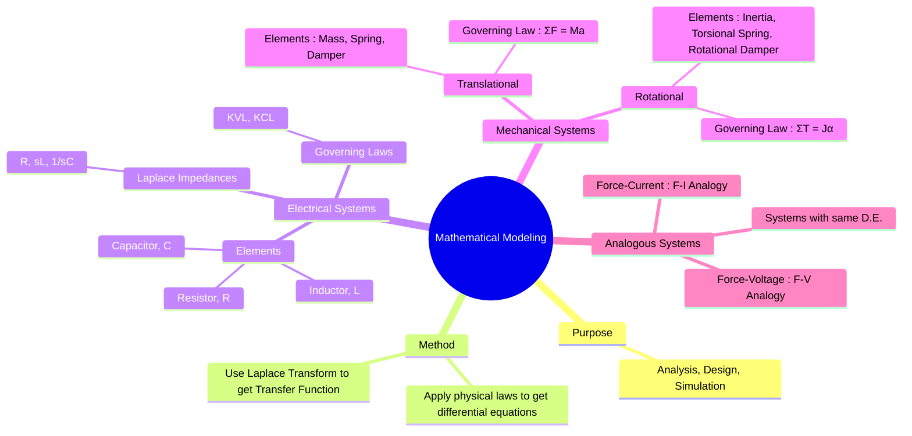

---
tags:
  - control-systems
  - system-modeling
  - mathematical-modeling
  - mechanical-systems
  - electrical-systems
  - analogous-systems
created: 2025-09-22
aliases:
  - System Modeling
  - Modeling of Physical Systems
  - "Example : Series RLC Circuit : Mathematical Modeling"
subject: "[[Control Systems]]"
parent:
  - Control System Modeling
modified: 2026-08-04T09:59:23
---
### Mathematical Modeling of Physical Systems
#control-systems/modeling #mathematical-modeling

> Mathematical modeling is the process of describing a physical system using a set of mathematical equations. For control systems, the goal is typically to derive the linear, time-invariant (LTI) differential equations that govern the system's dynamics. These equations are then transformed into the Laplace domain to find the system's **transfer function**, which relates the output to the input.

---
#### Electrical Systems
#electrical-modeling

Electrical systems are modeled by applying Kirchhoff's laws to a circuit containing resistors, inductors, and capacitors.

##### 1. Basic Elements and their Laplace Transforms (with zero initial conditions)

| Element | Time-Domain Relationship | Laplace-Domain (Impedance) |
| :--- | :--- | :--- |
| **Resistor (R)** | $v(t) = R i(t)$ | $V(s) = R I(s)$ |
| **Inductor (L)** | $v(t) = L \frac{di(t)}{dt}$ | $V(s) = sL I(s)$ |
| **Capacitor (C)**| $v(t) = \frac{1}{C} \int i(t) dt$ | $V(s) = \frac{1}{sC} I(s)$ |

---
##### 2. Modeling Procedure

1. Draw the circuit diagram.
2. Write the differential equations using Kirchhoff's Voltage Law (KVL) or Kirchhoff's Current Law (KCL).
3. Take the Laplace transform of these equations, assuming zero initial conditions.
4. Solve the resulting algebraic equations to find the desired transfer function, e.g., $T(s) = \frac{V_{out}(s)}{V_{in}(s)}$.

---
##### Example: Series RLC Circuit
For a series RLC circuit with input voltage $v_{in}(t)$ and output voltage across the capacitor $v_c(t)$:
Applying KVL:
$$v_{in}(t) = R i(t) + L \frac{di(t)}{dt} + v_c(t)$$
Since $i(t) = C \frac{dv_c(t)}{dt}$, we can substitute to get the differential equation:
$$v_{in}(t) = RC \frac{dv_c}{dt} + LC \frac{d^2v_c}{dt^2} + v_c(t)$$
Taking the Laplace Transform:
$$V_{in}(s) = (RCs + LCs^2 + 1) V_c(s)$$
The transfer function is:
$$\boxed{\quad \frac{V_c(s)}{V_{in}(s)} = \frac{1}{LCs^2 + RCs + 1} \quad}$$

---
#### Mechanical Systems
#mechanical-modeling

Mechanical systems are modeled using Newton's Laws of Motion. They are categorized as either translational or rotational.

##### 1. Translational Systems

Characterized by motion along a straight line.
-   **Elements:**
    1.  **Mass (M):** An inertial element. Opposes acceleration. $F_M = M \frac{d^2x}{dt^2} = M\ddot{x}$.
    2.  **Damper (B or D):** A friction element. Opposes velocity. $F_B = B \frac{dx}{dt} = B\dot{x}$.
    3.  **Spring (K):** An elastic element. Opposes displacement. $F_K = Kx$.
-   **Governing Law:** Newton's Second Law ($\sum F = M\ddot{x}$).

---
##### 2. Rotational Systems

Characterized by motion about a fixed axis.
-   **Elements:**
    1.  **Moment of Inertia (J):** Opposes angular acceleration. $T_J = J \frac{d^2\theta}{dt^2} = J\ddot{\theta}$.
    2.  **Rotational Damper (B):** Opposes angular velocity. $T_B = B \frac{d\theta}{dt} = B\dot{\theta}$.
    3.  **Torsional Spring (K):** Opposes angular displacement. $T_K = K\theta$.
-   **Governing Law:** $\sum T = J\ddot{\theta}$.

---
#### Analogous Systems
#analogous-systems

Systems from different physical domains (e.g., electrical, mechanical, thermal) are considered analogous if they can be described by the same form of differential equation. This allows us to analyze a mechanical system by building an equivalent, easier-to-handle electrical circuit.

##### 1. Force-Voltage (F-V) Analogy

This analogy compares the KVL equation of a series RLC circuit with the force-balance equation of a translational mechanical system.
-   **Analogy:** Force ($F$) $\leftrightarrow$ Voltage ($V$)

---
##### 2. Force-Current (F-I) Analogy

This analogy compares the KCL equation of a parallel RLC circuit with the force-balance equation of a mechanical system.
-   **Analogy:** Force ($F$) $\leftrightarrow$ Current ($I$)

The following table summarizes both analogies for translational systems.

| Mechanical (Translational) | Force-Voltage Analogy | Force-Current Analogy |
| :--- | :--- | :--- |
| **Force (F)** | Voltage (V) | Current (I) |
| **Mass (M)** | Inductance (L) | Capacitance (C) |
| **Damper (B)** | Resistance (R) | Conductance (1/R) |
| **Spring (K)** | Elastance (1/C) | Reciprocal Inductance (1/L) |
| **Displacement (x)**| Charge (q) | Flux Linkage ($\psi$) |
| **Velocity (v)** | **Current (i)** | **Voltage (v)** |

For rotational systems, replace Force with Torque (T), Mass with Inertia (J), Displacement with Angle ($\theta$), and Velocity with Angular Velocity ($\omega$).

---
### Related Concepts
#control-systems/related-concepts

> [[Transfer Function and Impulse Response]]

[[Open-Loop and Closed-Loop (Feedback) Control Systems]]
[[The Laplace Transform]]
[[Differential Equations]]
[[Electric Circuits]]
[[DC Motor Modeling]]
[[Bode Plots]]