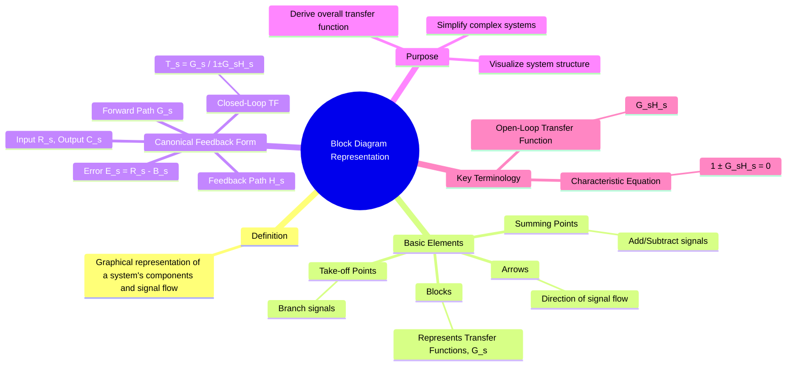

---
tags:
  - control-systems
  - system-modeling
  - block-diagram
  - graphical-representation
created: 2025-09-24
aliases:
  - Block Diagram
  - Block Diagram Algebra
subject: "[[Control Systems]]"
parent:
  - Control System Modeling
modified: 2026-08-04T09:13:53
---
### Block Diagram Representation
#control-systems/modeling #block-diagram #graphical-representation

> A **block diagram** is a graphical representation of a physical system that illustrates the functional relationships between its components. It provides a visual way to understand the flow of signals and the cause-and-effect relationships within a [[Control Systems|control systems]], simplifying the analysis and design process.

---
#### Basic Elements of a Block Diagram
#block-diagram/elements

1.  **Block:** Represents a system component or a mathematical operation. The block contains the transfer function, $G(s)$, of the element. The output signal is the product of the input signal and the transfer function.
    $Y(s) = G(s) \cdot X(s)$

2.  **Summing Point (Comparator):** Represents an operation where signals are added or subtracted. It is drawn as a circle with arrows indicating the incoming signals, each with a $+$ or $-$ sign.

3.  **Take-off Point (Pick-off Point):** Represents a point from which a signal is taken and fed to other blocks or summing points. This branching does not affect the original signal.

4.  **Arrows:** Indicate the direction of signal flow from one block or point to another.

---
#### Canonical Form of a Closed-Loop System
#block-diagram/canonical-form #feedback-system

The most common configuration in control systems is the canonical negative feedback loop.

-   **$R(s)$**: Reference Input (Setpoint)
-   **$C(s)$**: Controlled Output
-   **$G(s)$**: Forward Path Transfer Function
-   **$H(s)$**: Feedback Path Transfer Function
-   **$E(s)$**: Error Signal, $E(s) = R(s) - B(s)$
-   **$B(s)$**: Feedback Signal, $B(s) = H(s) C(s)$

##### Derivation of the Closed-Loop Transfer Function
The goal is to find the overall transfer function $T(s) = \frac{C(s)}{R(s)}$.
1.  The output signal is $C(s) = G(s) E(s)$.
2.  The error signal is $E(s) = R(s) - B(s)$.
3.  The feedback signal is $B(s) = H(s) C(s)$.

Substitute (3) into (2):
$$E(s) = R(s) - H(s) C(s)$$
Now substitute this expression for $E(s)$ into (1):
$$C(s) = G(s) [R(s) - H(s) C(s)]$$
$$C(s) = G(s) R(s) - G(s) H(s) C(s)$$
Rearrange the terms to solve for $C(s)$:
$$C(s) + G(s) H(s) C(s) = G(s) R(s)$$
$$C(s) [1 + G(s) H(s)] = G(s) R(s)$$
Finally, the closed-loop transfer function for **negative feedback** is:
$$\boxed{\quad T(s) = \frac{C(s)}{R(s)} = \frac{G(s)}{1 + G(s)H(s)} \quad}$$
For a **positive feedback** system, the sign in the denominator is reversed:
$$\boxed{\quad T(s) = \frac{C(s)}{R(s)} = \frac{G(s)}{1 - G(s)H(s)} \quad}$$

---
#### Important Terminology
#block-diagram/terminology

-   **[[Open-Loop Transfer Function (OLTF)|Open-Loop Transfer Function]]:** The product of the forward path and feedback path transfer functions, $G(s)H(s)$. It is the total transfer function around the loop, calculated as the ratio of the feedback signal $B(s)$ to the error signal $E(s)$ if the loop were opened at the summing point.
-   **Characteristic Equation:** The equation obtained by setting the denominator of the closed-loop transfer function to zero:
    $$\boxed{\quad 1 \pm G(s)H(s) = 0 \quad}$$
    The roots of the characteristic equation are the poles of the closed-loop system, which determine its stability.

---
### Related Concepts
#control-systems/related-concepts

> [[Block Diagram Reduction Techniques]]

[[Signal Flow Graph (SFG)]]
[[Mason's Gain Formula]]
[[Transfer Function and Impulse Response]]
[[Open-Loop and Closed-Loop (Feedback) Control Systems]]
[[Effect of Feedback on System Performance]]