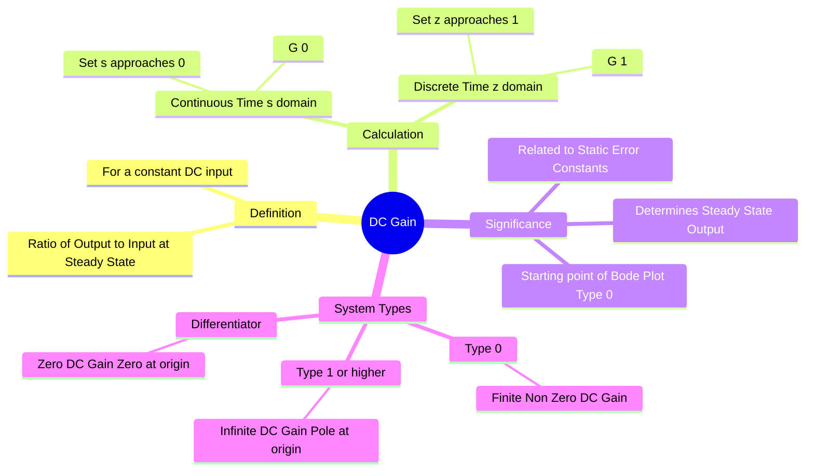

---
tags:
  - control-system
  - transfer-function
  - frequency-response
  - steady-state
  - gate
created: 2026-08-04T09:30:48
aliases:
  - Static Gain
  - Zero Frequency Gain
  - "Example : DC Gain"
subject: "[[Control Systems]]"
parent: "[[Transfer Function and Impulse Response|Transfer Function]]"
modified: 2026-08-04T09:30:48
---
### DC Gain
#control-system/basics #transfer-function

> **DC Gain** (or Static Gain) is the ratio of the steady-state output signal to the constant (DC) input signal. ==It represents the amplification factor of a system when the frequency of the input is zero ($\omega = 0$).==

---

#### Mathematical Definition
#dc-gain/calculation

For a system described by a transfer function, ==the DC gain is found by evaluating the transfer function at zero frequency==.

**A. Continuous-Time Systems ($s$-domain):**
==Since $s = \sigma + j\omega$, at DC (steady state), the frequency $\omega = 0$ and transients die out ($\sigma \to 0$).==
$$\boxed{\quad K_{dc} = \lim_{s \to 0} G(s) \quad}$$

> [!pyq]- PYQ : GATE EE 2020
> ![[ee_2020#^q41]]

**B. Discrete-Time Systems ($z$-domain):**
==Since $z = e^{sT}$, if $s \to 0$, then $z \to e^0 = 1$.==
$$\boxed{\quad K_{dc} = \lim_{z \to 1} G(z) \quad}$$

---
#### Calculation from Time-Constant Form
#dc-gain/time-constant-form

To find the DC gain by inspection, it is best to write the transfer function in **Time-Constant Form**:

$$G(s) = \frac{K (1 + sT_a)(1 + sT_b)\dots}{s^N (1 + sT_1)(1 + sT_2)\dots}$$

![[Control System Repeated Generic Notes#^time-constant-form-conversion]]

*   **For Type-0 Systems ($N=0$):**
    Apply $s \to 0$. The terms $(1+sT)$ all become $1$.
    $$K_{dc} = K$$
    Here, $K$ is the DC Gain.

*   **For Type-1 or higher Systems ($N \ge 1$):**
    The term $s^N$ in the denominator becomes $0$.
    $$K_{dc} = \lim_{s \to 0} \frac{K}{s^N} = \infty$$
    *Physical Interpretation:* If you apply a constant voltage to a pure integrator (like a capacitor charged by a current source), the output voltage rises indefinitely.

*   **For Systems with a Zero at Origin ($s$ in numerator):**
    $$K_{dc} = 0$$
    *Physical Interpretation:* A differentiator blocks DC.

---
#### Steady-State Output Calculation
#steady-state/output

If a system $G(s)$ is stable and subjected to a step input of magnitude $A$ (i.e., Input $R(t) = A \cdot u(t)$), the steady-state output $c_{ss}$ is:

$$c_{ss} = (\text{Input Magnitude}) \times (\text{DC Gain})$$
$$\boxed{\quad c_{ss} = A \cdot G(0) \quad}$$

> [!refer]
> This is derived from the [[Properties of the Laplace Transform#10. Final Value Theorem (FVT)|Final Value Theorem]] $$\lim_{s \to 0} s [G(s) \cdot \frac{A}{s}] = A G(0)$$

---
#### Relation to Bode Plots
#frequency-response/bode

The DC gain determines the starting height of the Bode Magnitude Plot (at low frequencies).

*   **Type 0 System:** The plot starts at a horizontal line of magnitude **$20 \log_{10}(K)$ dB**.
*   **Type 1 System:** The plot starts with a slope of -20 dB/dec. The line (or its extension) passes through 0 dB at frequency $\omega = K$.

---
#### Example

**Given Transfer Function:**
$$G(s) = \frac{10(s+2)}{(s+1)(s+5)}$$

**Step 1: Convert to Time Constant Form** (Divide by constant terms in factors):
$$G(s) = \frac{10 \cdot 2 (\frac{s}{2} + 1)}{1(s+1) \cdot 5 (\frac{s}{5} + 1)} = \frac{20 (1 + 0.5s)}{5 (1 + s)(1 + 0.2s)} = \frac{4 (1 + 0.5s)}{(1 + s)(1 + 0.2s)}$$

**Step 2: Evaluate $s \to 0$:**
$$K_{dc} = 4$$
Alternatively, using the original form:
$$G(0) = \frac{10(0+2)}{(0+1)(0+5)} = \frac{20}{5} = 4$$

---
### Related Concepts
#topic/related-concepts

> [[Properties of the Laplace Transform|Final Value Theorem (FVT)]]

[[Transfer Function and Impulse Response|Transfer Function]]
[[Bode Plots]]
[[Type and Order of Control Systems]]
[[Steady State Error Analysis]] (Static Error Constant $K_p$ is essentially the Open Loop DC Gain)
[[Discrete Time Systems]]
