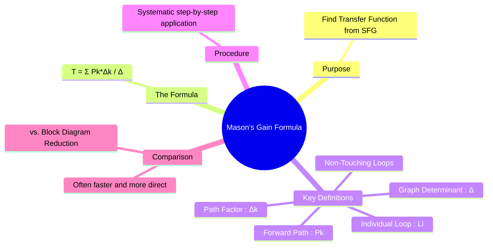

---
tags:
  - control-systems
  - signal-flow-graph
  - transfer-function
  - masons-gain-formula
created: 2025-09-20
aliases:
  - Mason's Gain
  - MGF
  - Signal Flow Graph Gain Formula
subject:
  - "[[Control Systems]]"
parent:
  - "[[Signal Flow Graph (SFG)]]"
formula:
  - "Graph Determinant (Mason's Gain Formula) : $$\\Delta = 1 - (\\sum L_i) + (\\sum L_i L_j) - (\\sum L_i L_j L_k) + \\dots$$"
  - "Graph Determinant (Mason's Gain Formula) : $$\\Delta = 1 - \\text{(Sum of all individual loop gains)} + \\text{ (Sum of gain products of all pairs of non-touching loops)} - (\\text{Sum of gain products of all triplets of non-touching loops}) + \\dots \\quad$$"
  - "Mason's Gain Formula : $$T = \\frac{\\sum_{k} P_k \\Delta_k}{\\Delta}$$"
modified: 2026-08-04T09:58:58
---
### Mason's Gain Formula
#masons-gain-formula #signal-flow-graph

> ==**Mason's Gain Formula** is a systematic method for finding the overall transfer function (gain) of a linear system represented by a [[Signal Flow Graph (SFG)]].== It provides a single, direct formula to calculate the relationship between an input and an output, often proving to be faster and less error-prone than [[Block Diagram Reduction]] for complex systems.

---
#### The Formula
#masons-gain-formula 

The overall transfer function, $T(s) = \frac{C(s)}{R(s)}$, is given by:
$$\boxed{\quad T = \frac{\sum_{k} P_k \Delta_k}{\Delta} \quad}$$
where:
* $T$ is the overall gain or transfer function of the system.
* $P_k$ is the path gain of the k-th forward path.
* $\Delta$ is the determinant of the graph.
* $\Delta_k$ is the path factor for the $k$-th forward path (the determinant of the part of the graph not touching the $k$-th path).

---
#### Definitions of Key Terms
#sfg-definitions

To use the formula, one must first identify the components of the SFG:

1. **Forward Path ($P_k$)**: A path from the input node to the output node that does not traverse any node more than once. The **path gain** is the product of all branch gains along the path.
2. **Individual Loop ($L_i$)**: A path that starts and ends at the same node without traversing any other node more than once. The **loop gain** is the product of the branch gains in the loop.
3. **Non-Touching Loops**: Two or more loops are considered non-touching if they do not share any common nodes. We identify all possible pairs, triplets, etc., of non-touching loops.

4. **Graph Determinant ($\Delta$)**: This is the key component of the formula.
    $$\boxed{\quad \Delta = 1 - (\sum L_i) + (\sum L_i L_j) - (\sum L_i L_j L_k) + \dots \quad}$$
    In words:
	$$\begin{align}
	\Delta &= 1 - \text{(Sum of all individual loop gains)} \\
	 &= + \text{ (Sum of gain products of all pairs of non-touching loops)} \\
	 &= - (\text{Sum of gain products of all triplets of non-touching loops}) + \dots
	\end{align}$$

5. **Path Factor ($\Delta_k$)**: For each forward path $P_k$, the path factor $\Delta_k$ is calculated in the same way as $\Delta$, but it is the determinant of the part of the graph that is **not touching** the k-th forward path.
    * To find $\Delta_k$, you conceptually remove the k-th forward path (and all nodes on it) and then calculate the determinant of the remaining graph using the same formula as for $\Delta$. If a path touches all loops, its $\Delta_k$ will be 1.

---
#### Step-by-Step Procedure

1. **Identify Forward Paths**: Find all forward paths from the specified input to the output node and calculate their respective gains ($P_1, P_2, \dots$).
2. **Identify All Loops**: Find all individual loops in the SFG and calculate their gains ($L_1, L_2, \dots$).
3. **Identify Non-Touching Loops**: Find all possible combinations of two, three, or more non-touching loops and calculate their gain products (e.g., $L_1L_2, L_1L_3, \dots$).
4. **Calculate Determinant ($\Delta$)**: Use the formula above to compute the graph determinant from the loop gains.
5. **Calculate Path Factors ($\Delta_k$)**: For each forward path $P_k$, determine the loops that do not touch it and calculate the corresponding $\Delta_k$.
6. **Apply the Formula**: Substitute all the calculated values into Mason's Gain Formula to find the overall transfer function.

---
### Related Concepts
#related-concepts

> [[Signal Flow Graph (SFG)]] (The structure on which the formula operates)

[[Block Diagram Reduction]] (The alternative method for finding the transfer function)
[[Transfer Function and Impulse Response|Transfer Function]] (The result obtained from the formula)
[[Control Systems]] (The primary field of application)