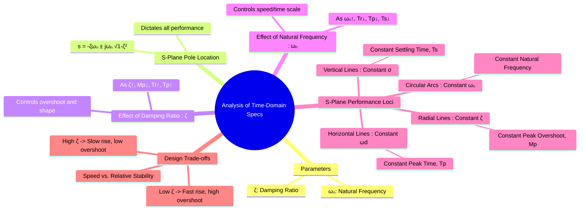

---
tags:
  - control-systems
  - time-response
  - second-order-system
  - system-analysis
  - performance-analysis
  - s-plane
created: 2025-10-01
aliases:
  - Performance Analysis of Second-Order Systems
  - Second-Order System Analysis
subject: "[[Control Systems]]"
parent:
  - Time Response Analysis
modified: 2026-08-04T09:08:48
---
### Analysis of Time-Domain Specifications for Second-Order Systems
#control-systems/analysis #second-order-system #s-plane

> The transient response of a second-order system is entirely defined by its damping ratio ($\zeta$) and natural frequency ($\omega_n$). By analyzing how these two parameters affect the time-domain specifications, we can understand the fundamental trade-offs in control system design and learn how to place system poles in the s-plane to achieve a desired performance.

---
#### Effect of Damping Ratio ($\zeta$) (for a fixed $\omega_n$)
#performance-analysis/damping-ratio

The damping ratio $\zeta$ controls the *shape* and oscillatory nature of the response.

-   **Peak Overshoot ($M_p$):** This is the most direct relationship. $M_p$ depends **only** on $\zeta$. As $\zeta$ increases from 0 to 1, the system becomes less oscillatory, and the peak overshoot decreases from 100% to 0%.
    $$\boxed{\quad \%M_p = e^{\frac{-\zeta\pi}{\sqrt{1-\zeta^2}}} \times 100\% \quad}$$
-   **Rise Time ($T_r$):** As $\zeta$ increases, the system becomes more damped and sluggish, generally leading to an increase in rise time.
-   **Peak Time ($T_p$):** As $\zeta$ increases, the damped frequency $\omega_d = \omega_n\sqrt{1-\zeta^2}$ decreases, so the time to reach the first peak ($T_p = \pi/\omega_d$) increases.
-   **Settling Time ($T_s$):** As $\zeta$ increases (for fixed $\omega_n$), the real part of the pole, $\sigma = \zeta\omega_n$, becomes more negative, causing the exponential envelope to decay faster. Therefore, settling time decreases.

---
#### Effect of Natural Frequency ($\omega_n$) (for a fixed $\zeta$)
#performance-analysis/natural-frequency

The natural frequency $\omega_n$ acts as a time-scaling factor for the response.

-   **Response Shape:** Keeping $\zeta$ constant maintains the exact same response shape, including the same percent overshoot ($M_p$).
-   **Response Speed:** Increasing $\omega_n$ makes the system faster. The response curve is compressed along the time axis.
    -   **Rise Time ($T_r$), Peak Time ($T_p$), and Settling Time ($T_s$)** are all inversely proportional to $\omega_n$. Doubling $\omega_n$ while keeping $\zeta$ constant will halve all these time specifications.

---
#### S-Plane Analysis of Pole Locations
#s-plane-analysis

The location of the closed-loop poles in the s-plane directly maps to the transient performance. For an underdamped system, the poles are at $s = -\zeta\omega_n \pm j\omega_n\sqrt{1-\zeta^2} = -\sigma \pm j\omega_d$.

-   **Vertical Lines (Constant $\sigma = \zeta\omega_n$):**
    -   All systems whose poles lie on the same vertical line in the left-half plane have the **same settling time ($T_s \approx 4/\sigma$)**.
    -   Poles further to the left result in a faster settling time.

-   **Horizontal Lines (Constant $\omega_d$):**
    -   All systems whose poles lie on the same horizontal line have the **same damped frequency ($\omega_d$)**, and therefore the **same peak time ($T_p = \pi/\omega_d$)**.

-   **Radial Lines from the Origin (Constant $\zeta$):**
    -   All systems whose poles lie on the same radial line originating from the origin have the **same damping ratio ($\zeta$)**, and therefore the **same percent overshoot ($M_p$)**.
    -   The angle with the negative real axis is $\theta = \cos^{-1}(\zeta)$.

-   **Circular Arcs Centered at the Origin (Constant $\omega_n$):**
    -   All systems whose poles lie on a circle of a given radius have the **same natural frequency ($\omega_n$)**.

---
#### Design Implications and Trade-offs
#control-system-design/tradeoffs

This analysis forms the basis of control system design. To meet performance requirements, a designer must place the dominant closed-loop poles in a specific region of the s-plane.

-   **The Speed vs. Stability Trade-off:** The primary trade-off is between a fast response and an acceptable level of overshoot and settling time.
    -   To get a very fast rise time, we need a small $\zeta$ and a large $\omega_n$.
    -   However, a small $\zeta$ leads to a high peak overshoot ($M_p$).
    -   A common compromise is to select a damping ratio in the range of $\zeta = 0.5$ to $0.8$, which provides a good balance between speed and overshoot.

-   **Design Example:** Suppose specifications are: $\%M_p \le 16\%$ and $T_s \le 2$s (2% criterion).
    1.  **From $M_p$:** $\%M_p \le 16\%$ implies $\zeta \ge 0.5$. This defines a cone in the s-plane bounded by lines at an angle of $\theta = \cos^{-1}(0.5) = 60^\circ$.
    2.  **From $T_s$:** $T_s \le 2$s implies $\sigma = \zeta\omega_n \ge 4/2 = 2$. This requires the poles to be to the left of the vertical line $s = -2$.
    3.  **Acceptable Region:** The desired closed-loop poles must lie in the region of the s-plane that satisfies both conditions simultaneously.

---
### Related Concepts
#control-systems/related-concepts

> [[Second-Order System Response]]

[[Time-Domain Specifications]]
[[Effect of Adding Poles and Zeros on System Response]]
[[Concept and Definition of Root Locus|Root Locus]]
[[Proportional-Integral (PI) Controller|PI Controller]] , [[Proportional-Derivative (PD) Controller|PD Controller]] & [[Proportional-Integral-Derivative (PID) Controller|PID Controller]]
[[Lead Compensator]] , [[Lag Compensator]] & [[Lag-Lead Compensator]]
