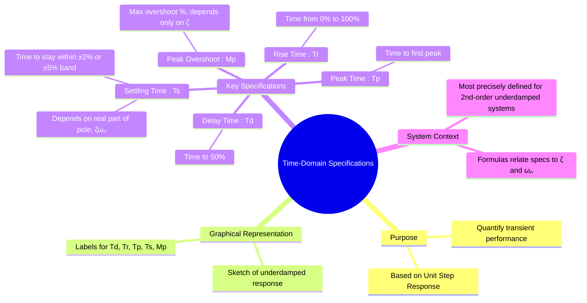

---
tags:
  - control-systems
  - time-response
  - system-performance
  - transient-response
  - performance-specs
created: 2025-09-30
aliases:
  - Time Response Specifications
  - Performance Specifications
  - Transient Response Specifications
  - Underdamped Second-Order System
  - Underdamped Step Response Curve
  - Delay Time (T_d)
  - Rise Time (T_r)
  - Peak Time (T_p)
  - Peak Overshoot (M_p)
  - Settling Time (T_s)
  - Time-Domain Specifications (Rise Time, Peak Time, Settling Time, Peak Overshoot)
  - rise time
  - peak time
  - peak overshoot
  - settling time
  - delay time
  - Rise Time for Overdamped Second Order System
  - Second-Order System Parameters
subject: "[[Control Systems]]"
parent:
  - Time Response Analysis
formula:
  - "Rise Time (underdamp) : $$T_r = \\frac{\\pi - \\phi}{\\omega_d}$$"
  - "Peak Time (underdamp) : $$T_p = \\frac{\\pi}{\\omega_d} = \\frac{\\pi}{\\omega_n\\sqrt{1-\\zeta^2}}$$"
  - "Peak Overshoot (underdamp) : $$\\%M_p = e^{\\left(\\frac{-\\zeta\\pi}{\\sqrt{1-\\zeta^2}}\\right)} \\times 100\\%$$"
  - "Settling Time (underdamp) : $$T_s (\\text{for 2\\% tolerance}) \\approx \\frac{4}{\\zeta\\omega_n} = \\frac{4}{\\sigma}$$"
  - "Settling Time (underdamp) : $$T_s (\\text{for 5\\% tolerance}) \\approx \\frac{3}{\\zeta\\omega_n} = \\frac{3}{\\sigma}$$"
modified: 2026-08-04T10:41:40
---
### Time-Domain Specifications
#control-systems/time-response #performance-specifications

> Time-domain specifications are a set of quantitative metrics used to characterize the transient performance of a control system. They are typically derived from the system's **unit step response** and provide a standard way to describe the speed, overshoot, and settling behavior of the system. While these concepts can be applied to any system, the specific formulas are derived for and most accurately describe a standard underdamped [[Second-Order System Response]].

---
#### Graphical Representation of Specifications
#time-domain-specifications/graph

The following figure illustrates the key specifications on a typical underdamped step response curve:

![[underdamped step response curve.png]]

---
#### Definitions and Formulas
#time-domain-specifications/formulas

For a standard underdamped second-order system with damping ratio $\zeta$ ($0 < \zeta < 1$) and natural frequency $\omega_n$:

##### 1. Delay Time ($T_d$)
#delay-time 

- **Definition:** The time required for the response to reach 50% of its final value for the first time.
- **Significance:** It is a measure of the initial delay in the system's response.

---
##### 2. Rise Time ($T_r$)
#rise-time 

- **Definition:** For underdamped systems, it's the time required for the response to rise from 0% to 100% of its final value for the first time. (For overdamped systems, it is often defined as the time from 10% to 90%).
- **Significance:** It represents the speed of the response. A smaller $T_r$ means a faster system.
- **Formula:**
    $$\boxed{\quad T_r = \frac{\pi - \phi}{\omega_d} \quad}$$
    where $\omega_d = \omega_n\sqrt{1-\zeta^2}$ is the damped frequency and $\phi = \cos^{-1}(\zeta)$ is in radians.

---
##### 3. Peak Time ($T_p$)
#peak-time 

- **Definition:** The time required for the response to reach the first peak, or maximum overshoot.
- **Significance:** It characterizes the time to the maximum deviation from the setpoint.
- **Formula:**
    $$\boxed{\quad T_p = \frac{\pi}{\omega_d} = \frac{\pi}{\omega_n\sqrt{1-\zeta^2}} \quad}$$

---
##### 4. Peak Overshoot ($M_p$)
#peak-overshoot 

- **Definition:** The maximum value of the response curve measured from the final steady-state value, expressed as a percentage of the final value.
- **Significance:** It is a key indicator of the system's relative stability. High overshoot may be undesirable.
- **Formula:** It is a function **only** of the damping ratio, $\zeta$.
    $$\boxed{\quad \%M_p = e^{\left(\frac{-\zeta\pi}{\sqrt{1-\zeta^2}}\right)} \times 100\% \quad}$$
    Conversely, the damping ratio can be found from the peak overshoot:
    $$\zeta = \frac{-\ln(M_p/100)}{\sqrt{\pi^2 + [\ln(M_p/100)]^2}}$$

> [!success] Maximum peak overshoot
> Peak overshoot exists **only for** $0 < \zeta < 1$.
> Within this range:
> $$M_p \uparrow \;\text{as}\; \zeta \downarrow$$
> 👉 For multiple $\zeta$ values, **maximum peak overshoot corresponds to the smallest $\zeta$** in $(0,1)$.
> 
> > [!fail] Validity condition
> > This rule is exact **only for dominant second-order systems**.
> > For higher-order systems, it applies **only if the response is explicitly stated to be second-order–dominant**.

---
##### 5. Settling Time ($T_s$)
#settling-time 

- **Definition:** The time required for the response to reach and stay within a specified tolerance band (commonly 2% or 5%) of its final value.
- **Significance:** It indicates how long it takes for the transient oscillations to die out.
- **Formula:** It is determined by the real part of the dominant poles, $\sigma = \zeta\omega_n$. The 2% criterion is most common unless stated otherwise.
    $$\boxed{\quad T_s (\text{for 2\% tolerance}) \approx \frac{4}{\zeta\omega_n} = \frac{4}{\sigma} \quad}$$
    $$\boxed{\quad T_s (\text{for 5\% tolerance}) \approx \frac{3}{\zeta\omega_n} = \frac{3}{\sigma} \quad}$$

---
### Related Concepts
#control-systems/related-concepts

> [[Second-Order System Response]]

[[First-Order System Response]]
[[Unit Step, Ramp, Parabolic, and Impulse Signals]]
[[Effect of Adding Poles and Zeros on System Response]]
[[Steady-State Error]]
[[Concept and Definition of Root Locus|Root Locus]]