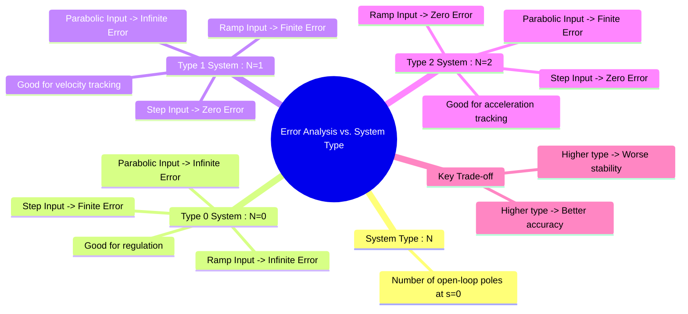

---
tags:
  - control-systems
  - time-response
  - system-accuracy
  - system-type
  - steady-state-error
created: 2025-10-05
aliases:
  - System Type Error Analysis
  - Error vs System Type
subject: "[[Control Systems]]"
parent:
  - Steady-State Response
  - "[[Type and Order of Control Systems]]"
  - "[[Steady-State Error]]"
  - "[[Static Error Constants]]"
modified: 2026-08-04T09:39:03
---
### Error Analysis for different System Types (Type 0, 1, 2)
#control-systems/steady-state-response #system-type #system-accuracy

> The steady-state accuracy of a feedback control system is fundamentally determined by its **system type**. The system type, defined as the number of pure integrators (poles at the origin) in the [[Open-Loop Transfer Function (OLTF)|open-loop transfer function]] $G(s)H(s)$, dictates the system's ability to track standard test inputs (step, ramp, parabolic) with zero, finite, or infinite error.

> [!prerequisite]
> [[Type and Order of Control Systems]]

---

#### Type 0 System (N=0)
#type-0-system #system-type/0 

A Type 0 system has no integrators in its open-loop transfer function.

-   **Open-Loop Transfer Function:** $G(s)H(s) = \frac{K(1+T_a s)\cdots}{(1+T_1 s)\cdots}$
-   **Step Input ($r(t) = A u(t)$):**
    -   Position constant $K_p = \lim_{s \to 0} G(s)H(s) = K$ (a finite value).
    -   The steady-state error is **finite**:
        $$\boxed{\quad e_{ss} = \frac{A}{1+K_p} \quad}$$
-   **Ramp Input ($r(t) = A t$):**
    -   Velocity constant $K_v = \lim_{s \to 0} sG(s)H(s) = 0$.
    -   The steady-state error is **infinite**: $e_{ss} = \frac{A}{K_v} = \infty$.
-   **Conclusion:** A Type 0 system cannot track a ramp or parabolic input. It will have a constant, finite error for a step input, which can be reduced by increasing the open-loop gain $K$.

---
#### Type 1 System (N=1)
#type-1-system #system-type/1 

A Type 1 system has one integrator in its open-loop transfer function. This is very common in motor position control systems.

-   **Open-Loop Transfer Function:** $G(s)H(s) = \frac{K(1+T_a s)\cdots}{s(1+T_1 s)\cdots}$
-   **Step Input ($r(t) = A u(t)$):**
    -   Position constant $K_p = \lim_{s \to 0} G(s)H(s) = \infty$.
    -   The steady-state error is **zero**:
        $$\boxed{\quad e_{ss} = \frac{A}{1+\infty} = 0 \quad}$$
-   **Ramp Input ($r(t) = A t$):**
    -   Velocity constant $K_v = \lim_{s \to 0} sG(s)H(s) = K$ (a finite value).
    -   The steady-state error is **finite**:
        $$\boxed{\quad e_{ss} = \frac{A}{K_v} \quad}$$
-   **Parabolic Input ($r(t) = A t^2/2$):**
    -   Acceleration constant $K_a = \lim_{s \to 0} s^2G(s)H(s) = 0$.
    -   The steady-state error is **infinite**: $e_{ss} = \frac{A}{K_a} = \infty$.
-   **Conclusion:** The integrator allows a Type 1 system to perfectly track a step input. It can also track a ramp input with a constant, finite error.

---
#### Type 2 System (N=2)
#type-2-system #system-type/2

A Type 2 system has two integrators in its open-loop transfer function.

-   **Open-Loop Transfer Function:** $G(s)H(s) = \frac{K(1+T_a s)\cdots}{s^2(1+T_1 s)\cdots}$
-   **Step Input ($r(t) = A u(t)$):**
    -   $K_p = \infty \implies \boxed{e_{ss} = 0}$
-   **Ramp Input ($r(t) = A t$):**
    -   $K_v = \infty \implies \boxed{e_{ss} = 0}$
-   **Parabolic Input ($r(t) = A t^2/2$):**
    -   Acceleration constant $K_a = \lim_{s \to 0} s^2G(s)H(s) = K$ (a finite value).
    -   The steady-state error is **finite**:
        $$\boxed{\quad e_{ss} = \frac{A}{K_a} \quad}$$
-   **Conclusion:** A Type 2 system can perfectly track both step and ramp inputs, and can track a parabolic input with a constant, finite error.

---
#### Summary Table of Steady-State Errors
#system-type/summary

| System Type | Step Input ($r(t)=u(t)$) | Ramp Input ($r(t)=t$) | Parabolic Input ($r(t)=t^2/2$) |
| :---: | :---: | :---: | :---: |
| **Type 0** | Finite   $\frac{1}{1+K_p}$ | $\infty$ | $\infty$ |
| **Type 1** | 0 | Finite   $\frac{1}{K_v}$ | $\infty$ |
| **Type 2** | 0 | 0 | Finite   $\frac{1}{K_a}$ |

#### Design Implications
-   **Accuracy vs. Stability:** Increasing the system type (e.g., by adding an integrator like in a PI controller) improves steady-state accuracy. However, each integrator adds -90° of phase lag to the frequency response, which reduces the system's phase margin and can lead to instability. This is a fundamental trade-off in control system design.

---
### Related Concepts
#control-systems/related-concepts

> [[Steady-State Error]]

[[Static Error Constants|Static Error Constants (Position, Velocity, Acceleration Constants)]]
[[Proportional (P) Controller]]
[[Lead Compensator]]
[[Stability Analysis]]
[[Bode Plots]]
