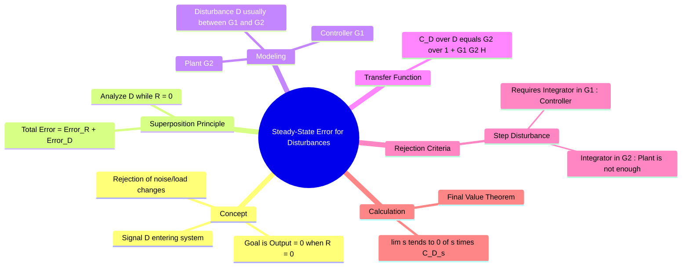

---
tags:
  - control-system
  - steady-state-error
  - disturbance-rejection
  - gate
  - block-diagram
aliases:
  - Disturbance Rejection
  - Steady State Output due to Disturbance
subject: "[[Control Systems]]"
parent:
  - "[[Steady-State Error]]"
created: 2026-08-04T10:36:07
modified: 2026-08-04T10:36:07
---
### Steady-State Error for Disturbances
#control-system/steady-state-error #disturbance-rejection

> In practical control systems, the output must track the reference input ($R$) while rejecting unwanted signals known as **Disturbances** ($D$). Calculating the steady-state error due to disturbances involves analyzing the system's response to $D(s)$ while assuming the reference input $R(s)$ is zero, utilizing the **[[Linearity#The Principle of Superposition|Principle of Superposition]]**.

---
#### Block Diagram Representation
#block-diagram/disturbance

Consider a feedback control system where the forward path is split into a Controller ($G_1(s)$) and a Plant ($G_2(s)$). The disturbance $D(s)$ typically enters between them (e.g., a load torque on a motor shaft).

![[Block Diagram with Disturbance.png]]

*   $R(s)$: Reference Input
*   $G_1(s)$: Controller Transfer Function
*   $G_2(s)$: Plant Transfer Function
*   $H(s)$: Feedback Element
*   $D(s)$: Disturbance Input

**Signal Flow:**
Output $C(s) = G_2(s) [D(s) + G_1(s) E_a(s)]$
Where actuating error $E_a(s) = R(s) - H(s)C(s)$.

#### Transfer Function for Disturbance
#transfer-function/disturbance

To find the error due to disturbance, set $R(s) = 0$.
The system becomes a regulator problem (maintaining zero output despite disturbance).

From the block diagram algebra with $R(s) = 0$:
$$C(s) = G_2(s) D(s) - G_1(s) G_2(s) H(s) C(s)$$
$$C(s) [1 + G_1(s) G_2(s) H(s)] = G_2(s) D(s)$$

The **Disturbance-to-Output Transfer Function** is:
$$\boxed{\quad \frac{C_D(s)}{D(s)} = \frac{G_2(s)}{1 + G_1(s) G_2(s) H(s)} \quad}$$

*Note: In the context of disturbances, the "Error" is often considered the deviation of the output from zero. For a unity feedback system, $E(s) = -C(s)$.*

#### Calculating Steady-State Error ($e_{ss}$)
#steady-state-error/calculation

Using the **Final Value Theorem**, the steady-state value of the output due to disturbance is:

$$\boxed{\quad c_{ss}|_D = \lim_{t \to \infty} c_D(t) = \lim_{s \to 0} s C_D(s) = \lim_{s \to 0} s \left[ \frac{G_2(s)}{1 + G_1(s) G_2(s) H(s)} \right] D(s) \quad}$$

#### Conditions for Disturbance Rejection
#control-system/design

The goal is to make $c_{ss}|_D = 0$. The location of integrators (poles at origin) in the forward path is critical.

Consider a **Step Disturbance** ($D(s) = 1/s$).

$$c_{ss} = \lim_{s \to 0} s \left( \frac{G_2(s)}{1 + G_1(s) G_2(s) H(s)} \right) \frac{1}{s} = \lim_{s \to 0} \frac{G_2(s)}{1 + G_1(s) G_2(s) H(s)}$$

**Scenario A: Integrator in the Plant ($G_2(s)$)**
If $G_2(s)$ has a pole at origin (Type 1 plant), $G_2(0) \to \infty$.
$$c_{ss} = \lim_{s \to 0} \frac{\infty}{1 + G_1(0) \cdot \infty \cdot H(0)} = \frac{1}{G_1(0)H(0)}$$
*Result:* Finite constant error. The disturbance is **not** fully rejected.

**Scenario B: Integrator in the Controller ($G_1(s)$)**
If $G_1(s)$ has a pole at origin (Integral Control), $G_1(0) \to \infty$.
Assuming $G_2(0)$ is finite:
$$c_{ss} = \lim_{s \to 0} \frac{K_{plant}}{1 + \infty} = 0$$
*Result:* **Zero steady-state error.**

> **Crucial Concept:** To reject a constant (step) disturbance with zero steady-state error, the system must have an **Integrator placed upstream** (before) the point where the disturbance enters the system.

#### Total Steady-State Error
#steady-state-error/total

By the principle of superposition (for linear systems), the total steady-state error is the sum of the error due to the reference input and the error due to the disturbance.

$$\boxed{\quad e_{ss(\text{total})} = e_{ss}|_R + e_{ss}|_D \quad}$$

*   $e_{ss}|_R$: Calculated using standard static error constants ($K_p, K_v, K_a$) based on System Type.
*   $e_{ss}|_D$: Calculated using the disturbance transfer function derived above.

---
### Related Concepts
#topic/related-concepts

> [[Steady-State Error]]
> [[Error Analysis for different System Types (Type 0, 1, 2)]]

[[Proportional (P) Controller|P Controller]] , [[Proportional-Integral (PI) Controller|PI Controller]] , [[Proportional-Derivative (PD) Controller|PD Controller]] & [[Proportional-Integral-Derivative (PID) Controller|PID Controller]] (PI controllers are used specifically to add the upstream integrator for disturbance rejection)
[[Block Diagram Reduction Techniques]]
[[Type and Order of Control Systems]]
[[Effect of Feedback on System Performance|Feedback Effects]] (Sensitivity to disturbance)
[[Properties of the Laplace Transform|Final Value Theorem (FVT)]]