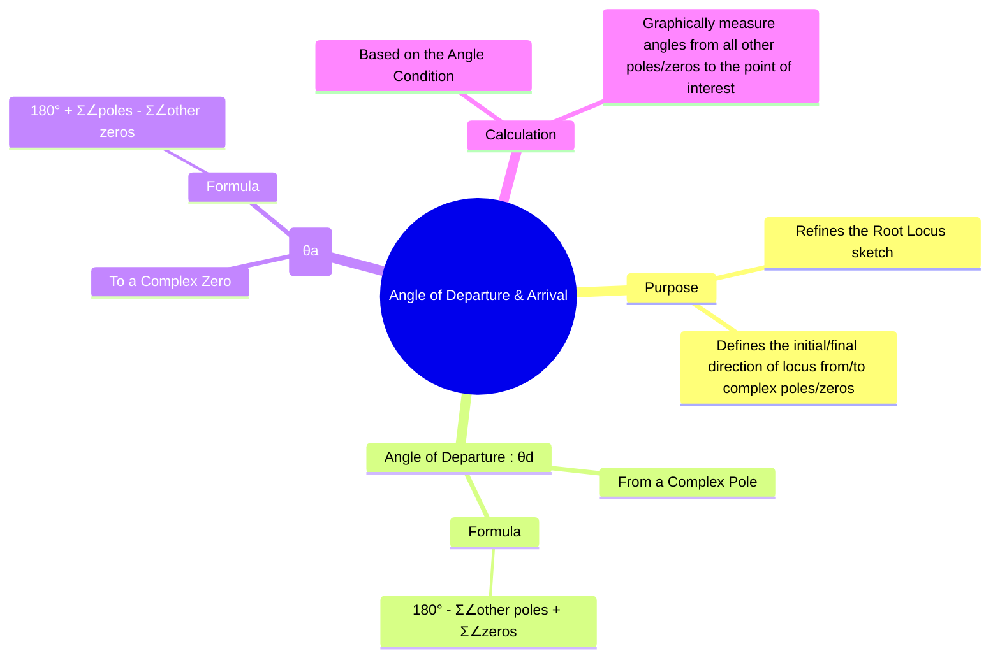

---
tags:
  - control-systems
  - root-locus
  - stability-analysis
  - system-dynamics
created: 2025-10-18
aliases:
  - Angle of Departure
  - Angle of Arrival
  - Root Locus Angles
  - "Example : Find the Angle of Departure from a Pole"
subject: "[[Control Systems]]"
parent:
  - "[[Rules for Constructing the Root Locus|Construction of Root Locus]]"
modified: 2026-08-04T09:09:34
---
### Angle of Departure and Angle of Arrival
#control-systems/root-locus #complex-poles-zeros

> The **angle of departure** and **angle of arrival** are specific angles that must be calculated to accurately sketch the root locus when the [[Open-Loop Transfer Function (OLTF)|open-loop transfer function]] has complex conjugate poles or zeros. These angles define the direction in which the locus branch leaves a complex pole (departure) or enters a complex zero (arrival), ensuring the [[Angle and Magnitude Conditions|angle condition]] is met in the immediate vicinity of that point.

---
#### Angle of Departure ($\theta_d$)
#angle-of-departure

==The angle of departure is the angle at which a root locus branch **leaves** a complex open-loop pole.==

- **Concept:** To find this angle, we apply the angle condition to a test point $s$ that is infinitesimally close to the complex pole $p_k$. The angle of the vector from $p_k$ to this test point is the angle of departure, $\theta_d$. The sum of angles from all other poles and zeros to this test point must satisfy the angle condition.
- **Formula:** The angle of departure from a complex pole $p_k$ is calculated as:

$$\boxed{\quad \theta_d = 180^\circ - \left( \sum \text{angles from other poles} - \sum \text{angles from all zeros} \right) \quad}$$
^angle-of-departure

More formally:$$\theta_d = 180^\circ - \left( \sum_{j \neq k} \angle(p_k - p_j) - \sum_{i} \angle(p_k - z_i) \right)$$

> See [[ee_2024#^q57]]

> [!tip]- Angle of a Pole/Zero with Respect to a Test Point
>
> For a pole/zero at $(a,b)$ and a test point $P(\sigma,j\omega)$, draw a vector from the pole/zero to the test point.
>
> $$\Delta x = \sigma-a$$
> $$\Delta y = \omega-b$$
>
> The reference angle is $$\phi=\tan^{-1}\left(\frac{|\Delta y|}{|\Delta x|}\right)$$
>
> Determine the final angle from the quadrant of the vector:
>
> | Quadrant | Condition | Angle |
> |-----------|-----------|-----------|
> | I | $\Delta x>0,\ \Delta y>0$ | $\theta=\phi$ |
> | II | $\Delta x<0,\ \Delta y>0$ | $\theta=180^\circ-\phi$ |
> | III | $\Delta x<0,\ \Delta y<0$ | $\theta=180^\circ+\phi$ |
> | IV | $\Delta x>0,\ \Delta y<0$ | $\theta=360^\circ-\phi$ |
>
> For Root Locus: $$\sum \theta_{\text{zeros}} - \sum \theta_{\text{poles}} = (2k+1)180^\circ$$
>
> Measure all angles at the test point and use the vector direction from each pole/zero to the test point.
>
> **Fastest Method**
> 
> $$\theta=\operatorname{atan2}(\omega-b,\ \sigma-a)$$
>
> The `atan2()` function automatically gives the correct quadrant.
^angle-finding

---
#### Angle of Arrival ($\theta_a$)
#angle-of-arrival

==The angle of arrival is the angle at which a root locus branch **arrives** at a complex open-loop zero.==

- **Concept:** Similar to the angle of departure, we apply the angle condition to a test point $s$ that is infinitesimally close to the complex zero $z_k$. The angle of the vector from the test point to $z_k$ is the angle of arrival, $\theta_a$.

- **Formula:** The angle of arrival at a complex zero $z_k$ is calculated as:

$$\boxed{\quad \theta_a = 180^\circ + \left( \sum \text{angles from all poles} - \sum \text{angles from other zeros} \right) \quad}$$
^angle-of-arrival

More formally: $$\theta_a = 180^\circ + \left( \sum_{j} \angle(z_k - p_j) - \sum_{i \neq k} \angle(z_k - z_i) \right)$$

![[Angle of Departure and Angle of Arrival#^angle-finding]]

---
#### Calculation Procedure (Graphical Method)
#root-locus/angle-calculation

1. **Select the Point:** Choose the complex pole (for departure) or complex zero (for arrival) for which you want to calculate the angle.
2. **Draw Vectors:** Draw vectors from all **other** open-loop poles and **all** open-loop zeros to this selected point.
3. **Measure Angles:** Measure the angles of all these vectors with respect to the positive real axis.
4. **Apply Formula:** Substitute the measured angles into the appropriate formula ($\theta_d$ or $\theta_a$) to find the required angle.
    - Remember: angles from poles are subtracted, and angles from zeros are added (relative to the $180^\circ$ baseline).

##### Example

For a system with poles at $0, -4, -1+j1$ and a zero at $-2$. To find the angle of departure from the pole at $p_1 = -1+j1$:
- Vector from pole at $0$: $\angle(-1+j1 - 0) = 135^\circ$
- Vector from pole at $-4$: $\angle(-1+j1 - (-4)) = \angle(3+j1) = 18.4^\circ$
- Vector from zero at $-2$: $\angle(-1+j1 - (-2)) = \angle(1+j1) = 45^\circ$
- The angle from the conjugate pole at $-1-j1$ is $90^\circ$.

$$\theta_d = 180^\circ - (\angle_{p_0} + \angle_{p_{-4}} + \angle_{p_{-1-j1}} - \angle_{z_{-2}})$$
$$\theta_d = 180^\circ - (135^\circ + 18.4^\circ + 90^\circ - 45^\circ) = 180^\circ - 198.4^\circ = -18.4^\circ$$
The locus leaves the pole at $-1+j1$ at an angle of $-18.4^\circ$.

---
### Related Concepts
#control-systems/related-concepts

> [[Rules for Constructing the Root Locus]]

[[Breakaway and Break-in Points]]
[[Angle and Magnitude Conditions]]
[[Concept and Definition of Root Locus]]