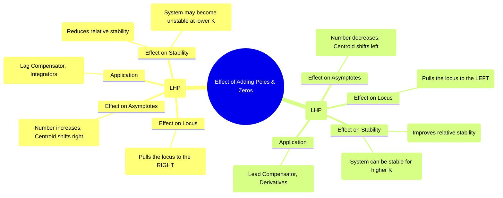

---
tags:
  - control-systems
  - root-locus
  - stability-analysis
  - system-design
  - compensators
created: 2025-10-20
aliases:
  - Adding Poles and Zeros to RL
  - Root Locus Compensation
subject: "[[Control Systems]]"
parent:
  - "[[Concept and Definition of Root Locus|Root Locus]]"
modified: 2026-08-04T09:35:43
---
### Effect of Adding Poles and Zeros on the Root Locus
#control-systems/root-locus #system-design

> Adding open-loop poles and zeros fundamentally reshapes the root locus, thereby altering the system's stability and transient response. This is the foundational principle behind the design of controllers and compensators, which are used to improve a system's performance by strategically placing additional poles and zeros.

---
#### Effect of Adding an Open-Loop Pole
#pole-effects

Adding an open-loop pole tends to pull the root locus to the **right**, generally **reducing the system's relative stability** and making the response more sluggish.

1.  **Effect on Asymptotes:**
    -   The number of asymptotes ($P-Z$) increases by one.
    -   The angles of the asymptotes change.
    -   The centroid ($\sigma_a$) shifts to the right, moving the "center of gravity" of the asymptotes towards the unstable region.
        $$\sigma_a = \frac{\sum (\text{poles}) - \sum (\text{zeros})}{P-Z}$$
        Adding a pole makes the numerator more negative (shifts left), but the denominator increases, often resulting in a net rightward shift of the centroid depending on the pole's location.

2.  **Effect on Stability:**
    -   The locus branches are "pushed" or bent towards the right-half plane (RHP).
    -   This often causes the locus to cross the jω-axis at a **lower value of gain K**, meaning the system becomes unstable sooner.
    -   The overall system becomes less stable.

3.  **Effect on Breakaway Points:** The location of breakaway points will shift.

**Special Case: Adding a Pole at the Origin (Integrator)**
-   This increases the **system type** by one.
-   Benefit: It significantly improves or eliminates the [[Steady-State Error]].
-   Drawback: It adds -90° of phase shift, which severely degrades relative stability, often making the system less stable or even unstable.

$$\boxed{\quad \text{Adding a Pole } \implies \text{Pulls Locus Right } \implies \text{Reduces Stability} \quad}$$

---
#### Effect of Adding an Open-Loop Zero
#zero-effects

Adding an open-loop zero tends to pull the root locus to the **left**, generally **improving the system's relative stability** and speeding up the response.

1.  **Effect on Asymptotes:**
    -   The number of asymptotes ($P-Z$) decreases by one.
    -   The centroid ($\sigma_a$) shifts to the left, pulling the asymptotes into the more stable region of the s-plane.

2.  **Effect on Stability:**
    -   The locus branches are "attracted" or bent towards the left-half plane (LHP).
    -   This can prevent the locus from entering the RHP or cause it to cross the jω-axis at a much **higher value of gain K**.
    -   The overall system becomes more stable.

3.  **Effect on Response Speed:** Pulling the locus to the left means the closed-loop poles can achieve a more negative real part, resulting in a faster settling time.

$$\boxed{\quad \text{Adding a Zero } \implies \text{Pulls Locus Left } \implies \text{Improves Stability} \quad}$$

---
#### Application: Controller and Compensator Design
#compensator-design

The deliberate placement of poles and zeros is the essence of compensator design.
-   **[[Lead Compensator]]:** A lead compensator adds a **dominant zero** and a non-dominant pole. The primary effect is from the zero, which pulls the locus to the left, improving stability (increasing phase margin) and speeding up the transient response.
-   **[[Lag Compensator]]:** A lag compensator adds a pole and a zero very close to the origin (pole is closer). Its primary goal is to improve [[Steady-State Error]] by increasing the low-frequency gain, without significantly altering the shape of the root locus for the transient response.
-   **[[Proportional-Integral-Derivative (PID) Controller|PID Controller]]:**
    -   **Integral (I) Control:** Adds a pole at the origin (improves steady-state error, hurts stability).
    -   **Derivative (D) Control:** Adds a zero (improves stability, anticipates error).

---
### Related Concepts
#control-systems/related-concepts

> [[Rules for Constructing the Root Locus]]

[[Controllers and Compensators]]
[[Lead Compensator]]
[[Lag Compensator]]
[[Effect of Adding Poles and Zeros on System Response]]
[[Relationship between Pole Location and System Stability]]