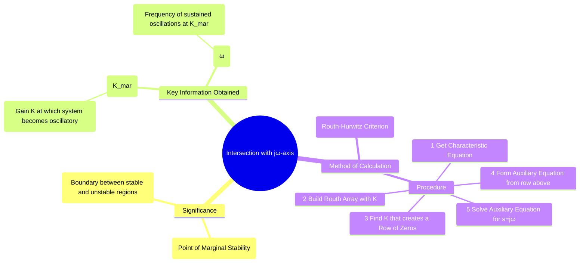

---
tags:
  - control-systems
  - root-locus
  - stability-analysis
  - marginal-stability
  - routh-hurwitz
created: 2025-10-19
aliases:
  - jω-axis crossing
  - Root Locus Imaginary Axis Intersection
  - "Example : Root Locus : Intersection with the Imaginary Axis"
subject: "[[Control Systems]]"
parent:
  - "[[Concept and Definition of Root Locus]]"
modified: 2026-08-04T09:51:17
---
### Intersection with the Imaginary Axis
#control-systems/root-locus #marginal-stability

> ==The point where the root locus crosses the imaginary (jω) axis is of critical importance in stability analysis.== This intersection represents the transition from a stable system (poles in the LHP) to an unstable system (poles in the RHP). The system is **marginally stable** at this exact point, and the analysis yields two crucial pieces of information: the **marginal gain ($K_{mar}$)** and the **frequency of sustained oscillation ($\omega$)**.

---
#### Significance of the Intersection

- **Marginal Stability:** When the closed-loop poles lie on the jω-axis, the system's impulse response will exhibit sustained, undamped oscillations.
- **Marginal Gain ($K_{mar}$):** This is the specific value of the gain $K$ that causes the poles to lie on the jω-axis. For any gain $K > K_{mar}$, the system will be unstable.
- **Frequency of Oscillation ($\omega$):** This is the frequency at which the marginally stable system will oscillate.

---
#### Method of Calculation: Routh-Hurwitz Criterion
#routh-hurwitz

The most reliable and systematic method to find the jω-axis crossing is by using the [[Routh-Hurwitz Stability Criterion]]. The procedure is as follows:

1. **Find the Characteristic Equation:** Determine the closed-loop characteristic equation, $1 + G(s)H(s) = 0$, leaving the gain $K$ as a variable.
    $$a_n s^n + a_{n-1} s^{n-1} + \dots + a_1(K)s + a_0(K) = 0$$

2. **[[Routh-Hurwitz Stability Criterion#Constructing the Routh Array|Construct the Routh Array]]:** Build the Routh array using the coefficients of the characteristic equation. Some elements in the array will be functions of $K$.

3. **Find the Condition for Marginal Stability:** For the system to have poles on the jω-axis, a [[Routh-Hurwitz Stability Criterion#Case 2 An Entire Row of Zeros|row of zeros]] must appear in the Routh array. Typically, you force the first element of the $s^1$ row to be zero and solve for the value of $K$. This value is the marginal gain, $K_{mar}$.

4. **Form the [[Routh-Hurwitz Special Case-2#Example|Auxiliary Equation]] ($A(s)$):** Go to the row just *above* the row that was forced to zero (this is usually the $s^2$ row). The coefficients in this row form the auxiliary equation, $A(s)$. This equation will be of even order.

5. **Find the Frequency of Oscillation ($\omega$):** The roots of the auxiliary equation, $A(s)=0$, are the poles that lie on the jω-axis. Substitute $s=j\omega$ into $A(s)$ and solve for $\omega$.

##### Example

Consider a system with the [[Open-Loop Transfer Function (OLTF)|open-loop transfer function]]: $G(s)H(s) = \frac{K}{s(s+2)(s+4)}$.

**1. Characteristic Equation:**
$1 + \frac{K}{s(s+2)(s+4)} = 0 \implies s(s^2+6s+8) + K = 0$
$$s^3 + 6s^2 + 8s + K = 0$$

**2. Routh Array:**

| $s^3$ | 1 | 8 |
| :--- | :--- | :--- |
| $s^2$ | 6 | K |
| $s^1$ | $\frac{6 \cdot 8 - 1 \cdot K}{6} = \frac{48-K}{6}$ | 0 |
| $s^0$ | K | |

**3. Find Marginal Gain ($K_{mar}$):**
For marginal stability, the $s^1$ row must be a row of zeros. We set its first element to zero:
$$\frac{48-K}{6} = 0 \implies \boxed{K_{mar} = 48}$$

**4. Form Auxiliary Equation:**
Using the coefficients from the $s^2$ row (the row above the zero row):
$$A(s) = 6s^2 + K$$

**5. Find Frequency of Oscillation ($\omega$):**
Substitute $K=K_{mar}=48$ and $s=j\omega$ into $A(s)$:
$$6(j\omega)^2 + 48 = 0$$
$$-6\omega^2 + 48 = 0$$
$$\omega^2 = \frac{48}{6} = 8$$
$$\boxed{\omega = \sqrt{8} = 2\sqrt{2} \text{ rad/s}}$$

**Conclusion:** The root locus crosses the imaginary axis at $s = \pm j2\sqrt{2}$ when the gain is $K=48$. For $K>48$, the system is unstable.

---
### Related Concepts
#control-systems/related-concepts

> [[Rules for Constructing the Root Locus]]

[[Routh-Hurwitz Stability Criterion]]
[[Special Cases in Routh Array]]
[[Relative Stability Analysis]]
[[Nyquist Stability Criterion]]