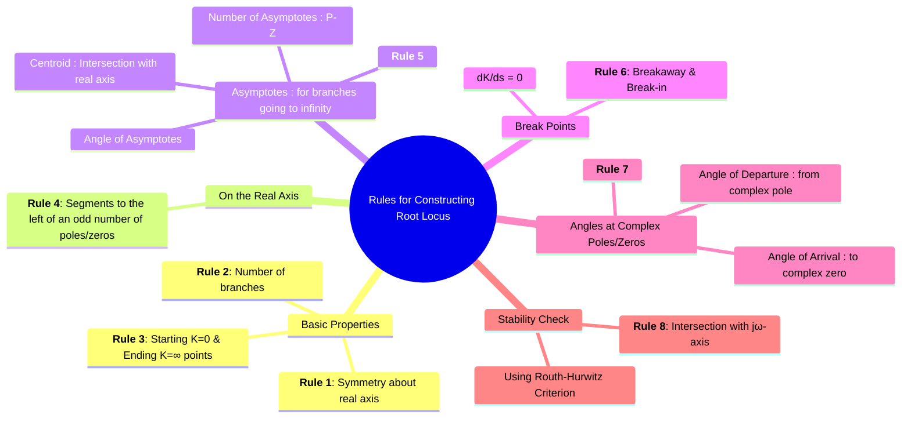

---
tags:
  - control-systems
  - root-locus
  - stability-analysis
  - graphical-method
  - system-design
created: 2025-10-15
aliases:
  - Root Locus Rules
  - Sketching Root Locus
  - How to draw Root Locus?
  - "Video : Root Locus (Brian Douglas)"
  - Construction of Root Locus
subject: "[[Control Systems]]"
parent:
  - "[[Concept and Definition of Root Locus|Root Locus]]"
youtube:
  - eTVddYCeiKI
  - jb_FiP5tKig
modified: 2026-08-04T10:26:28
---
### Rules for Constructing the Root Locus
#control-systems/root-locus #graphical-method

> The following set of rules provides a systematic procedure for sketching the [[Concept and Definition of Root Locus|root locus]] of a system. These rules are derived from the [[Angle and Magnitude Conditions|angle condition]] and allow for a reasonably accurate plot to be created without extensive calculations, providing deep insight into the system's behavior.

![[Root Locus Construction.jpg]]

> [!warning]- Evans Form (Root-Locus Form) Conversion
> To sketch the root locus or calculate gain, the open-loop transfer function $G(s)H(s)$ **must** be in the standard root-locus form (Evans Form), where the coefficient of highest power of $s$ in every factor is $1$.
> 
> Let the system be:  
> $$G(s) = \frac{10(2s+6)}{(3s+6)(s+5)}$$
>
> ##### **Step 1: Factor out the coefficients of $s$**
> You need terms in the form $(s + a)$, not $(bs + c)$.
>
> Numerator: 
> $$2s+6 = 2(s+3)$$
>
> Denominator:  
> $$3s+6 = 3(s+2)$$
>
> ##### **Step 2: Substitute and isolate $K$**
> $$G(s) = \frac{10 \cdot 2(s+3)}{3(s+2)(s+5)}$$
>
> Simplify to isolate the root locus gain, $K_{RL}$:
> $$G(s) = \frac{20}{3} \cdot \frac{s+3}{(s+2)(s+5)}$$
> 
> Here, $K_{RL} = 20/3$. The poles are at $p_1 = -2, p_2 = -5$ and the zero is at $z_1 = -3$. 
> *(Note: Do not confuse this with the Bode/Time-Constant form $(1 + s/a)$, which is used for frequency response).*
^evans-form-conversion

> [!warning]- Pole–Zero Form Conversion Step
> Let  
> $$G(s) = \frac{10(s+3)}{(s+2)(s+5)}$$
>
> ##### **Step 1: Identify poles and zeros**
>
> Poles: 
> $p_1 = -2,\quad p_2 = -5$
>
> Zero: 
> $z_1 = -3$
>
> ##### **Step 2: Express each as $(1 + \frac{s}{a})$**
>
> Poles:  
> $$s+2 = 2\left(1+\frac{s}{2}\right)$$
> $$s+5 = 5\left(1+\frac{s}{5}\right)$$
>
> Zero:  
> $s+3 = 3\left(1+\frac{s}{3}\right)$
>
> ##### **Step 3: Substitute into $G(s)$**
>
> $$G(s) = \frac{10 \cdot 3(1+s/3)}{2 \cdot 5(1+s/2)(1+s/5)}$$
>
> Simplify: $$G(s) = \frac{3}{(1+s/2)(1+s/5)}(1+s/3)$$
>
> This is the **pole–zero normalized form**.
^pole-zero-form-conversion

> [!success]- Root-Locus Quick Checks & Common Mistakes
> #cheatsheet
> 
> - **Always** draw poles and zeros first and sketch real-axis segments before algebra.  
> - **Check breakpoints:** solutions of $dK/ds=0$ can be complex or off-segment — reject invalid ones.  
> - **Sign of K:** when using algebraic $K(s)$ watch sign; use $|G(s)H(s)|=1$ to get positive magnitude.  
> - **Asymptote sanity:** centroid should lie between extreme pole/zero x-values for many common systems; if not, recheck sums.  
> - **Angle formula trap:** use the departure formula above and then add/subtract $360^\circ$ as needed — do not blindly flip signs.  
> - **Imaginary axis:** do **not** apply the “odd real-count” rule on $j\omega$; use Routh or evaluate angle condition at $s=j\omega$.  
> - **[[Routh-Hurwitz Stability Criterion|Routh]] as a shortcut:** after adding a compensator (pole/zero), a quick Routh table often reveals whether crossings can occur — useful under exam time pressure.  
> - **Visual check:** for each $K$ value, compute closed-loop roots numerically for 2–3 sample K’s to verify sketch.
^quick-checks

---
==Let $P$ be the number of open-loop poles and $Z$ be the number of open-loop zeros.==
#### Rule 1: Symmetry
#rule-1 #root-locus/construction/rule-1

==The root locus is always symmetrical with respect to the real axis.==

---
#### Rule 2: Number of Branches
#rule-2 #root-locus/construction/rule-2

==The number of branches in the root locus is equal to the number of open-loop poles or zeros, whichever is greater.==
- Number of branches, $N = \max(P, Z)$. Usually, $P > Z$, so $N=P$.

---
#### Rule 3: Starting and Ending Points
#rule-3 #root-locus/construction/rule-3

- The branches of the root locus ==**start** (at $K=0$) from the open-loop poles==.
- The branches ==**end** (at $K=\infty$) at the open-loop zeros or at infinity==.
    - $Z$ branches will end at the finite open-loop zeros.
    - $P-Z$ branches will end at infinity.

---
#### Rule 4: Locus on the Real Axis
#rule-4 #root-locus/construction/rule-4 

The existence of the root locus on the real axis depends on the type of feedback (or the sign of the gain $K$):

> [!danger] Negative Feedback ($180^\circ$ Locus)
> (🔥standard assumption for most exams)
> 
> > See [[ee_2025#^q29]]
> 
> ==A point on the real axis lies on the locus if the total number of open-loop poles and zeros to its **right** is **ODD**.==
^locus-on-real-axis-for-negative-feedback

**Positive Feedback ($0^\circ$ Locus)**
> See [[ee_2014(1)#^q28]]

==A point on the real axis lies on the locus if the total number of open-loop poles and zeros to its **right** is **EVEN** (including zero).==
^locus-on-real-axis-for-positive-feedback

---
#### Rule 5: [[Centroid and Asymptotes|Asymptotes for Branches to Infinity]]
#rule-5 #root-locus/construction/rule-5 

The $P-Z$ branches that go to infinity approach straight lines called asymptotes.
- **==Number of asymptotes:==** ![[Centroid and Asymptotes#^number-of-asymptotes]]

- **==Angle of asymptotes ($\phi_a$):==** ![[Centroid and Asymptotes#^angle-of-asymptotes]]
- **==Centroid ($\sigma_a$):==** The point where the asymptotes intersect the real axis. ![[Centroid and Asymptotes#^centroid]]

---
#### Rule 6: [[Breakaway and Break-in Points]]
#rule-6 #root-locus/construction/rule-6 

==These are points on the real axis where multiple branches meet and leave.==
- **Breakaway Point:** ==Locus branches leave the real axis. Occurs between two adjacent poles.==
- **Break-in Point:** ==Locus branches enter the real axis. Occurs between two adjacent zeros.==
- **[[Breakaway and Break-in Points#Calculation Procedure|Calculation]]:** ==Break points are the roots of the equation $\frac{dK}{ds} = 0$.==
    1. From the characteristic equation $1+G(s)H(s)=0$, write an expression for $K$.
    2. Differentiate this expression for $K$ with respect to $s$.
    3. Set $\boxed{\quad\frac{dK}{ds} = 0\quad}$ and solve for $s$. The valid break points are the real roots that lie on a root locus segment.

![[Breakaway and Break-in Points#^calculation-question]]

---
#### Rule 7: [[Angle of Departure and Angle of Arrival]]
#rule-7 #root-locus/construction/rule-7 

==These are the angles at which the locus leaves a complex pole or arrives at a complex zero.==
##### 1. [[Angle of Departure and Angle of Arrival#Angle of Departure ($ theta_d$)|Angle of Departure]]

![[Angle of Departure and Angle of Arrival#^angle-of-departure]]

In words: $180^\circ$ minus the sum of angles from all other poles plus the sum of angles from all zeros, calculated at the pole in question.
##### 2. [[Angle of Departure and Angle of Arrival#Angle of Arrival ($ theta_a$)|Angle of Arrival]]

![[Angle of Departure and Angle of Arrival#^angle-of-arrival]]

![[Angle of Departure and Angle of Arrival#^angle-finding]]

---
#### Rule 8: [[Intersection with the Imaginary Axis]] (jω)
#rule-8 #root-locus/construction/rule-8 

==This point determines the gain ($K_{mar}$) and frequency ($\omega$) at which the system becomes marginally stable.== It is found using the [[Routh-Hurwitz Stability Criterion]].
1. Obtain the characteristic equation $Q(s)=0$.
2. Construct the Routh array with the gain $K$ as an unknown.
3. Find the value of $K$ that makes an entire row of the array zero. This is the marginal gain, $K_{mar}$.
4. Form the **[[Routh-Hurwitz Special Case-2#Example|Auxiliary Equation]]** $A(s)=0$ from the row just above the zero row.
5. The roots of $A(s)=0$ give the intersection points on the jω-axis, i.e., $s = \pm j\omega$.

> [!info]- Rule 9: Finding the Gain $K$ at any specific point
> #rule-9 #root-locus/construction/rule-9
> 
> Once the root locus is sketched, you can find the exact gain $K$ required to place the closed-loop poles at a specific target point $s_0$ on the locus using the **Magnitude Condition**:
> 
> $$|K G(s_0)H(s_0)| = 1 \implies K = \frac{1}{|G(s_0)H(s_0)|}$$
> 
> **Graphical Calculation:**
> $$K = \frac{\prod \text{Distance from all open-loop poles to } s_0}{\prod \text{Distance from all open-loop zeros to } s_0}$$
> 
> $$K = \frac{|s_0 - p_1| \cdot |s_0 - p_2| \cdots |s_0 - p_n|}{|s_0 - z_1| \cdot |s_0 - z_2| \cdots |s_0 - z_m|}$$
^magnitude-condition-k

---
### Related Concepts
#control-systems/related-concepts

> [[Concept and Definition of Root Locus]]
> [[Complementary (Zero-Degree) Root Locus]]

[[Angle and Magnitude Conditions]]
[[Routh-Hurwitz Stability Criterion]]
[[Effect of Adding Poles and Zeros on the Root Locus]]