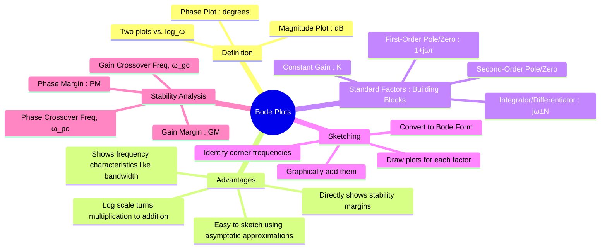

---
tags:
  - control-systems
  - frequency-response
  - bode-plots
  - graphical-method
created: 2025-10-23
aliases:
  - Bode Plot
  - Bode Diagram
  - Bode Plots (Magnitude and Phase Plots)
  - corner frequency
  - Gain Crossover Frequency
  - Phase Crossover Frequency
  - Bode form (or time-constant form)
  - time-constant decomposition
  - factored form
  - Constant Gain
subject: "[[Control Systems]]"
parent: Graphical Methods for Frequency Response
youtube:
  - qnsznGf70eU
modified: 2026-08-04T09:14:12
---
### Bode Plots (Magnitude and Phase Plots)
#control-systems/frequency-response #bode-plot

> A **Bode plot** is a graphical representation of a system's [[Frequency Response from Transfer Function|frequency response]], widely used for stability analysis and control system design. It consists of a pair of plots: a **magnitude plot** and a **phase plot**, both drawn as a function of frequency ($\omega$) on a logarithmic scale. The primary advantage of Bode plots is that complex transfer functions can be sketched quickly and accurately using straight-line (asymptotic) approximations.

> [!warning]- Bode plots are _not only_ for open-loop transfer functions
> Bode plots are simply **magnitude and phase plots of ANY transfer function**:
> - You can plot a **filter transfer function**
> - You can plot a **closed-loop transfer function**
> - You can plot an **open-loop transfer function**
> - You can plot a **network function**
> 
> ---
> In General → Bode plot of any transfer function
> In [[Control Systems]] → Bode plot of OLTF for stability

---
The two plots are:
1.  **Magnitude Plot:** The magnitude of the [[Open-Loop Transfer Function (OLTF)]] $|G(j\omega)H(j\omega)|$ in decibels (dB) *versus* frequency on a logarithmic scale. $$\boxed{ \quad\text{Magnitude in dB} = 20 \log_{10} |G(j\omega)H(j\omega)|\quad }$$
	![[Magnitude Plot of Bode Plot.png]]

2.  **Phase Plot:** The phase angle $\angle G(j\omega)H(j\omega)$ in degrees *versus* frequency on a logarithmic scale.
	![[Phase Plot of Bode Plot.png]]

> [!warning] Frequency Scale
> Logarithmic (Base 10).
> - A **Decade** is a tenfold increase in frequency (e.g., 1 to 10 rad/s).
> - An **Octave** is a doubling of frequency (e.g., 2 to 4 rad/s).

> [!important]- Octave and Decade — Bode Plot Frequency Steps
> **Octave:** A frequency interval where the frequency **doubles**  
> $$f_2 = 2f_1 \quad\Rightarrow\quad 1~\text{octave} = \log_{10}(2) \approx 0.301~\text{decades}.$$
>
> **Decade:** A frequency interval where the frequency increases by a **factor of 10**  
> $$f_2 = 10f_1 \quad\Rightarrow\quad 1~\text{decade} \approx 3.322~\text{octaves}.$$
>
> **Slope conversion (Bode magnitude):**  
> $$\pm 20~\text{dB/decade} \;\equiv\; \pm 6~\text{dB/octave}.$$

---

#### Bode Form and Building Blocks
#bode-plot/standard-form

To sketch a Bode plot, the transfer function is first put into the **Bode form (or time-constant form)**:
$$ G(s)H(s) = \frac{K_b \prod (1+s\tau_{zi})}{s^N \prod (1+s\tau_{pi}) \left(1 + \frac{2\zeta s}{\omega_n} + (\frac{s}{\omega_n})^2\right)} $$
The overall plot is a graphical summation of the plots of these individual factors. ==The frequency at which the slope of the asymptotic magnitude plot changes is called the **corner frequency**.==

> [!example]- Time Constant Form Conversion Step
> Let $$G(s) = \frac{10}{(s+2)(s+5)}$$
>
> ##### Step 1: Compute time constants
>
> $\tau_1 = \frac{1}{2},\quad \tau_2 = \frac{1}{5}$
>
> ##### Step 2: Rewrite each pole
>
> $s+2 = \frac{1}{\tau_1}(1+s\tau_1)$
> $s+5 = \frac{1}{\tau_2}(1+s\tau_2)$
>
> i.e. $$s+2 = 2(1+0.5s),\quad s+5 = 5(1+0.2s)$$
>
> ##### Step 3: Substitute
>
> $$G(s)=\frac{10}{2 \cdot 5 (1+0.5s)(1+0.2s)}$$
> $$G(s)=\frac{1}{(1+0.5s)(1+0.2s)}$$
>
> This is the **time-constant form**.
^time-constant-form-conversion

---
#### Asymptotic Bode Plots of Basic Factors
#bode-plot/building-blocks

##### 1. Constant Gain (K)
#bode-plot/constant-gain 

- **Magnitude:** A horizontal line at $20 \log_{10}(K_b)$ dB.
- **Phase:** A horizontal line at $0^\circ$ (if $K_b>0$) or $\pm 180^\circ$ (if $K_b<0$).

> [!critical] Reading "Constant Gain" from a Transfer Function
> 
> > [!pyq]- PYQ : 2014
> > ![[ee_2014(2)#^q45]]
> 
> The raw multiplier in a standard polynomial transfer function is **NOT** the constant gain term ($K_b$) for a Bode plot. You must explicitly convert the system to **[[#Bode Form and Building Blocks|Bode form (time-constant form)]]** by factoring out corner frequencies first.
> 
> > [!example]- Solution 2014 > q45
> > ![[ee_2014(2)#^q45]]
> > 
> > ---
> > $$G(s) = \frac{5(s + 4)}{s(s + 0.25)(s^2 + 4s + 25)}$$
> > Factoring out the constants:
> > $$G(s) = \frac{5 \cdot 4 \left(1 + \frac{s}{4}\right)}{s \cdot 0.25(1 + 4s) \cdot 25 \left(1 + \frac{4}{25}s + \frac{s^2}{25}\right)}$$
> > Net Constant Gain Term ($K_b$) = $\frac{5 \cdot 4}{0.25 \cdot 25} = 3.2$

---
##### 2. Integrator/Differentiator at Origin
#bode-plot/integrator-or-differentiator-at-origin 

$$\boxed{\quad s^{\pm N}\quad}$$
-   **Integrator ($1/s^N$):** For $s=j\omega$, this is $(j\omega)^{-N}$.
    -   **Magnitude:** A straight line with a slope of **-20N dB/decade**, passing through 0 dB at $\omega=1$ rad/s.
    -   **Phase:** A constant phase shift of **-90N degrees**.
-   **Differentiator ($s^N$):** For $s=j\omega$, this is $(j\omega)^{N}$.
    -   **Magnitude:** A straight line with a slope of **+20N dB/decade**, passing through 0 dB at $\omega=1$ rad/s.
    -   **Phase:** A constant phase shift of **+90N degrees**.

---
##### 3. First-Order Pole
#bode-plot/pole/first-order 

$$\boxed{\quad \frac{1}{1+s\tau}\quad}$$
-   **Corner Frequency:** $\omega_c = 1/\tau$.
-   **Magnitude:**
    -   For $\omega \ll \omega_c$: 0 dB (horizontal line).
    -   For $\omega \gg \omega_c$: A line with a slope of **-20 dB/decade**.
    -   The two asymptotes meet at the corner frequency. The actual value at $\omega_c$ is -3 dB.
-   **Phase:**
    -   Starts at $0^\circ$.
    -   Passes through **-45° at $\omega_c$**.
    -   Approaches **-90°** for high frequencies.

---
##### 4. First-Order Zero
#bode-plot/zero/first-order 

$$\boxed{\quad 1+s\tau \quad}$$
-   **Corner Frequency:** $\omega_c = 1/\tau$.
-   **Magnitude:**
    -   For $\omega \ll \omega_c$: 0 dB (horizontal line).
    -   For $\omega \gg \omega_c$: A line with a slope of **+20 dB/decade**.
    -   The actual value at $\omega_c$ is +3 dB.
-   **Phase:**
    -   Starts at $0^\circ$.
    -   Passes through **+45° at $\omega_c$**.
    -   Approaches **+90°** for high frequencies.

> [!warning]- Non-Minimum Phase (NMP) Zeros
> #bode-plot/zero/non-minimum-phase
> 
> > See [[Non-Minimum Phase Systems]]
> 
> A system with zeros in the Right-Half Plane (RHP) is called a Non-Minimum Phase system. The most common form is $\boxed{\quad 1 - s\tau \quad}$.
> 
> - **Magnitude:** Behaves exactly like a standard LHP zero. The slope increases by **+20 dB/decade** for $\omega \gg 1/\tau$.
> - **Phase:** Behaves like a **pole**. Instead of providing phase lead, it introduces a phase *lag*, starting at $0^\circ$, passing through **-45°** at $\omega_c$, and approaching **-90°** for high frequencies.
> 
> *Always check the sign of the $s$ term in the Bode form before sketching the phase plot!*
^non-minimum-phase-zero

---
##### 5. Second-Order Pole
#bode-plot/pole/second-order

$$\boxed{\quad \frac{\omega_n^2}{s^2 + 2\zeta\omega_n s + \omega_n^2}\quad}$$
-   **Corner Frequency:** $\omega_n$.
-   **Magnitude:**
    -   For $\omega \ll \omega_n$: 0 dB.
    -   For $\omega \gg \omega_n$: A line with a slope of **-40 dB/decade**.
    -   Near $\omega_n$, the response can have a resonant peak, the height of which depends on the damping ratio $\zeta$. For small $\zeta$, the peak is large.
-   **Phase:**
    -   Starts at $0^\circ$.
    -   Passes through **-90° at $\omega_n$**.
    -   Approaches **-180°** for high frequencies.

> [!info]- Resonant Frequency and Peak Magnitude
> #bode-plot/pole/second-order-resonance
> 
> For an underdamped second-order pole where $\zeta < 0.707$, the magnitude plot will exhibit a resonant peak. 
> 
> The **Resonant Frequency** ($\omega_r$) occurs slightly before the corner frequency ($\omega_n$):
> $$\omega_r = \omega_n \sqrt{1 - 2\zeta^2}$$
> 
> The actual **Resonant Peak Magnitude** ($M_r$) at this frequency is:
> $$M_r = \frac{1}{2\zeta\sqrt{1-\zeta^2}}$$
> 
> *To plot this on the Bode magnitude graph, convert $M_r$ to decibels: $20 \log_{10}(M_r)$.*
^resonant-peak-formulas

---
#### Initial Slope and System Type
#bode-plot/system-type

The behavior of the magnitude plot at low frequencies ($\omega \to 0$) is determined by the number of poles/zeros at the origin (System Type $N$).

* **Initial Slope:** $-20 \times N$ dB/decade.

| System Type ($N$) | Initial Magnitude Slope | Low-Frequency Phase Asymptote | Intersection with $0\text{ dB}$ Axis |
| :--- | :--- | :--- | :--- |
| **Type 0** ($N=0$) | $0\text{ dB/decade}$ | $0^\circ$ | N/A (Flat at $20\log_{10}(K_p)$) |
| **Type 1** ($N=1$) | $-20\text{ dB/decade}$ | $-90^\circ$ | $\omega = K_v$ |
| **Type 2** ($N=2$) | $-40\text{ dB/decade}$ | $-180^\circ$ | $\omega = \sqrt{K_a}$ |

* **Intersection with $\omega = 1$:** The extension of the initial slope line intersects the 0 dB axis at $\omega = K^{1/N}$ (for Type $\ge 1$). For Type 0, the height is $20\log K_p$.

> [!tip] Quick-Reading Shortcut for Type 1 Systems
> For a Type 1 system ($N=1$), the low-frequency asymptote has a slope of $-20\text{ dB/decade}$. 
> - The value of the line at $\omega = 1\text{ rad/s}$ is exactly equal to $20\log_{10}(K_v)$.
> - The point where this initial $-20\text{ dB/decade}$ line (or its extension) crosses the $0\text{ dB}$ axis occurs exactly at $\omega = K_v$.

---
### Related Concepts
#control-systems/related-concepts

> [[Procedure for Drawing Bode Plots]]
> [[Transfer Function from Bode Plot]]
> [[Stability Analysis from Bode Plots]]

[[Frequency Response from Transfer Function]]
[[Gain Margin (GM)]]
[[Phase Margin (PM)]]
[[Polar Plots]]
[[Nyquist Plots]]
[[Time Delay Systems]]
[[DC Gain]]
[[Correlation between Time and Frequency Response]]
