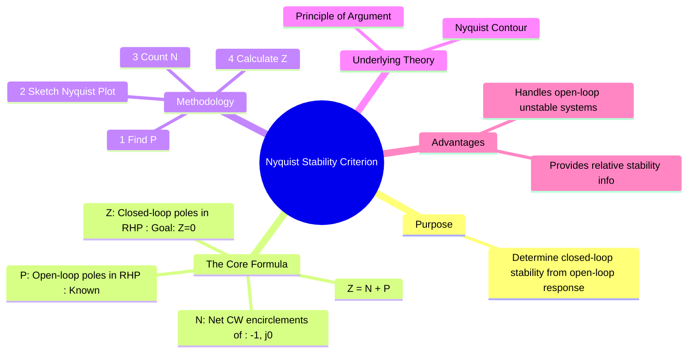

---
tags:
  - control-systems
  - frequency-response
  - nyquist-criterion
  - stability-analysis
  - graphical-method
created: 2025-10-27
aliases:
  - Nyquist Criterion
  - Nyquist Test
  - How to apply Nyquist Stability Criterion?
subject: "[[Control Systems]]"
parent: Graphical Methods for Frequency Response
youtube:
  - sof3meN96MA
  - tsgOstfoNhk
  - Rbvau5oXOkg
formula:
  - "Nyquist Stability Formula : $$Z = N + P$$"
  - "Nyquist Stability Criterion (for Stable) : $$Z = 0$$"
  - "Nyquist Stability Criterion (for unstable) : $$Z > 0$$"
modified: 2026-08-04T10:09:09
---
### Nyquist Stability Criterion
#control-systems/stability #nyquist-criterion

> ==The **Nyquist Stability Criterion** is a graphical method that determines the stability of a closed-loop system by analyzing the [[Nyquist Plots|Nyquist plot]] of its [[Open-Loop Transfer Function (OLTF)|open-loop transfer function]], $G(s)H(s)$.== It provides a definitive test for absolute stability and can also be used to determine relative stability. Its power lies in its ability to handle systems that are open-loop unstable and systems with time delays.

![[Control System Repeated Generic Notes#^time-constant-form-conversion]]

---
#### The Nyquist Stability Formula
#nyquist-criterion/formula

The criterion is based on the [[principle of argument]] and relates the number of open-loop poles in the Right-Half Plane (RHP) to the number of encirclements of a critical point. The formula is:
$$\boxed{\quad Z = N + P \quad}$$
Where:
- ==**Z** = The number of **zeros** of the [[characteristic equation]] ($1+G(s)H(s)=0$) in the RHP. This is equivalent to the number of **[[closed-loop poles]] in the RHP**.==

> [!memory] Stable System
> ==For the system to be stable, $Z$ must be equal to 0.==
> $$Z=0$$

- ==**N** = The number of **net clockwise (CW) encirclements** of the **critical point** $(-1, j0)$ by the [[Nyquist Plots|nyquist plot]] of $G(s)H(s)$.==
    - ==Clockwise encirclements are counted as positive.==
    - ==Counter-clockwise (CCW) encirclements are counted as negative.==

- ==**P** = The number of **poles** of the **[[Open-Loop Transfer Function (OLTF)|open-loop transfer function]]**, $G(s)H(s)$, that are in the **RHP**.==
    - This value is determined by inspecting the open-loop transfer function *before* sketching the plot.

> [!important] Important Notes on Modified Contour
> ==While $P$ is usually the number of poles in the Right-Half Plane (RHP), it more accurately represents the number of open-loop poles **enclosed by the chosen Nyquist contour**.==
> 
> If the contour is modified to *scoop* poles on the imaginary axis (like $s = 0$) into the shaded region, those poles must be included in the count for $P$ as clearly stated in [[principle of argument]].

> [!pyq]- PYQ : GATE EE 2020
> ![[ee_2020#^q24]]

---
#### Procedure for Applying the Criterion
#nyquist-criterion/procedure

1. **Determine P:** Find the number of poles of the open-loop transfer function $G(s)H(s)$ that have a positive real part.
2. **Sketch the Nyquist Plot:** Draw the complete Nyquist plot by [[Mapping of Contours|mapping]] the Nyquist contour from the $s$-plane to the $G(s)H(s)$-plane.
3. **Count N:** Count the net number of clockwise encirclements of the critical point $(-1, j0)$. A simple way is to draw a vector from $(-1, j0)$ to a point on the plot and observe its net rotation as the point traverses the entire contour.
4. **Calculate Z:** Use the formula $Z = N + P$.
5. **Determine Stability:**
    - If **Z = 0**, the closed-loop system is **stable**.
    - If **Z > 0**, the closed-loop system is **unstable**, and Z gives the number of unstable closed-loop poles.

---
#### Simplified Case: Open-Loop Stable Systems
#nyquist-criterion/simplified

A very common scenario is when the open-loop system is stable itself.
- If the [[Open-Loop Transfer Function (OLTF)|open-loop transfer function]] $G(s)H(s)$ has **no poles in the RHP**, then **P = 0**.
- In this case, the Nyquist criterion simplifies to: $$Z = N$$
- **Stability Condition for P=0:** For the closed-loop system to be stable, we need $Z=0$, which means **N must be 0**.

> [!memory]
> If $P=0$, the system is stable if and only if the Nyquist plot does NOT encircle the $(-1, j0)$ point.

---
#### How It Works: The Principle of Argument
#principle-of-argument

The criterion is a clever application of the [[principle of argument]] from complex analysis, which states that [[Mapping of Contours|mapping]] a closed contour from one plane to another results in a plot whose encirclements of the origin are given by $N_{origin} = Z_F - P_F$.
-  We choose our function to be $F(s) = 1 + G(s)H(s)$.
-  The **Zeros** of $F(s)$ are the **closed-loop poles**.
-  The **Poles** of $F(s)$ are the **open-loop poles**.
-  The Nyquist contour in the s-plane is chosen to enclose the entire RHP.
-  Therefore, $Z_F$ becomes the number of closed-loop poles in the RHP (our $Z$), and $P_F$ becomes the number of open-loop poles in the RHP (our $P$).
-  Instead of plotting $1+G(s)H(s)$ and counting encirclements of the origin, we plot just $G(s)H(s)$ and count encirclements of the **critical point** $(-1, j0)$, which yields the same result for $N$.

---
### Related Concepts
#control-systems/related-concepts

> [[Nyquist Plots]]

[[Principle of Argument]]
[[Polar Plots]]
[[Gain Margin (GM)]]
[[Phase Margin (PM)]]
[[Time Delay Systems]]
[[Routh-Hurwitz Stability Criterion]]
[[Relative Stability Analysis]]
[[Contour Integration]]
[[Mapping of Contours]]
[[Closed-Loop Poles]]
[[Poles and Zeros of a Transfer Function]]