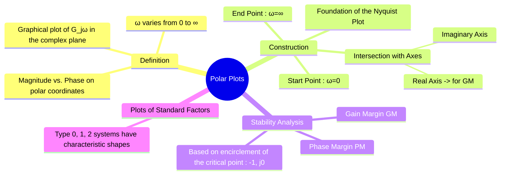

---
tags:
  - control-systems
  - frequency-response
  - polar-plots
  - graphical-method
  - nyquist-plots
created: 2025-10-25
aliases:
  - Polar Plot
  - Nyquist Plot (Partial)
subject: "[[Control Systems]]"
parent: Graphical Methods for Frequency Response
youtube:
  - xWw7z5QzYgE
modified: 2026-08-04T10:14:23
---
### Polar Plots
#control-systems/frequency-response #polar-plot

> A **Polar Plot** is a graphical representation of the [[Frequency Response from Transfer Function|frequency response]] of a system, plotted on the complex plane. It is the locus of the tip of the phasor representing the [[Open-Loop Transfer Function (OLTF)|open-loop transfer function]] $G(j\omega)$ as the frequency $\omega$ is varied from 0 to $\infty$. The plot uses polar coordinates, where the radial distance from the origin is the magnitude $|G(j\omega)|$ and the angle from the positive real axis is the phase $\angle G(j\omega)$.

The polar plot is the foundation for constructing the more comprehensive [[Nyquist Plots]].

---
#### Procedure for Sketching a Polar Plot
#polar-plot/construction

1.  **Obtain the Frequency Response Function:** Substitute $s=j\omega$ into the [[Open-Loop Transfer Function (OLTF)|open-loop transfer function]] $G(s)H(s)$.
2.  **Find the Starting Point ($\omega=0$):** Calculate the magnitude and phase of $G(j\omega)$ as $\omega \to 0$. This is where the plot begins.
3.  **Find the Ending Point ($\omega=\infty$):** Calculate the magnitude and phase of $G(j\omega)$ as $\omega \to \infty$. This is where the plot terminates (usually at the origin).
4.  **Find Intersections with Axes:**
    -   **Real Axis Intersection:** Find the frequency $\omega$ for which the imaginary part of $G(j\omega)$ is zero. $\text{Im}[G(j\omega)] = 0$. The value of $\text{Re}[G(j\omega)]$ at this frequency gives the intersection point.
    -   **Imaginary Axis Intersection:** Find the frequency $\omega$ for which the real part of $G(j\omega)$ is zero. $\text{Re}[G(j\omega)] = 0$.
5.  **Determine Asymptotes:** Determine the phase angle as $\omega \to \infty$ to find the tangent at the origin.

---
#### Polar Plots for Standard Systems
#polar-plot/standard-forms

The general shape of the polar plot is determined by the **system type (N)** and the **order (P)**.
-   The starting point ($\omega=0$) depends on the system type.
-   The ending point ($\omega=\infty$) depends on the number of poles and zeros ($P-Z$).

**1. First-Order System ($G(s) = \frac{1}{1+s\tau}$)**
-   Starts at $1\angle 0^\circ$ (for $\omega=0$).
-   Ends at $0\angle -90^\circ$ (for $\omega=\infty$).
-   The plot is a semicircle in the fourth quadrant.

**2. Second-Order System ($G(s) = \frac{\omega_n^2}{s^2+2\zeta\omega_n s+\omega_n^2}$)**
-   Starts at $1\angle 0^\circ$.
-   Ends at $0\angle -180^\circ$.
-   The plot starts on the positive real axis and terminates at the origin along the negative real axis, sweeping through the fourth and third quadrants.

**3. Type 1 System (e.g., $G(s) = \frac{K}{s(1+s\tau)}$)**
-   At $\omega \to 0$, magnitude is $\infty$ and phase is $-90^\circ$. The plot starts from infinity along the negative imaginary axis.
-   At $\omega \to \infty$, magnitude is $0$ and phase is $-180^\circ$.
-   The plot is a curve from $-j\infty$ that terminates at the origin along the negative real axis.

---
#### Stability from the Polar Plot
#polar-plot/stability-analysis

Relative stability can be determined by examining the plot's proximity to the **critical point $(-1+j0)$**.

-   **Gain Crossover Frequency ($\omega_{gc}$):** The frequency at which the plot intersects a circle of radius 1 centered at the origin. $|G(j\omega_{gc})| = 1$.
-   **Phase Crossover Frequency ($\omega_{pc}$):** The frequency at which the plot intersects the negative real axis. $\angle G(j\omega_{pc}) = -180^\circ$.

-   **Gain Margin (GM):** Let the plot intersect the negative real axis at point $(-x, 0)$.
    $$\boxed{\quad GM = \frac{1}{x} \quad}$$
    In dB, $GM = -20\log_{10}(x)$. A stable system has its intersection point between 0 and -1, so $x<1$ and $GM > 1$.

-   **Phase Margin (PM):** The angle between the negative real axis and the vector to the point where the plot crosses the unit circle.
    $$\boxed{\quad PM = 180^\circ + \angle G(j\omega_{gc}) \quad}$$
    A stable system has a positive phase margin.

---
### Related Concepts
#control-systems/related-concepts

> [[Nyquist Plots]]

[[Bode Plots]]
[[Frequency Response from Transfer Function]]
[[Gain Margin (GM)]]
[[Phase Margin (PM)]]
[[Nyquist Stability Criterion]]