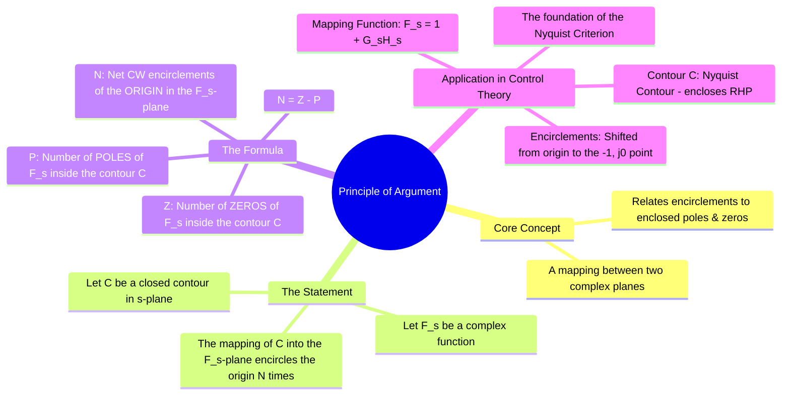

---
tags:
  - control-systems
  - stability-analysis
  - nyquist-criterion
  - complex-analysis
  - mathematics
created: 2025-10-28
aliases:
  - Cauchy's Argument Principle
  - Argument Principle
subject: "[[Control Systems]]"
parent: "[[Nyquist Plots]]"
formula:
  - "Principle of Argument : $$N = Z - P$$"
modified: 2026-07-16
---
### Principle of Argument
#complex-analysis #nyquist-criterion #mathematics

> The **Principle of Argument**, also known as Cauchy's Argument Principle, is a fundamental theorem from complex analysis that forms the mathematical basis for the [[Nyquist Stability Criterion]]. It provides a powerful link between the number of poles and zeros of a complex function inside a closed contour and the number of times the [[Mapping of Contours|mapping]] of that contour encircles the origin.

---
#### The Mathematical Statement
#argument-principle/statement

Let $F(s)$ be a [[meromorphic function]] (analytic except for a finite number of poles) inside and on a simple closed contour $C$ in the $s$-plane. Assume that $F(s)$ has no poles or zeros on the contour $C$ itself.

As a point $s$ travels once clockwise around the contour $C$, the corresponding point $F(s)$ will travel along a new closed contour, $C_F$, in the complex $F(s)$-plane.

The **Principle of Argument** states that the number of times the mapped contour $C_F$ encircles the origin in the clockwise direction is equal to the number of zeros of $F(s)$ minus the number of poles of $F(s)$ enclosed by the original contour $C$.

$$\boxed{\quad N = Z - P \quad}$$
Where:
-   **$N$**: The number of **net clockwise (CW) encirclements** of the origin in the $F(s)$-plane. (Counter-clockwise encirclements are counted as negative).
-   **$Z$**: The number of **zeros** of the function $F(s)$ that lie inside the contour $C$.
-   **$P$**: The number of **poles** of the function $F(s)$ that lie inside the contour $C$.

---
#### Application to the Nyquist Criterion
#argument-principle/nyquist-application

The Nyquist criterion is a direct and ingenious application of this principle to determine the stability of a closed-loop system.

1.  **Choosing the Contour ($C$):** We choose the [[Nyquist Plots|Nyquist Contour]] in the $s$-plane. This contour is specifically designed to enclose the **entire Right-Half Plane (RHP)**, which is the region of instability.

2.  **Choosing the Function ($F(s)$):** We are interested in the locations of the **closed-loop poles**. The closed-loop poles are the roots of the characteristic equation, $1 + G(s)H(s) = 0$. Therefore, we choose our mapping function to be:
    $$F(s) = 1 + G(s)H(s)$$

3.  **Identifying Z and P:**
    -   The **zeros** of our chosen $F(s)$ are the values of $s$ that make $1+G(s)H(s)=0$. These are the **closed-loop poles**. So, **Z** in the formula becomes the number of closed-loop poles in the RHP.
    -   The **poles** of our chosen $F(s)$ are the same as the poles of the [[Open-Loop Transfer Function (OLTF)|open-loop transfer function]] $G(s)H(s)$ (since the '1' does not add any poles). So, **P** in the formula becomes the number of open-loop poles in the RHP.

4.  **Shifting the Reference Point:**
    The formula $N = Z - P$ requires us to plot $F(s) = 1 + G(s)H(s)$ and count encirclements of the origin. It is much easier to work with the open-loop function $G(s)H(s)$ directly.
    -   The condition $1 + G(s)H(s) = 0$ is the same as $G(s)H(s) = -1$.
    -   Therefore, an encirclement of the origin by the plot of $1+G(s)H(s)$ is equivalent to an encirclement of the **critical point** $(-1, j0)$ by the plot of $G(s)H(s)$.

5.  **The Final Criterion:**
    By making this shift, the Principle of Argument is transformed directly into the Nyquist Stability Criterion:
    $$\boxed{\quad Z = N + P \quad}$$
    Where:
    -   $Z$ = Number of closed-loop poles in the RHP (must be 0 for stability).
    -   $N$ = Net CW encirclements of the $(-1, j0)$ point by the plot of $G(s)H(s)$.
    -   $P$ = Number of open-loop poles in the RHP.

---
### Related Concepts
#control-systems/related-concepts

> [[Nyquist Stability Criterion]]

[[Nyquist Plots]]