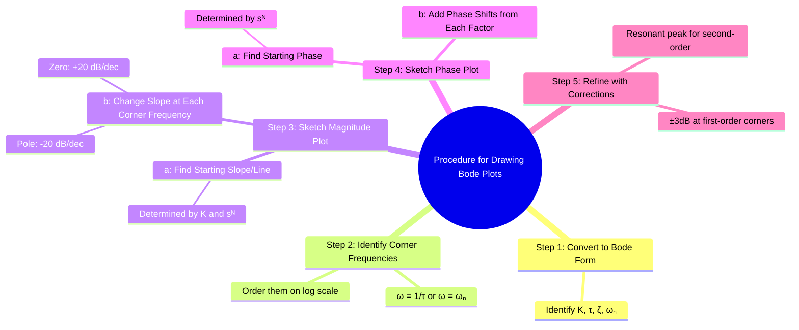

---
tags:
  - control-systems
  - frequency-response
  - bode-plots
  - graphical-method
  - procedure
created: 2025-10-24
aliases:
  - How to draw Bode plots?
  - Bode Plot Sketching
  - Asymptotic Bode Plot Construction
  - "Example : Procedure for Drawing Bode Plots"
subject: "[[Control Systems]]"
parent: "[[Bode Plots]]"
modified: 2026-08-04T10:17:59
---
### Procedure for Drawing Bode Plots
#control-systems/bode-plot #procedure

> This procedure outlines the systematic steps for sketching the asymptotic (straight-line approximation) Bode plot for a given [[Open-Loop Transfer Function (OLTF)|open-loop transfer function]], $G(s)H(s)$. The core idea is to break the transfer function into its basic factors, draw the plot for each, and then graphically add them together.

---
#### Step 1: Convert the Transfer Function to Bode Form
#bode-plot/standard-form

Rewrite the transfer function into the standard time-constant form (Bode Form). This step is crucial for identifying the corner frequencies and the correct gain.
$$\boxed{\quad G(s)H(s) = \frac{K (1+s\tau_{z1})(1+s\tau_{z2})\cdots}{s^N (1+s\tau_{p1})(1+s\tau_{p2})\cdots} \quad}$$
-   **$K$** is the **Bode Gain** or DC gain after factoring out constants.
-   **$s^N$** represents the $N$ poles or zeros at the origin (integrators/differentiators).
-   **$(1+s\tau)$** are the first-order factors.

![[Bode Plots#^time-constant-form-conversion]]

**Example:** For $G(s) = \frac{20(s+1)}{s(s+10)}$, the Bode form is:
$$G(s) = \frac{20 \cdot 1(1+s)}{s \cdot 10(1+s/10)} = \frac{2(1+s)}{s(1+0.1s)}$$
Here, the Bode Gain is $K=2$, we have one integrator ($N=1$), a zero at $s=-1$, and a pole at $s=-10$.

#### Step 2: Identify and List the Corner Frequencies
#corner-frequency

Corner frequencies are the points where the slope of the asymptotic magnitude plot changes.
-   For a first-order factor $(1+s\tau)$, the corner frequency is $\omega_c = 1/\tau$.
-   For a second-order factor, the corner frequency is the natural frequency $\omega_n$.

**Example (cont.):**
-   Zero at $s=-1$: $\tau_z = 1 \implies \omega_{c1} = 1/1 = 1$ rad/s.
-   Pole at $s=-10$: $\tau_p = 0.1 \implies \omega_{c2} = 1/0.1 = 10$ rad/s.

#### Step 3: Sketch the Asymptotic Magnitude Plot
#bode-plot/magnitude-plot

1.  **Starting Point (Low Frequency):** The initial part of the plot is determined by the Bode Gain $K$ and the poles/zeros at the origin, $s^N$. The initial slope is **$-20N$ dB/decade**. This line passes through the point **$20\log_{10}(K)$ dB** at $\omega = 1$ rad/s.
    -   **Example (cont.):** $K=2, N=1$. The initial slope is -20 dB/decade. The line passes through $20\log_{10}(2) \approx 6$ dB at $\omega=1$.

2.  **Change Slopes at Corner Frequencies:** Proceed from left to right along the frequency axis. At each corner frequency, adjust the slope of the line:
    -   At a **pole's** corner frequency, **add -20 dB/decade** to the slope.
    -   At a **zero's** corner frequency, **add +20 dB/decade** to the slope.
    -   For a complex pole pair, add -40 dB/decade; for a complex zero pair, add +40 dB/decade.
    -   **Example (cont.):**
        -   **Start:** Slope = -20 dB/dec.
        -   **At $\omega_c=1$ (zero):** New slope = $(-20) + (+20) = 0$ dB/dec.
        -   **At $\omega_c=10$ (pole):** New slope = $(0) + (-20) = -20$ dB/dec.

#### Step 4: Sketch the Phase Plot
#bode-plot/phase-plot

1.  **Starting Point:** The initial phase at low frequencies is determined by the term $s^N$ at the origin and the sign of $K$. The phase is **$-90^\circ \times N$**. (If $K$ is negative, add/subtract $180^\circ$).
    -   **Example (cont.):** $N=1, K>0$. The initial phase is $-90^\circ$.

2.  **Add Phase Contributions:** Each factor contributes to the total phase shift.
    -   **First-order pole:** Adds a phase shift from $0^\circ$ to $-90^\circ$, centered at its corner frequency (it's $-45^\circ$ at $\omega_c$).
    -   **First-order zero:** Adds a phase shift from $0^\circ$ to $+90^\circ$, centered at its corner frequency (it's $+45^\circ$ at $\omega_c$).
    -   **Second-order pole:** Adds a phase shift from $0^\circ$ to $-180^\circ$.
    -   The total phase at any frequency is the sum of the contributions from all factors.

#### Step 5: Refine the Plot with Corrections (Optional but Recommended)
The asymptotic plot is an approximation. For a more accurate sketch:
-   **Magnitude Correction:**
    -   At a first-order pole corner frequency, the actual curve is **-3 dB** below the asymptote.
    -   At a first-order zero corner frequency, the actual curve is **+3 dB** above the asymptote.
    -   For second-order poles, the correction depends on $\zeta$. For $\zeta < 0.707$, there will be a resonant peak.
-   **Phase Correction:** The phase transition is a smooth curve, not a step change. The primary change occurs over the two-decade range from $0.1\omega_c$ to $10\omega_c$.

---
### Related Concepts
#control-systems/related-concepts

> [[Bode Plots]]

[[Gain Margin (GM)]]
[[Phase Margin (PM)]]
[[Frequency Response from Transfer Function]]
[[Nyquist Plots]]
[[Polar Plots]]
[[DC Gain]]