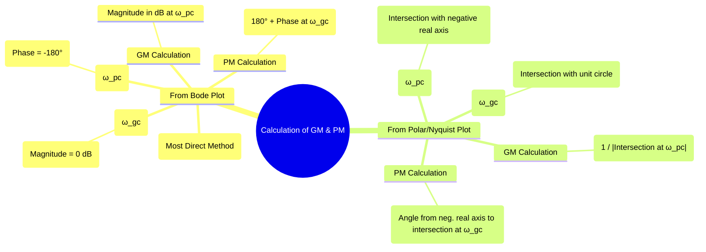

---
tags:
  - control-systems
  - frequency-response
  - stability-margins
  - gain-margin
  - phase-margin
  - bode-plots
  - nyquist-plots
  - polar-plots
created: 2025-10-31
aliases:
  - GM and PM Calculation
  - Finding Stability Margins from Plots
subject: "[[Control Systems]]"
parent:
  - Stability Margins
modified: 2026-08-04T09:15:36
---
### Calculation of GM and PM from Bode, Polar, and Nyquist Plots
#control-systems/stability-margins #bode-plot #nyquist-plot #polar-plot

> The [[Gain Margin (GM)]] and [[Phase Margin (PM)]] are crucial metrics for [[Relative Stability Analysis|relative stability]]. They can be determined graphically from any of the standard frequency response plots: [[Bode Plots|Bode]], [[Polar Plots|Polar]], or [[Nyquist Plots|Nyquist]]. The Bode plot is often the most straightforward for reading these values directly.

---
#### Definitions Recap
-   **Phase Crossover Frequency ($\omega_{pc}$):** The frequency at which the phase angle of the [[Open-Loop Transfer Function (OLTF)|open-loop transfer function]] is $-180^\circ$.
    $$ \angle G(j\omega_{pc})H(j\omega_{pc}) = -180^\circ $$
-   **Gain Crossover Frequency ($\omega_{gc}$):** The frequency at which the magnitude of the open-loop transfer function is 1 (or 0 dB).
    $$ |G(j\omega_{gc})H(j\omega_{gc})| = 1 $$

---
#### 1. From [[Bode Plots]]
#bode-plot/gm-pm-calculation

This is the most common and direct method. The two plots (magnitude and phase) are analyzed together.
##### To Find [[Gain Margin (GM)]]
1. **Find $\omega_{pc}$:** On the **phase plot**, find the frequency where the phase curve crosses the **-180° line**. This is $\omega_{pc}$.
2. **Find Magnitude at $\omega_{pc}$:** Move vertically from this frequency up to the **magnitude plot**. Read the magnitude in dB at this point. Let's call it $M_{dB}$.
3. **Calculate GM:** The Gain Margin in dB is the negative of this value.
    $$\boxed{\quad GM_{dB} = -M_{dB} \quad}$$
    If the magnitude plot is below 0 dB at $\omega_{pc}$, the GM is positive, and the system is stable.
##### To Find [[Phase Margin (PM)]]
1.  **Find $\omega_{gc}$:** On the **magnitude plot**, find the frequency where the magnitude curve crosses the **0 dB line**. This is $\omega_{gc}$.
2.  **Find Phase at $\omega_{gc}$:** Move vertically from this frequency down to the **phase plot**. Read the phase angle in degrees. Let's call it $\phi_{gc}$.
3.  **Calculate PM:** The Phase Margin is the difference between this phase and -180°.
    $$\boxed{\quad PM = 180^\circ + \phi_{gc} \quad}$$
    If the phase curve is above -180° at $\omega_{gc}$, the PM is positive, and the system is stable.

**Stability Rule:** For most systems, stability requires **$\omega_{gc} < \omega_{pc}$**.

---
#### 2. From [[Polar Plots|Polar]] and [[Nyquist Plots]]
#polar-plot/gm-pm-calculation #nyquist-plot/gm-pm-calculation

The method for Polar and Nyquist plots is identical, as the Polar plot is the main component of the Nyquist plot for positive frequencies.
##### To Find [[Gain Margin (GM)]]
1. **Find Intersection:** Identify the point where the plot intersects the **negative real axis**. The frequency at this point is $\omega_{pc}$.
2. **Measure Magnitude:** Let the intersection point be $(-x, 0)$. The magnitude at this frequency is $x$.
3. **Calculate GM:** The Gain Margin is the reciprocal of this magnitude.
    $$\boxed{\quad GM = \frac{1}{x} \quad}$$
    If the plot intersects the negative real axis between -1 and the origin, then $x<1$ and $GM>1$ (stable).

##### To Find [[Phase Margin (PM)]]
1.  **Find Intersection:** Identify the point where the plot intersects the **unit circle** (a circle of radius 1 centered at the origin). The frequency at this point is $\omega_{gc}$.
2.  **Measure Angle:** Draw a line from the origin to this intersection point. The phase angle of this point is $\phi_{gc}$.
3.  **Calculate PM:** The Phase Margin is the angle measured counter-clockwise from the negative real axis to this line.
    $$\boxed{\quad PM = 180^\circ + \phi_{gc} \quad}$$
    If the unit circle intersection occurs in the second quadrant, the PM is positive (stable).

---
### Related Concepts
#control-systems/related-concepts

> [[Gain Margin (GM)]]

[[Phase Margin (PM)]]
[[Bode Plots]]
[[Polar Plots]]
[[Nyquist Plots]]
[[Nyquist Stability Criterion]]
[[Relative Stability Analysis]]