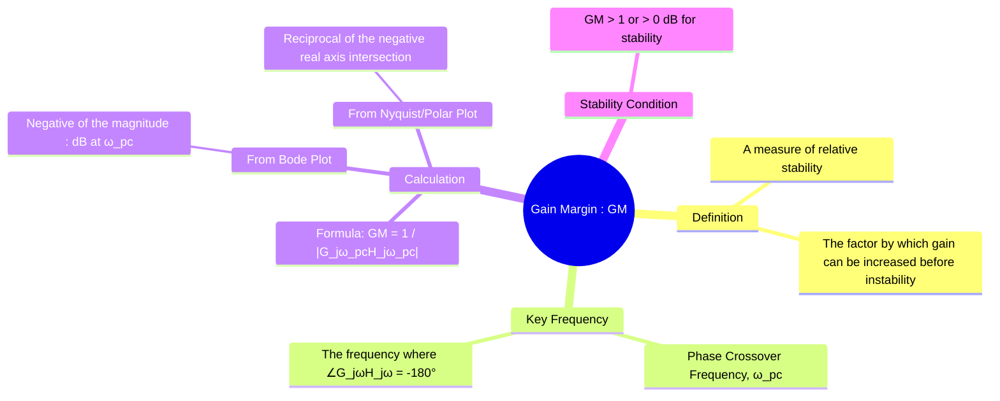

---
tags:
  - control-systems
  - frequency-response
  - stability-analysis
  - stability-margins
  - gain-margin
  - relative-stability
created: 2025-10-29
aliases:
  - GM
  - Gain Margin
  - Phase Crossover Frequency
subject: "[[Control Systems]]"
parent:
  - Stability Margins
formula:
  - "Gain Margin (GM) (from Bode Plot) : $$GM_{dB} = -M_{dB} = - (20 \\log_{10} |G(j\\omega_{pc})H(j\\omega_{pc})|)$$"
  - "Gain Margin (GM) (from Nyquist/Polar Plot) : $$GM = \\frac{1}{x}$$"
  - "Gain Margin (GM) (fundamental formula) : $$GM = \\frac{1}{M_{pc}} = \\frac{1}{|G(j\\omega_{pc})H(j\\omega_{pc})|}$$"
define:
  - "Phase Crossover Frequency : The phase crossover frequency is the frequency at which the phase angle of the open-loop transfer function, $\\angle G(j\\omega)H(j\\omega)$, is exactly $-180^\\circ$."
modified: 2026-08-04T09:45:10
---
### Gain Margin (GM)
#control-systems/stability #gain-margin

> The **Gain Margin (GM)** is a key metric of [[Relative Stability Analysis|relative stability]] that quantifies how much the open-loop gain of a system can be increased before the closed-loop system becomes unstable. It provides a safety margin against gain variations and is a measure of the system's robustness.

![[Gain Margin (GM).png]]

---
#### Phase Crossover Frequency
#phase-crossover-frequency

To define the Gain Margin, we must first identify a specific frequency: the **phase crossover frequency ($\omega_{pc}$)**.

> [!success] Definition
> The phase crossover frequency is the frequency at which the phase angle of the [[Open-Loop Transfer Function (OLTF)|open-loop transfer function]], $\angle G(j\omega)H(j\omega)$, is exactly $-180^\circ$.

- **Significance:** At this frequency, the system's output is perfectly out of phase with its input, creating the potential for positive feedback and instability if the gain is high enough.

---
#### Calculating the Gain Margin
#gain-margin/calculation

The Gain Margin is calculated at the phase crossover frequency, $\omega_{pc}$.

- **Fundamental Formula:** If the magnitude of the [[Open-Loop Transfer Function (OLTF)|open-loop transfer function]] at $\omega_{pc}$ is $M_{pc} = |G(j\omega_{pc})H(j\omega_{pc})|$, then the Gain Margin is:
    $$\boxed{\quad GM = \frac{1}{M_{pc}} = \frac{1}{|G(j\omega_{pc})H(j\omega_{pc})|} \quad}$$

##### 1. From the [[Bode Plots|Bode Plot]]
#gain-margin/calculation/from/bode-plot 

1. Locate the frequency on the phase plot where the phase angle crosses the **$-180^\circ$ line**. This is $\omega_{pc}$.
2. At this same frequency, go to the magnitude plot and read the magnitude in dB. Let this be $M_{dB}$.
3. The Gain Margin in dB is the negative of this value.
    $$\boxed{\quad GM_{dB} = -M_{dB} = - (20 \log_{10} |G(j\omega_{pc})H(j\omega_{pc})|) \quad}$$
    Graphically, it is the vertical distance from the magnitude curve up to the 0 dB line at $\omega_{pc}$.

##### 2. From the [[Nyquist Plots|Nyquist]] or [[Polar Plots|Polar Plot]]
#gain-margin/calculation/from/nyqust-plot #gain-margin/calculation/from/polar-plot 

1. Locate the point where the Nyquist plot intersects the **negative real axis**. The frequency at this point is $\omega_{pc}$.
2. Let the intersection point be $(-x, 0)$, where $x$ is the magnitude at this frequency.
3. The Gain Margin is the reciprocal of this magnitude.
    $$\boxed{\quad GM = \frac{1}{x} \quad}$$

---
#### Interpretation and Stability Condition
#gain-margin/interpretation

The value of the Gain Margin tells us about the stability of the closed-loop system:
- **If $GM > 1$ (or $GM_{dB} > 0$):** The system is **stable**. The gain at the phase crossover frequency is less than 1, so there is a "margin" before instability.
- **If $GM = 1$ (or $GM_{dB} = 0$):** The system is **marginally stable**. The Nyquist plot passes through the critical point $(-1, j0)$.
- **If $GM < 1$ (or $GM_{dB} < 0$):** The system is **unstable**. The gain at the phase crossover frequency is already greater than 1.

For good performance, a typical design target for Gain Margin is between 3 and 10 (or 10 to 20 dB).

---
### Related Concepts
#control-systems/related-concepts

> [[Phase Margin (PM)]]

[[Calculation of GM and PM from Bode, Polar, and Nyquist Plots]]
[[Relative Stability Analysis]]
[[Time Delay Systems]]
[[Bode Plots]]
[[Nyquist Plots]]
[[Polar Plots]]
[[Nyquist Stability Criterion]]