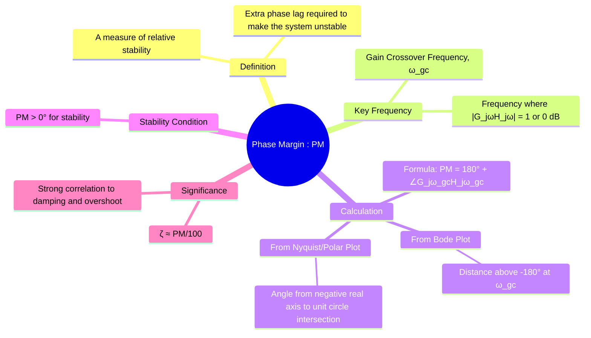

---
tags:
  - control-systems
  - frequency-response
  - stability-analysis
  - stability-margins
  - phase-margin
  - relative-stability
created: 2025-10-30
aliases:
  - PM
  - Phase Margin
  - Gain Crossover Frequency
subject: "[[Control Systems]]"
parent:
  - Stability Margins
formula:
  - "Phase Margin (PM) (fundamental formula) 🌟 : $$PM = 180^\\circ + \\phi_{gc} = 180^\\circ + \\angle G(j\\omega_{gc})H(j\\omega_{gc})$$"
  - "Relationship between Damping Ratio and Phase Margin (standard second-order system) : $$\\zeta \\approx \\frac{PM \\text{ (in degrees)}}{100}$$"
define:
  - "Gain Crossover Frequency : The gain crossover frequency is the frequency at which the magnitude of the open-loop transfer function, $|G(j\\omega)H(j\\omega)|$, is exactly **1 (or 0 dB)**."
modified: 2026-08-04T10:10:52
---
### Phase Margin (PM)
#control-systems/stability #phase-margin

> The **Phase Margin (PM)** is a critical metric of [[Relative Stability Analysis|relative stability]] that indicates how close a system is to instability due to phase lag. It is defined as the additional phase lag that can be introduced into the open-loop system at the gain crossover frequency before the closed-loop system becomes marginally stable. A larger phase margin implies a more robust and better-damped system.

![[Phase Margin (PM).png]]

---
#### Gain Crossover Frequency
#gain-crossover-frequency

To define the Phase Margin, we must first identify the **gain crossover frequency ($\omega_{gc}$)**.

> [!success] Definition
> The gain crossover frequency is the frequency at which the magnitude of the [[Open-Loop Transfer Function (OLTF)|open-loop transfer function]], $|G(j\omega)H(j\omega)|$, is exactly **1 (or 0 dB)**.

- **Significance:** This is the frequency where a phase shift of -180° would cause the Nyquist plot to pass through the critical $(-1, j0)$ point, leading to instability. The phase margin quantifies how far the phase is from this critical value.

---
#### Calculating the Phase Margin
#phase-margin/calculation

The Phase Margin is calculated at the gain crossover frequency, $\omega_{gc}$.

-   **Fundamental Formula:** If the phase angle of the [[Open-Loop Transfer Function (OLTF)|open-loop transfer function]] at $\omega_{gc}$ is $\phi_{gc} = \angle G(j\omega_{gc})H(j\omega_{gc})$, then the Phase Margin is:
    $$\boxed{\quad PM = 180^\circ + \phi_{gc} = 180^\circ + \angle G(j\omega_{gc})H(j\omega_{gc}) \quad}$$
    Since $\phi_{gc}$ is almost always negative, this formula gives the "margin" or distance (in degrees) above the -180° line.

##### 1. From the Bode Plot
#phase-margin/calculation/from/bode-plot 

1.  Locate the frequency on the magnitude plot where the gain crosses the **0 dB line**. This is $\omega_{gc}$.
2.  At this same frequency, go down to the phase plot and read the phase angle, $\phi_{gc}$.
3.  Calculate the Phase Margin using the formula. Graphically, it is the vertical distance from the phase curve **up to the -180° line** at the frequency $\omega_{gc}$.

##### 2. From the Nyquist or Polar Plot
#phase-margin/calculation/from/nyquist-plot #phase-margin/calculation/from/polar-plot

1.  Locate the point where the Nyquist plot intersects the **unit circle** (a circle of radius 1 centered at the origin). The frequency at this point is $\omega_{gc}$.
2.  Draw a vector from the origin to this intersection point.
3.  The Phase Margin is the angle between the **negative real axis** and this vector, measured in the counter-clockwise direction.

---
#### Interpretation and Stability Condition
#phase-margin/interpretation

The value of the Phase Margin is a direct indicator of stability and performance:
-   **If $PM > 0^\circ$:** The system is **stable**.
-   **If $PM = 0^\circ$:** The system is **marginally stable**.
-   **If $PM < 0^\circ$:** The system is **unstable**.

For good performance, a typical design target for Phase Margin is between **30° and 60°**.

---
#### Relationship with Damping Ratio and Transient Response
#phase-margin/transient-response

The Phase Margin is an excellent predictor of the system's transient response, especially the peak overshoot ($M_p$). This is because PM is strongly correlated with the **damping ratio ($\zeta$)** of the dominant closed-loop poles.
-   **Rule-of-Thumb Approximation:** For a standard second-order system (and as a good estimate for many other systems), the relationship is:
    $$\boxed{\quad \zeta \approx \frac{PM \text{ (in degrees)}}{100} \quad}$$
-   **Implication:** A higher Phase Margin leads to a higher effective damping ratio, which results in a **lower peak overshoot** and a more stable, less oscillatory step response.

---
### Related Concepts
#control-systems/related-concepts

> [[Gain Margin (GM)]]

[[Calculation of GM and PM from Bode, Polar, and Nyquist Plots]]
[[Relative Stability Analysis]]
[[Time Delay Systems]]
[[Bode Plots]]
[[Nyquist Plots]]
[[Correlation between Time and Frequency Response]]
[[Second-Order System Response]]