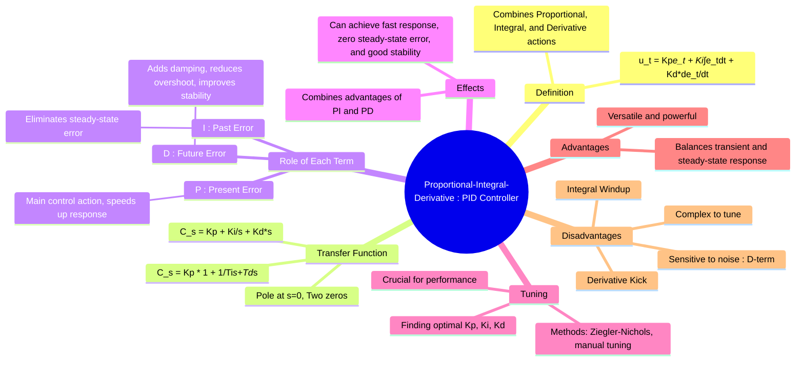

---
tags:
  - control-systems
  - controllers
  - feedback-control
  - pid-controller
created: 2025-09-21
aliases:
  - PID Controller
  - Proportional-Integral-Derivative Control
subject: "[[Control Systems]]"
parent:
  - Controllers
modified: 2026-08-04T10:19:02
---
### Proportional-Integral-Derivative (PID) Controller
#control-systems/controller #pid-controller

> The **Proportional-Integral-Derivative (PID) Controller** is the most widely used feedback controller in industrial applications. It combines the three fundamental control actions : proportional, integral, and derivative—to provide a sophisticated and versatile control strategy. It calculates a control action based on the error's history (integral), its current value (proportional), and its future trend (derivative).

---
#### Mathematical Representation
#pid-controller/model

The controller output $u(t)$ in the time domain is given by:
$$ \boxed{\quad u(t) = K_p e(t) + K_i \int_0^t e(\tau)d\tau + K_d \frac{de(t)}{dt} \quad} $$
where:
- $K_p$: Proportional Gain
- $K_i$: Integral Gain
- $K_d$: Derivative Gain

The transfer function $C(s)$ in the Laplace domain is:
$$ C(s) = \frac{U(s)}{E(s)} = K_p + \frac{K_i}{s} + K_d s $$
This can be factored as:
$$ C(s) = \frac{K_d s^2 + K_p s + K_i}{s} $$
The controller has one **pole at the origin** ($s=0$) and **two zeros**, whose locations depend on the values of $K_p, K_i, K_d$.

The standard form is also common:
$$ \boxed{\quad C(s) = K_p \left( 1 + \frac{1}{T_i s} + T_d s \right) \quad} $$
where $T_i = K_p/K_i$ is the integral time constant and $T_d = K_d/K_p$ is the derivative time constant.

---
#### Role of Each Control Action
#pid-controller/components

- **Proportional (P) Action**: Reacts to the **present** error. It provides the main control effort to drive the system towards the setpoint. A higher $K_p$ results in a faster response but increases overshoot and can reduce stability.

- **Integral (I) Action**: Reacts to the **past** accumulated error. Its primary purpose is to **eliminate steady-state error** by continuing to increase the control output as long as any error exists. This comes at the cost of potentially worse transient response (more overshoot) and reduced stability.

- **Derivative (D) Action**: Reacts to the **future** error by observing its rate of change. It acts as a damping force, anticipating and counteracting large changes. This improves stability, **reduces peak overshoot**, and decreases settling time.

---
#### Summary of Effects (Increasing Each Gain Independently)
#pid-controller/effects

The following table summarizes the general effect on a closed-loop system when each gain is increased independently.

| Parameter          | Rise Time ($t_r$)      | Peak Overshoot ($M_p$) | Settling Time ($t_s$) | Steady-State Error ($E_{ss}$) | Relative Stability |
| ------------------ | ---------------------- | ---------------------- | --------------------- | ----------------------------- | ------------------ |
| **Increase $K_p$** | Decrease               | Increase               | Small Change          | Decrease                      | Degrade            |
| **Increase $K_i$** | Decrease               | Increase               | Increase              | **Eliminate**                 | Degrade            |
| **Increase $K_d$** | Minor/Small Decrease   | **Decrease**           | **Decrease**          | No Effect                     | **Improve**        |

The power of the PID controller lies in its ability to combine these effects to achieve a desired overall system performance.

---
#### Controller Tuning
#pid-controller/tuning

**Tuning** is the process of selecting the optimal controller parameters ($K_p, K_i, K_d$) to meet specific performance criteria (e.g., fast response, minimal overshoot).
- **Manual Tuning**: An operator iteratively adjusts the gains based on observing the system response.
- **Ziegler-Nichols Method**: A popular heuristic method that provides a starting point for the gains based on the system's response at the edge of instability (finding its ultimate gain $K_u$ and ultimate period $T_u$).

---
#### Advantages and Disadvantages
#pid-controller/pros-cons #pros-cons/pid-controller 

##### Advantages

* **Versatility**: Can be tuned to provide excellent performance for a very wide range of systems.
* **Optimal Control**: Balances the trade-offs between transient response (speed, overshoot) and steady-state response (error).
* **Robustness**: Provides reliable control even when the system model is not perfectly known.

##### Disadvantages

* **Complexity in Tuning**: Finding the optimal values for three interacting parameters can be challenging.
* **Integral Windup**: The integral term can accumulate to a very large value if the actuator saturates, causing large overshoots. Anti-windup circuits are often needed.
* **Noise Sensitivity**: The derivative term amplifies high-frequency measurement noise, which can cause erratic control action. A low-pass filter is typically added to the D-term in practice.
* **Derivative Kick**: A sudden change in the setpoint causes an impulse in the error derivative, leading to a large spike ("kick") in the controller output. This can be mitigated by taking the derivative of the process variable instead of the error.

---
### Related Concepts
#related-concepts

> [[Proportional (P) Controller]]

[[Proportional-Integral (PI) Controller]]
[[Proportional-Derivative (PD) Controller]]
[[Lag-Lead Compensator]] (A PID controller is a type of lag-lead compensator)
[[Steady-State Error]]
[[Transient Response of Systems]]
[[Tuning of PID Controllers|Ziegler-Nichols Method]]

