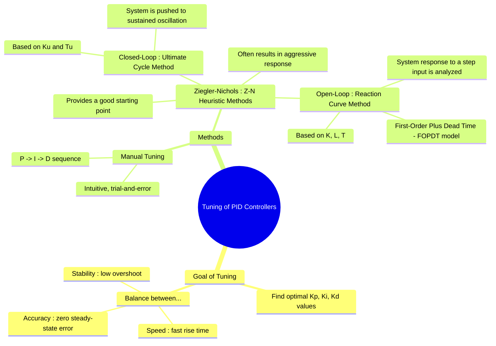

---
tags:
  - control-systems
  - pid-controller
  - controller-tuning
  - ziegler-nichols
  - system-design
created: 2025-09-21
aliases:
  - PID Tuning
  - Controller Tuning
  - Ziegler-Nichols Method
subject: "[[Control Systems]]"
parent:
  - "[[Proportional-Integral-Derivative (PID) Controller|PID Controller]]"
modified: 2026-08-04T10:43:59
---
### Tuning of PID Controllers
#control-systems/design #pid-controller/tuning

> **PID Tuning** is the process of selecting the optimal values for the controller parameters: Proportional Gain ($K_p$), Integral Gain ($K_i$), and Derivative Gain ($K_d$)—to achieve a desired level of system performance. The primary goal is to find a balance between conflicting objectives such as fast response time, minimal [[Time-Domain Specifications|overshoot]], and zero [[steady-state error]]. A poorly tuned controller can lead to instability, slow response, or excessive oscillations.

---
#### The Goal of Tuning
#performance-specifications

The objective is to adjust the PID parameters to meet specific [[Time-Domain Specifications|time-domain performance criteria]], which typically include:
1. **Minimizing [[Time-Domain Specifications|Rise Time]] ($t_r$)**: The system should respond quickly to changes in the setpoint.
2. **Minimizing [[Time-Domain Specifications|Peak Overshoot]] ($M_p$)**: The output should not exceed the desired value by a large amount.
3. **Minimizing [[Time-Domain Specifications|Settling Time]] ($t_s$)**: The system should stabilize at the new setpoint quickly.
4. **Eliminating [[Steady-State Error]] ($E_{ss}$)**: The final output should match the setpoint exactly.

Tuning is an exercise in managing trade-offs. For example, increasing $K_p$ speeds up the response but also increases overshoot.

---
#### Manual Tuning Method
#manual-tuning

This is an intuitive, trial-and-error approach performed directly on the system:
1. **Tune Proportional Gain ($K_p$)**: Start with $K_i$ and $K_d$ set to zero. Gradually increase $K_p$ until the system responds quickly to a setpoint change with some stable oscillation. A high $K_p$ will lead to instability.
2. **Tune Integral Gain ($K_i$)**: With $K_p$ set, begin to increase $K_i$ to eliminate the steady-state error. Too much $K_i$ will increase overshoot and settling time.
3. **Tune Derivative Gain ($K_d$)**: With $K_p$ and $K_i$ set, increase $K_d$ to reduce overshoot and improve the stability of the response. Too much $K_d$ can make the system sensitive to measurement noise.
4. **Iterate**: Repeat the steps until a satisfactory balance is achieved.

---
#### Ziegler-Nichols (Z-N) Methods
#ziegler-nichols

The Ziegler-Nichols methods are well-known heuristic rules for determining initial PID parameters. They provide a good starting point, although the resulting response is often aggressive (e.g., aiming for a quarter-amplitude decay ratio) and may require further fine-tuning.

##### 1. Closed-Loop (Ultimate Cycle) Method
This method is suitable for systems that can be safely made to oscillate.
###### Procedure

1. Set the controller to **P-only mode** (set Integral time $T_i = \infty$ and Derivative time $T_d = 0$).
2. With the feedback loop closed, gradually increase the proportional gain $K_p$ until the system output exhibits sustained, stable oscillations of constant amplitude.
3. Record the gain at which this occurs as the **Ultimate Gain ($K_u$)**.
4. Measure the period of these oscillations and record it as the **Ultimate Period ($T_u$)**.

###### Tuning Rules

Based on $K_u$ and $T_u$, the controller parameters are calculated as follows:

| Controller Type | $K_p$             | $T_i = K_p/K_i$   | $T_d = K_d/K_p$ |
| :-------------- | :---------------- | :---------------- | :-------------- |
| **P**           | $0.5 K_u$         | -                 | -               |
| **PI**          | $0.45 K_u$        | $T_u / 1.2$       | -               |
| **PID**         | $$\boxed{0.6 K_u}$$ | $$\boxed{0.5 T_u}$$ | $$\boxed{0.125 T_u}$$ |

##### 2. Open-Loop (Reaction Curve) Method
This method is used when the system is stable in open-loop and cannot be easily oscillated.

###### Procedure

1. Place the controller in manual mode (open the feedback loop).
2. Apply a small step change $\Delta u$ to the controller output (the plant input).
3. Record the process variable (plant output) over time. This response is called the **reaction curve**.
4. Model this S-shaped curve as a **First-Order Plus Dead Time (FOPDT)** system. From the graph, determine three parameters:
    * **Process Gain ($K$)**: $K = \frac{\text{Total Change in Output } (\Delta y)}{\text{Change in Input } (\Delta u)}$
    * **Time Delay / Dead Time ($L$)**: The time before the output starts to respond.
    * **Time Constant ($T$)**: The time it takes for the output to reach 63.2% of its final value after the delay $L$.

###### Tuning Rules

Based on $K$, $L$, and $T$, the controller parameters are:

| Controller Type | $K_p$                          | $T_i = K_p/K_i$   | $T_d = K_d/K_p$ |
| :-------------- | :----------------------------- | :---------------- | :-------------- |
| **P**           | $T / (KL)$                     | -                 | -               |
| **PI**          | $0.9 T / (KL)$                 | $L / 0.3$         | -               |
| **PID**         | $$\boxed{1.2 T / (KL)}$$        | $$\boxed{2L}$$    | $$\boxed{0.5L}$$  |

---
### Related Concepts
#related-concepts

> [[Proportional-Integral-Derivative (PID) Controller]]

[[Time-Domain Specifications]]
[[Stability Analysis]]
[[First-Order System Response]]
[[Ultimate Gain and Ultimate Period]]
