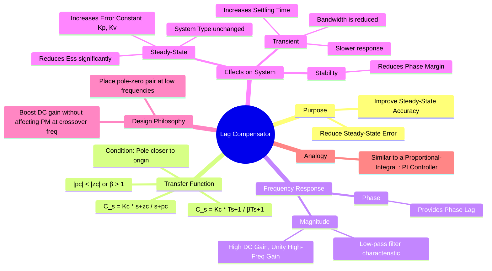

---
tags:
  - control-systems
  - compensator
  - lag-compensator
  - feedback-control
  - system-design
created: 2025-09-21
aliases:
  - Lag Compensation
  - Phase-Lag Compensator
subject: "[[Control Systems]]"
parent:
  - Compensators
modified: 2026-08-04T09:52:25
---
### Lag Compensator
#control-systems/compensator #lag-compensator #phase-lag

> A **Lag Compensator** is a type of compensator used in [[Control Systems]] primarily to **improve steady-state accuracy** by decreasing the [[steady-state error]]. It functions as a [[Low-Pass Filter|low-pass filter]], increasing the system's gain at low frequencies without significantly affecting the gain and phase at higher frequencies (like the [[Phase Margin (PM)|gain crossover frequency]]). This allows for the correction of steady-state error while preserving the transient response and stability characteristics.

It is considered analogous to a [[Proportional-Integral (PI) Controller]].

---
#### Transfer Function
#lag-compensator/model

A lag compensator adds a pole and a zero to the open-loop system. The transfer function is given by:
$$ C(s) = K_c \frac{s+z_c}{s+p_c} $$
For a lag compensator, the **pole must be closer to the origin than the zero** (or equal to it).
$$ \boxed{\quad |p_c| < |z_c| \quad} $$
An alternative form is:
$$ C(s) = K_c \frac{Ts+1}{\beta Ts+1} \quad \text{where} \quad \beta = \frac{z_c}{p_c} > 1, \quad T = \frac{1}{z_c} $$
Here, $\beta$ is the factor by which the low-frequency gain is improved.

#### Frequency Response Characteristics
#frequency-response #steady-state-error

- **Magnitude**: The compensator has a high gain at low frequencies (DC gain = $K_c \beta$) and a lower gain at high frequencies (High-freq gain = $K_c$). This high DC gain is what boosts the static error constant of the system.
- **Phase**: The phase angle is $\phi(\omega) = \angle C(j\omega) = \tan^{-1}(T\omega) - \tan^{-1}(\beta T\omega)$. Since $\beta > 1$, this angle is always negative, meaning the compensator introduces a **phase lag**.

---
#### Design Philosophy
#design-philosophy #lag-compensator/design-philosophy

The key to successful lag compensation is to place the pole-zero pair at frequencies **much lower** than the existing gain crossover frequency. This achieves two things:
1. The high DC gain ($\beta$) is fully realized, boosting the static error constant and reducing $E_{ss}$.
2. At the [[Phase Margin (PM)|gain crossover frequency]] (which determines transient response and stability), the compensator's frequency response has already transitioned back to near-unity gain and almost $0^\circ$ phase shift. This ensures that the original, satisfactory phase margin and transient response are not significantly degraded.

---
#### Effects on System Performance
#lag-compensator/effects

##### 1. Improves Steady-State Response

* This is the primary benefit. The compensator increases the open-loop gain at low frequencies by a factor of $\beta$.
* The static error constant (e.g., $K_p$ for a Type-0 system) is increased:
	$$ K_{p, new} = \lim_{s \to 0} C(s)G(s) = \left(K_c \frac{z_c}{p_c}\right) \lim_{s \to 0} G(s) = (K_c \beta) K_{p, old} $$
* The steady-state error is reduced by approximately the same factor $\beta$ (assuming $K_c=1$).
	$$\boxed{\quad E_{ss, new} \approx \frac{1}{\beta} E_{ss, old} \quad}$$

##### 2. Degrades Transient Response

* The introduction of a pole at low frequencies can create a slow-settling "tail" in the system's step response, thereby **increasing the settling time**.
* The bandwidth of the system is reduced, making the overall response slower.

##### 3. Reduces Relative Stability

* The phase lag introduced by the compensator, although small at the crossover frequency by design, will still slightly **reduce the Phase Margin**, thus degrading relative stability.

---
#### Advantages and Disadvantages
#lag-compensator/pros-cons

##### Advantages
1. Significantly improves steady-state accuracy.
2. The low-pass nature helps in attenuating high-frequency noise.

##### Disadvantages
1. Slows down the transient response (increases settling time).
2. Reduces system bandwidth.
3. Reduces stability margins, though this effect is minimized by careful design.

---
### Related Concepts
#related-concepts

> [[Need for Compensation]]

[[Lead Compensator]] (Used to improve transient response)
[[Lag-Lead Compensator]] (Combines the benefits of both)
[[Proportional-Integral (PI) Controller]] (The ideal, non-realizable version of a lag compensator)
[[Steady-State Error]]
[[Phase Margin (PM)]]
[[Bode Plots]]
