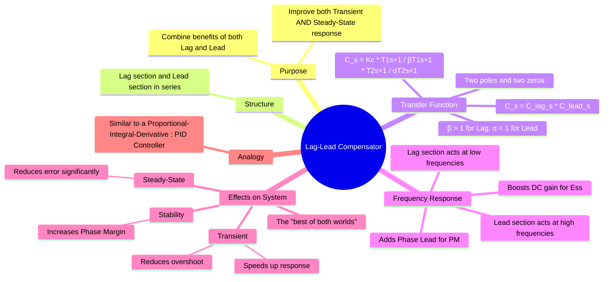

---
tags:
  - control-systems
  - compensator
  - lag-lead-compensator
  - feedback-control
  - system-design
created: 2025-09-21
aliases:
  - Lag-Lead Compensation
  - Phase Lag-Lead Compensator
subject: "[[Control Systems]]"
parent:
  - Compensators
modified: 2026-08-04T09:52:46
---
### Lag-Lead Compensator
#control-systems/compensator #lag-lead-compensator

> A **Lag-Lead Compensator** is a sophisticated control component that combines the effects of a [[Lag Compensator]] and a [[Lead Compensator]] in a single network. It is designed to simultaneously improve both the **steady-state accuracy** and the **transient response** of a system, offering a comprehensive solution that overcomes the individual limitations of lag or lead compensation alone.

It is analogous to a [[Proportional-Integral-Derivative (PID) Controller]] in its ability to address multiple performance aspects.

---
#### Transfer Function
#lag-lead-compensator/model

The compensator is effectively a lag section and a lead section connected in series. Its transfer function is the product of the two:
$$ C(s) = C_{lead}(s) \cdot C_{lag}(s) $$
In terms of poles and zeros:
$$ C(s) = K_c \left( \frac{s+z_{lead}}{s+p_{lead}} \right) \left( \frac{s+z_{lag}}{s+p_{lag}} \right) $$
where the pole-zero locations must satisfy $|z_{lead}| < |p_{lead}|$ and $|p_{lag}| < |z_{lag}|$.

The standard form using time constants is:
$$ \boxed{\quad C(s) = K_c \left( \frac{T_1 s + 1}{\beta T_1 s + 1} \right) \left( \frac{T_2 s + 1}{\alpha T_2 s + 1} \right) \quad} $$
- The first term is the **Lag Section**, with $\beta > 1$.
- The second term is the **Lead Section**, with $\alpha < 1$.
- Often, the design is passive, and the condition $\alpha\beta = 1$ is used.

> [!success] Valid vs invalid pole–zero pairing
> **Key rule (exam-safe):** Poles and zeros must be paired based on *frequency proximity*, not algebra.
>
> > [!success] Valid pairing
> > - Sort all poles and zeros in increasing order of corner frequency.
> > - Pair only **adjacent pole–zero elements** on the log-frequency axis.
> > - Reason: phase contribution of a pole/zero is significant only within ~1 decade around its own corner frequency.
> 
> > [!fail] Invalid pairing
> > - Pairing distant poles and zeros (far apart in frequency).
> > - Arbitrary algebraic regrouping that ignores frequency ordering.
> > - Such pairing has **no physical meaning** in Bode phase plots.

---
#### Frequency Response Characteristics
#frequency-response

The compensator is designed to operate in two distinct frequency regions:
1. **Low-Frequency Region**: The lag section dominates. It provides a high gain (a factor of $\beta$) at low frequencies, which boosts the static error constant ($K_p, K_v$) and thus reduces steady-state error.
2. **High-Frequency Region**: The lead section dominates. It provides the necessary phase lead around the gain crossover frequency to increase the phase margin, improving transient response (less overshoot, faster settling) and enhancing stability.

The overall effect is that it boosts the gain where needed for accuracy (at DC) and provides phase lead where needed for stability and speed (at the crossover frequency).

---
#### Effects on System Performance
#lag-lead-compensator/effects

A Lag-Lead compensator provides a combined set of benefits, addressing the shortcomings of using either a lag or lead compensator alone.

* **Improves Steady-State Response**: The lag component increases the low-frequency gain, significantly reducing the steady-state error, just like a pure lag compensator.
* **Improves Transient Response**: The lead component adds phase lead, increasing the damping ratio. This leads to a **reduction in peak overshoot** and a **decrease in settling time**.
* **Increases Response Speed**: The lead component also increases the bandwidth, resulting in a **shorter rise time**.
* **Enhances Stability**: The phase lead from the lead section increases the phase margin, allowing for a faster system that is still robustly stable.

---
#### Advantages and Disadvantages
#lag-lead-compensator/pros-cons

##### Advantages

1. **Comprehensive Improvement**: Offers a powerful method to satisfy stringent requirements for both steady-state and transient performance simultaneously.
2. **Flexibility**: Provides more parameters (two poles, two zeros) for the designer to shape the system response accurately.

##### Disadvantages

1. **Increased Complexity**: The design process is more involved than for a simple lag or lead compensator.
2. **More Components**: Requires a more complex electrical network for its physical realization.

---
### Related Concepts
#related-concepts

> [[Need for Compensation]]

[[Lead Compensator]]
[[Lag Compensator]]
[[Proportional-Integral-Derivative (PID) Controller]]
[[Bode Plots]]
[[Concept and Definition of Root Locus]]
[[Steady-State Error]]
[[Time-Domain Specifications]]

