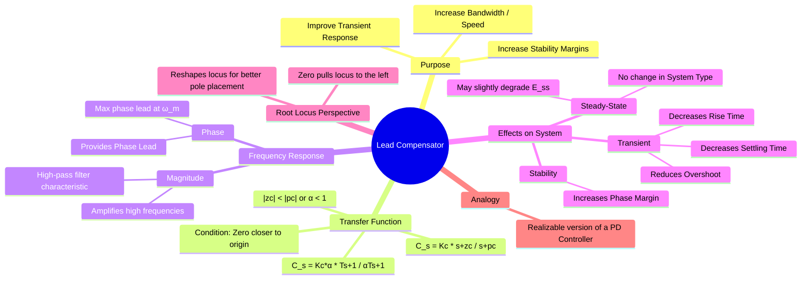

---
tags:
  - control-systems
  - compensator
  - lead-compensator
  - feedback-control
  - system-design
created: 2025-09-21
aliases:
  - Lead Compensation
  - Phase-Lead Compensator
  - Maximum Phase Lead
subject: "[[Control Systems]]"
parent:
  - Compensators
modified: 2026-08-04T09:53:58
---
### Lead Compensator
#control-systems/compensator #lead-compensator #phase-lead

> A **Lead Compensator** is a type of compensator used in [[Control Systems]] to improve transient response and increase stability margins. It is essentially a [[High-Pass Filter]] that adds positive phase shift, or "phase lead," to the system's open-loop frequency response. This anticipatory action helps to speed up the system response and increase damping.

It is considered the practical, physically realizable version of a [[Proportional-Derivative (PD) Controller]].

---
#### Transfer Function
#lead-compensator/model

==A lead compensator adds a zero and a pole to the open-loop system. The transfer function is given by:==
$$ C(s) = K_c \frac{s+z_c}{s+p_c} $$
==For a lead compensator, the **zero must be closer to the origin than the pole**.==
$$ \boxed{\quad |z_c| < |p_c| \quad} $$
An alternative form is:
$$ C(s) = K_c \alpha \frac{Ts+1}{\alpha Ts+1} \quad \text{where} \quad \alpha = \frac{z_c}{p_c} < 1, \quad T = \frac{1}{z_c} $$
Here, $\alpha$ is the attenuation factor.

> [!important]- Lead compensator — max-phase & magnitude (use this)
> - Transfer function: 
>   $$C(s)=K_c\frac{s+z_c}{s+p_c},\qquad |z_c|<|p_c|$$
> - Alternate form: $$C(s)=K_c\alpha\frac{Ts+1}{\alpha Ts+1},\quad \alpha=\dfrac{z_c}{p_c}<1,\ T=\dfrac{1}{z_c}$$
> - Frequencies: zero $\omega_z=z_c$, pole $\omega_p=p_c$
> - Frequency of maximum phase lead (exact):
>   $$\boxed{\omega_m=\sqrt{\omega_z\omega_p}=\sqrt{z_c\,p_c}}$$
> - Magnitude at $\omega_m$ (exact):
>   $$|C(j\omega_m)| = K_c\sqrt{\dfrac{p_c}{\,z_c\,}} = \dfrac{K_c}{\sqrt{\alpha}}$$
> - dB form (useful on asymptotic Bode):
>   $$|C(j\omega_m)|_{dB}=20\log_{10}K_c + 10\log_{10}\!\left(\dfrac{p_c}{z_c}\right)=20\log_{10}K_c -10\log_{10}\alpha$$
> - Special case (when $K_c=1$ and $z_c=a,\ p_c=\beta a$): 
>   $$|C(j\omega_m)|=\sqrt{\beta}\quad\Rightarrow\quad |C|_{dB}=10\log_{10}\beta$$
> - Quick use: choose $\omega_m\approx$ desired crossover; set $p_c/z_c$ from required boost at $\omega_m$; then place $z_c$ and $p_c$ so that $\sqrt{z_c p_c}=\omega_m$.

---
#### Frequency Response Characteristics
#frequency-response #phase-margin

The defining feature of a lead compensator is its ability to provide a positive phase shift over a specific range of frequencies.
- **Phase**: The phase angle of the compensator is $\phi(\omega) = \angle C(j\omega) = \tan^{-1}(\frac{\omega}{z_c}) - \tan^{-1}(\frac{\omega}{p_c})$. Since $z_c < p_c$, this angle is always positive.
- **Maximum Phase Lead ($\phi_m$)**: The maximum phase lead provided by the compensator is given by:
  $$\boxed{\quad \sin(\phi_m) = \frac{1-\alpha}{1+\alpha} \quad \text{or} \quad \alpha = \frac{1-\sin(\phi_m)}{1+\sin(\phi_m)} \quad}$$
- **Frequency of Max Phase Lead ($\omega_m$)**: This maximum lead occurs at the geometric mean of the zero and pole frequencies:
  $$\boxed{\quad \omega_m = \sqrt{z_c p_c} = \frac{1}{T\sqrt{\alpha}} \quad}$$
  For maximum effectiveness, the compensator is designed such that $\omega_m$ is located at or near the desired [[Phase Margin (PM)|gain crossover frequency]] of the compensated system.
- **Magnitude**: The compensator's gain increases with frequency, from a DC gain of $K_c \alpha$ to a high-frequency gain of $K_c$. This high-pass characteristic can amplify high-frequency noise.

> [!pyq]- PYQ : 2019
> ![[ee_2019#^q30]]

---
#### Effects on System Performance
#lead-compensator/effects

##### 1. Improves Transient Response

* **Increases Damping**: The phase lead acts like the derivative action, improving the damping of the system.
* **Reduces Overshoot**: A direct result of increased damping.
* **Reduces Rise Time and Settling Time**: The system's bandwidth is increased, leading to a faster response.

##### 2. Increases Stability

* The added phase lead directly **increases the Phase Margin** of the system, making it more stable.
* This allows the system to operate with a higher overall gain ($K_c$), which can help to reduce steady-state error and further speed up the response.

##### 3. No Effect on Steady-State Error

* A lead compensator does not add a pole at the origin, so it **does not change the system type**.
* Therefore, it does not inherently improve the steady-state error constant ($K_p, K_v, K_a$). While increasing the gain $K_c$ can reduce error, the primary function of the lead compensator is not steady-state error correction.

---
#### Root Locus Perspective
#root-locus-analysis

From a [[Concept and Definition of Root Locus|root locus]] perspective, the compensator's zero-pole pair reshapes the locus. The zero, being closer to the imaginary axis, "pulls" the root locus branches to the left, towards the more stable region of the $s$-plane. This allows the closed-loop poles to be placed in locations corresponding to better performance (faster response and higher damping) for a given gain.

---
#### Advantages and Disadvantages
#lead-compensator/pros-cons

##### Advantages

1. Effectively improves transient response (faster, less oscillatory).
2. Enhances relative stability by increasing the phase margin.
3. Increases the system's bandwidth.

##### Disadvantages

1. Amplifies high-frequency noise due to its high-pass nature.
2. The required increase in gain to offset the compensator's attenuation can increase demands on actuators.
3. Does not improve steady-state error.

---
### Related Concepts
#related-concepts

> [[Need for Compensation]]

[[Lag Compensator]] (Complements the lead compensator by improving steady-state error)
[[Lag-Lead Compensator]] (Combines the benefits of both)
[[Proportional-Derivative (PD) Controller]] (The ideal, non-realizable version of a lead compensator)
[[Phase Margin (PM)]]
[[Bode Plots]]
[[Concept and Definition of Root Locus]]

