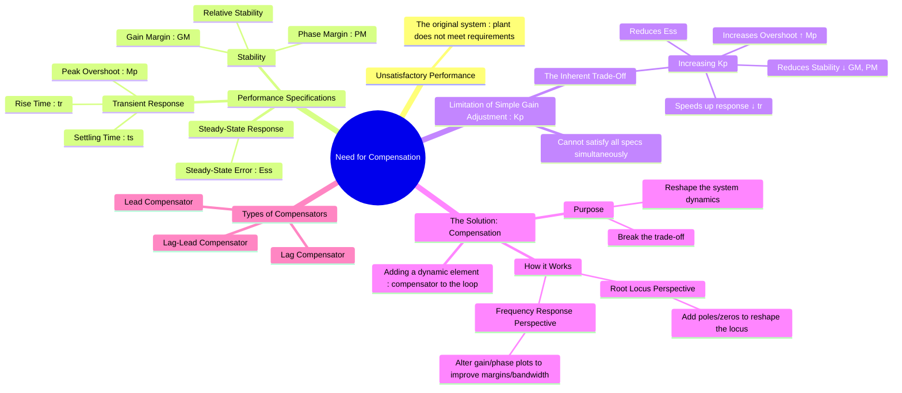

---
tags:
  - control-systems
  - system-design
  - compensation
  - feedback-control
created: 2025-09-21
aliases:
  - System Compensation
  - Control System Compensation
subject: "[[Control Systems]]"
parent:
  - Compensators
modified: 2026-08-04T10:06:55
---
### Need for Compensation
#control-systems/design #compensation #performance-specifications

> **Compensation** in [[Control Systems]] is the process of intentionally modifying the dynamics of a system by introducing an additional device, called a **compensator**, to achieve a desired set of performance specifications. This is necessary when the performance of the original system is unsatisfactory and cannot be corrected by a simple adjustment of the loop gain.

The primary goal of compensation is to reshape the system's [[Concept and Definition of Root Locus|Root Locus]] or [[Frequency Response from Transfer Function|Frequency Response]] characteristics to simultaneously meet requirements for transient response, steady-state accuracy, and stability.

![[Compensator Block.png]]

---
#### Unsatisfactory System Performance
#performance-specifications

A control system, consisting of the plant and a simple [[Proportional (P) Controller|proportional controller]], may exhibit one or more of the following undesirable characteristics:
1. **Poor Transient Response**: The system might be too slow, or it might oscillate excessively (high [[Time-Domain Specifications|peak overshoot]] and long [[Time-Domain Specifications|settling time]]).
2. **Poor Steady-State Response**: The system might have a large [[steady-state error]], meaning it is not accurate in tracking the desired setpoint.
3. **Inadequate Stability**: While the system may be stable, its relative stability (measured by [[Gain Margin (GM)|Gain Margin]] and [[Phase Margin (PM)|Phase Margin]]) might be too low, making it susceptible to changes in system parameters.

---
#### The Limitation of Simple Gain Adjustment
#proportional-control/tradeoff

A first attempt to improve performance is often to adjust the [[Proportional (P) Controller|proportional gain]], $K_p$. However, this presents a fundamental trade-off:

| Increasing Proportional Gain ($K_p \uparrow$)                                                                            |
| :----------------------------------------------------------------------------------------------------------------------- |
| **Pros:**                                                                                                                |
| -   Reduces steady-state error ($E_{ss} \downarrow$).                                                                    |
| -   Increases response speed (Rise time $t_r \downarrow$).                                                               |
| **Cons:**                                                                                                                |
| -   Increases peak overshoot ($M_p \uparrow$).                                                                           |
| -   Reduces relative stability ([[Gain Margin (GM)\|Gain Margin]] and [[Phase Margin (PM)\|Phase Margin]] $\downarrow$). |
| -   May lead to instability for high values of $K_p$.                                                                    |

This conflict means it is often impossible to find a single value of gain $K_p$ that satisfies all performance criteria. For instance, making the system accurate (low $E_{ss}$) might make it nearly unstable (high $M_p$).

---
#### The Role of a Compensator
#compensator/role

A compensator is a controller with its own dynamics (poles and zeros) that is inserted into the control loop (typically in series with the plant) to overcome the limitations of simple gain adjustment.

1. **[[Concept and Definition of Root Locus|Root Locus]] Perspective**: A compensator strategically adds poles and/or zeros to the [[Open-Loop Transfer Function (OLTF)|open-loop transfer function]]. This **reshapes the root locus**, altering the paths the closed-loop poles can take as the gain varies. The goal is to create a new locus that passes through a region of the $s$-plane corresponding to the desired performance (e.g., a specific damping ratio $\zeta$ and natural frequency $\omega_n$).

2. **[[Frequency Response from Transfer Function|Frequency Response]] Perspective**: A compensator modifies the magnitude and phase of the open-loop frequency response.
    * To improve **[[steady-state error]]**, a compensator can increase the low-frequency gain without significantly affecting the phase at the [[Phase Margin (PM)|gain crossover frequency]].
    * To improve **transient response and stability**, a compensator can add positive phase (phase lead) around the gain crossover frequency, thereby increasing the [[Phase Margin (PM)|phase margin]].

By introducing dynamic elements, a compensator provides more degrees of freedom than a simple gain, allowing a designer to address the conflicting requirements of transient response, steady-state error, and stability independently.

---
### Related Concepts
#related-concepts

> [[Lead Compensator]] (Used to improve transient response and stability)

[[Lag Compensator]] (Used to improve steady-state accuracy)
[[Lag-Lead Compensator]] (Combines the benefits of both)
[[Proportional-Integral-Derivative (PID) Controller]] (A classic and powerful implementation of compensation)
[[Time-Domain Specifications]]
[[Steady-State Error]]
[[Gain Margin (GM)]] and [[Phase Margin (PM)]]
[[Concept and Definition of Root Locus]]
[[Bode Plots]]

