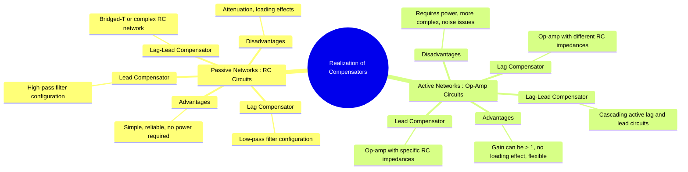

---
tags:
  - control-systems
  - compensator
  - circuit-design
  - analog-electronics
created: 2025-09-21
aliases:
  - Compensator Circuits
  - Electrical Compensators
subject: "[[Control Systems]]"
parent:
  - Compensators
modified: 2026-08-04T10:22:32
---
### Realization of Compensators using Electrical Networks
#control-systems/design #compensator/realization #circuit-design

> Compensators like [[Lead Compensator|Lead]], [[Lag Compensator|Lag]], and [[Lag-Lead Compensator|Lag-Lead]] are not just mathematical constructs; they are physically realized using electrical circuits. These circuits can be either **passive** (using only [[Resistors]] and [[Capacitors]]) or **active** (using [[Ideal Op-Amp|operational amplifiers]] along with resistors and capacitors).

- **Passive Networks**: Simple and economical, but introduce attenuation and can suffer from loading effects.
- **Active Networks**: More flexible, provide gain, and isolate stages (no loading), but require an external power supply.

---
#### 1. Lead Compensator Realization
#lead-compensator/realization

##### a) Passive Lead Network
#lead-compensator/passive 

This circuit acts as a high-pass filter.

![[Passive Lead Network.png]]

The transfer function $G_c(s) = V_o(s) / V_i(s)$ is found using the voltage divider rule:
$$\begin{align}
G_c(s) &= \frac{R_2}{R_2 + \frac{R_1 \cdot (1/sC)}{R_1 + 1/sC}} = \frac{R_2}{R_2 + \frac{R_1}{sR_1C + 1}} \\
&= \frac{R_2 (sR_1C + 1)}{R_2(sR_1C + 1) + R_1} = \frac{R_2}{R_1+R_2} \frac{sR_1C + 1}{s\frac{R_1R_2}{R_1+R_2}C + 1}
\end{align}$$
Comparing this with the standard form $C(s) = \alpha \frac{Ts+1}{\alpha Ts+1}$:
$$\boxed{\quad T = R_1C, \quad \alpha = \frac{R_2}{R_1+R_2} < 1 \quad}$$
The gain at DC is $\alpha$, which represents attenuation. An amplifier is often needed to compensate for this loss.

##### b) Active Lead Network
#lead-compensator/active 

An op-amp circuit can provide lead compensation along with amplification.

![[Active Lead Network.png]]
The transfer function is $G_c(s) = -Z_2(s) / Z_1(s)$.
With $Z_1 = \frac{R_1}{1+sR_1C_1}$ and $Z_2 = \frac{R_2}{1+sR_2C_2}$, we get:
$$ G_c(s) = -\frac{R_2}{R_1} \frac{1+sR_1C_1}{1+sR_2C_2} $$
For this to be a **[[lead compensator]]**, the zero must be at a lower frequency than the pole, which means its time constant must be larger:
$$\boxed{\quad R_1C_1 > R_2C_2 \quad}$$

---
#### 2. Lag Compensator Realization
#lag-compensator/realization

##### a) Passive Lag Network
#lag-compensator/passive 

This circuit acts as a low-pass filter.

![[Passive Lag Network.png]]

The transfer function is:
$$\begin{align}
G_c(s) &= \frac{R_2 + 1/sC}{R_1 + R_2 + 1/sC} = \frac{sR_2C + 1}{s(R_1+R_2)C + 1}
\end{align}$$
Comparing with the standard form $C(s) = \frac{Ts+1}{\beta Ts+1}$:
$$\boxed{\quad T = R_2C, \quad \beta = \frac{R_1+R_2}{R_2} > 1 \quad}$$
The high-frequency gain is $1/\beta$, which is an attenuation.

##### b) Active Lag Network
#lag-compensator/active 

![[Active Lag Network.png]]

Using the same op-amp circuit as the active lead, we can create a lag compensator by changing the component values. For the transfer function $G_c(s) = -\frac{R_2}{R_1} \frac{1+sR_1C_1}{1+sR_2C_2}$ to be a **[[lag compensator]]**, the pole must be at a lower frequency than the zero:
$$\boxed{\quad R_1C_1 < R_2C_2 \quad}$$

---
#### 3. Lag-Lead Compensator Realization
#lag-lead-compensator/realization

##### a) Passive Lag-Lead Network
#lag-lead-compensator/passive 

This network is created by combining the passive lag and lead networks.

![[Passive Lag-Lead Network.png]]

The transfer function is:
$$ G_c(s) = \frac{(1+sR_1C_1)(1+sR_2C_2)}{(1+sR_1C_1)(1+sR_2C_2) + sR_1C_2} = \frac{(1+sT_1)(1+sT_2)}{(1+sT_{1a})(1+sT_{2b})} $$
where $T_1 = R_1C_1$ is the lag zero time constant and $T_2 = R_2C_2$ is the lead zero time constant. The poles are functions of all four components. By choosing $R_1C_1 > R_2C_2$, it acts as a lag compensator at low frequencies and a lead compensator at high frequencies.

##### b) Active Lag-Lead Network
#lag-lead-compensator/active 

![[Active Lag-Lead Network.png]]
An active lag-lead compensator can be built using the general op-amp circuit shown previously, or more simply by cascading an active lag circuit and an active lead circuit. Cascading is possible because the high input impedance and low output impedance of op-amps prevent loading effects between stages.

---
### Related Concepts
#related-concepts

> [[Lead Compensator]]

[[Lag Compensator]]
[[Lag-Lead Compensator]]
[[Operational Amplifier (Op-Amp)]]
[[Passive Circuit Elements|Passive Elements]]
[[Electric Circuits]]
