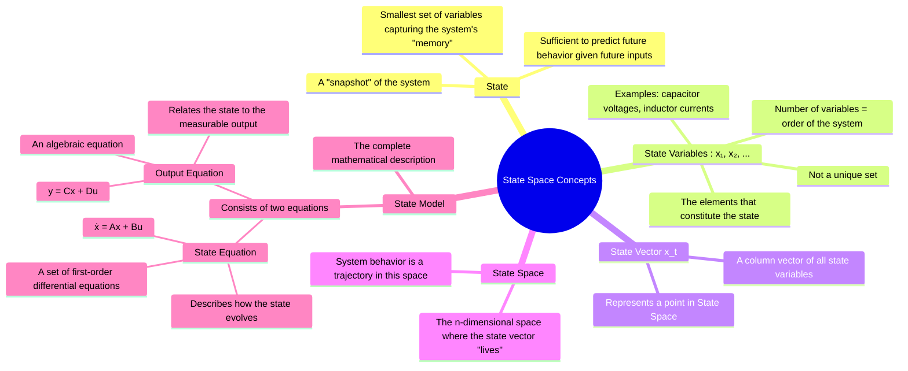

---
tags:
  - control-systems
  - state-space
  - modern-control
  - system-modeling
created: 2025-09-21
aliases:
  - State Variables
  - State Model
  - State Space Concepts
  - State Vector
  - State Space
subject: "[[Control Systems]]"
parent:
  - "[[State-Variable Analysis and Design]]"
modified: 2026-08-04T09:24:32
---
### Concepts of State, State Variables, and State Model
#control-systems/state-space #system-modeling

> State-space analysis is a modern control theory technique that provides a more complete description of a system compared to the classical transfer function approach. Instead of only representing the input-output relationship, it describes the internal behavior of the system through a set of variables known as **state variables**.

---

#### What is the State of a System?
#state-space/state

The **state** of a dynamic system is the smallest set of variables whose knowledge at an initial time $t_0$, combined with the knowledge of the input signal for all times $t \ge t_0$, is sufficient to completely determine the behavior of the system for any time $t \ge t_0$.

In simpler terms, the state is a complete "snapshot" or the "memory" of the system at a given instant. It captures the cumulative effect of all past inputs, so we don't need to know the system's history to predict its future.

---
#### State Variables
#state-space/state-variables

The variables that are part of the minimal set defining the state of the system are called **state variables**.

*   **Non-uniqueness**: The choice of state variables for a given system is **not unique**. Different sets of variables can be chosen to describe the same system.
*   **Number of Variables**: The number of state variables required is equal to the order of the system's governing differential equation. This is the minimum number of variables needed to describe the system completely.
*   **Physical Significance**: State variables are often chosen to be physically significant quantities that represent energy storage in the system.
    *   **Electrical Systems**: Voltages across capacitors and currents through inductors.
    *   **Mechanical Systems**: Positions and velocities of masses.

---
#### State Vector and State Space
#state-space/state-vector #state-space/space

*   **State Vector**: The set of 'n' state variables, $x_1(t), x_2(t), \dots, x_n(t)$, can be arranged into a column vector $\mathbf{x}(t)$, called the **state vector**.
    $$
    \mathbf{x}(t) = \begin{bmatrix} x_1(t) \\ x_2(t) \\ \vdots \\ x_n(t) \end{bmatrix}
    $$
*   **State Space**: The n-dimensional space where the state vector $\mathbf{x}(t)$ resides is called the **state space**. Each coordinate axis of this space corresponds to one of the state variables. The state of the system at any time 't' is represented by a single point in the state space, and the system's evolution over time traces a path or **trajectory** in this space.

---
#### The State Model
#state-space/state-model

The **state model** is the mathematical representation of a system using two key equations: the State Equation and the Output Equation. For a Linear Time-Invariant (LTI) system with 'm' inputs, 'p' outputs, and 'n' state variables, the model is:

1.  **State Equation**: A first-order matrix differential equation describing the evolution of the state vector.
    $$\boxed{\quad \dot{\mathbf{x}}(t) = A \mathbf{x}(t) + B \mathbf{u}(t) \quad}$$
    *   $\mathbf{x}(t)$: State vector ($n \times 1$)
    *   $\dot{\mathbf{x}}(t)$: Derivative of the state vector ($n \times 1$)
    *   $\mathbf{u}(t)$: Input (or control) vector ($m \times 1$)
    *   $A$: System Matrix ($n \times n$), defines the system's internal dynamics.
    *   $B$: Input Matrix ($n \times m$), maps the input to the state.

2.  **Output Equation**: An algebraic equation that defines the system's output in terms of the current state and input.
    $$\boxed{\quad \mathbf{y}(t) = C \mathbf{x}(t) + D \mathbf{u}(t) \quad}$$
    *   $\mathbf{y}(t)$: Output vector ($p \times 1$)
    *   $C$: Output Matrix ($p \times n$), maps the state to the output.
    *   $D$: Direct Transmission (or Feedforward) Matrix ($p \times m$), represents the direct path from input to output. For many physical systems, $D=0$.

---
### Advantages over Transfer Function Method
*   **MIMO Systems**: Easily handles Multiple-Input, Multiple-Output (MIMO) systems, whereas the transfer function is defined for Single-Input, Single-Output (SISO) systems.
*   **Internal Description**: Provides a complete description of the system's internal behavior, not just the overall input-output relationship.
*   **Initial Conditions**: Naturally incorporates non-zero initial conditions.
*   **Generality**: Can be applied to non-linear and time-varying systems.

---
### Related Concepts
#related-concepts

> [[State-Space Representation of LTI Systems]]

[[Transfer Function from State Space Model]]
[[State-Space Model from Transfer Function]]
[[Solution of State Equations]]
[[Controllability]]
[[Observability]]
[[Transfer Function and Impulse Response]]
