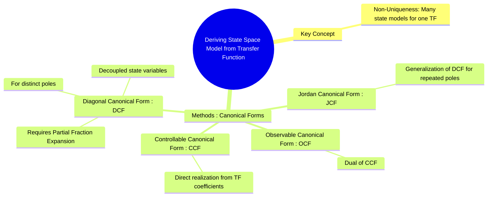

---
tags:
  - control-systems
  - state-space
  - transfer-function
  - modern-control
  - canonical-forms
created: 2025-09-21
aliases:
  - Transfer Function to State Space
  - TF to SS
subject: "[[Control Systems]]"
parent:
  - "[[State-Variable Analysis and Design]]"
trends:
  - "[[trends - State-Space Analysis]]"
modified: 2026-08-04T10:34:10
---
### Deriving State Space Model from Transfer Function
#control-systems/state-space #transfer-function #system-modeling

> Converting a transfer function (an external, input-output description) into a state-space model (an internal, state-variable description) is a fundamental task in modern control theory. A crucial point is that this representation is **not unique**; a single transfer function can be represented by infinitely many different state-space models. To make the process systematic, several standard or **canonical forms** are used.

Consider a general n-th order, strictly proper transfer function (numerator order < denominator order):
$$ G(s) = \frac{Y(s)}{U(s)} = \frac{b_{n-1}s^{n-1} + \dots + b_1s + b_0}{s^n + a_{n-1}s^{n-1} + \dots + a_1s + a_0} $$
For such a system, the direct transmission matrix $D$ will be zero.

---
#### 1. Controllable Canonical Form (CCF)
#controllable-canonical-form

This is a "direct realization" form where the coefficients of the transfer function denominator and numerator are placed directly into the A and C matrices, respectively.
$$ \boxed{ A = \begin{bmatrix} 0 & 1 & 0 & \dots & 0 \\ 0 & 0 & 1 & \dots & 0 \\ \vdots & \vdots & \vdots & \ddots & \vdots \\ 0 & 0 & 0 & \dots & 1 \\ -a_0 & -a_1 & -a_2 & \dots & -a_{n-1} \end{bmatrix}, \quad B = \begin{bmatrix} 0 \\ 0 \\ \vdots \\ 0 \\ 1 \end{bmatrix} }$$
$$ \boxed{ C = \begin{bmatrix} b_0 & b_1 & \dots & b_{n-1} \end{bmatrix}, \quad D = [0] }$$
This form is computationally simple to obtain and is guaranteed to be controllable.

---
#### 2. Observable Canonical Form (OCF)
#observable-canonical-form

This form is the dual of the CCF. The matrices are transposes of the CCF matrices, with the roles of B and C interchanged.
$$ \boxed{ A = \begin{bmatrix} 0 & 0 & \dots & -a_0 \\ 1 & 0 & \dots & -a_1 \\ 0 & 1 & \dots & -a_2 \\ \vdots & \vdots & \ddots & \vdots \\ 0 & 0 & \dots & -a_{n-1} \end{bmatrix}, \quad B = \begin{bmatrix} b_0 \\ b_1 \\ \vdots \\ b_{n-1} \end{bmatrix} }$$
$$ \boxed{ C = \begin{bmatrix} 0 & 0 & \dots & 1 \end{bmatrix}, \quad D = [0] }$$
This form is guaranteed to be observable.

---
#### 3. Diagonal Canonical Form (DCF)
#diagonal-canonical-form

This form is possible only if the transfer function has **distinct (non-repeated) poles**. It requires performing a partial fraction expansion of the transfer function first.
$$ G(s) = \frac{c_1}{s-p_1} + \frac{c_2}{s-p_2} + \dots + \frac{c_n}{s-p_n} $$
This form decouples the system dynamics, so each state variable corresponds to one of the system's modes (poles).
$$ \boxed{ A = \begin{bmatrix} p_1 & 0 & \dots & 0 \\ 0 & p_2 & \dots & 0 \\ \vdots & \vdots & \ddots & \vdots \\ 0 & 0 & \dots & p_n \end{bmatrix}, \quad B = \begin{bmatrix} 1 \\ 1 \\ \vdots \\ 1 \end{bmatrix} }$$
$$ \boxed{ C = \begin{bmatrix} c_1 & c_2 & \dots & c_n \end{bmatrix}, \quad D = [0] }$$
The diagonal A matrix makes analysis, such as finding the state-transition matrix, very simple ($e^{At}$ is a diagonal matrix with elements $e^{p_it}$).

---
#### 4. Jordan Canonical Form (JCF)
#jordan-canonical-form

This form is a generalization of the DCF for systems with **repeated poles**. The state matrix A is a block-diagonal matrix, where each block is a **Jordan block**. For a pole $p_1$ that is repeated 'r' times, the corresponding Jordan block is an $r \times r$ matrix:
$$ J = \begin{bmatrix} p_1 & 1 & 0 & \dots \\ 0 & p_1 & 1 & \dots \\ \vdots & & \ddots & 1 \\ 0 & \dots & 0 & p_1 \end{bmatrix} $$
The B and C matrices have specific structures corresponding to the partial fraction expansion involving terms like $\frac{c_1}{(s-p_1)^r}, \frac{c_2}{(s-p_1)^{r-1}}, \dots$. This form is more complex but is necessary to handle the coupling between modes associated with repeated poles.

---
### Related Concepts
#related-concepts

> [[State-Space Representation of LTI Systems]]

[[Transfer Function from State Space Model]]
[[Phase Variable and Canonical Forms (Controllable, Observable)]]
[[Controllability]]
[[Observability]]
[[Partial Fraction Expansion]]
