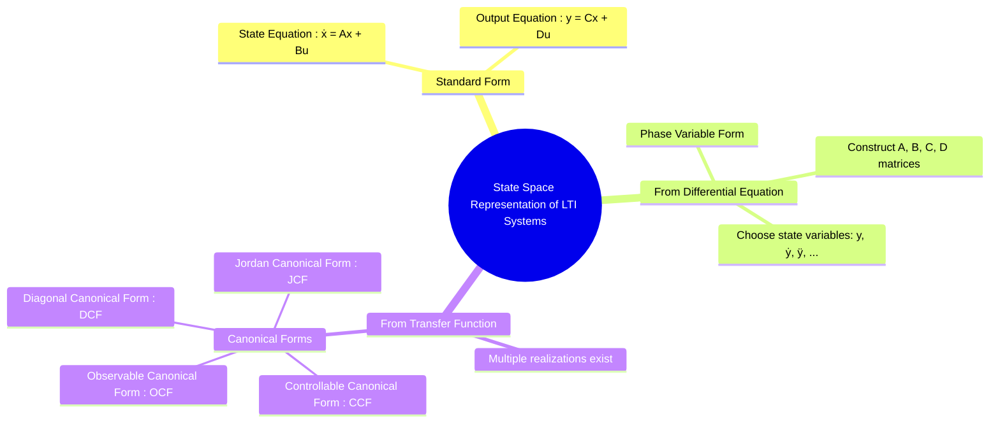

---
tags:
  - control-systems
  - state-space
  - modern-control
  - canonical-forms
  - lti-systems
created: 2025-09-21
aliases:
  - State Space Model
  - LTI State Space Representation
  - Controllable Canonical Form (CCF)
  - Jordan Canonical Form (JCF)
  - Diagonal Canonical Form (DCF)
  - Observable Canonical Form (OCF)
  - State-Space Representation
  - Stability from State-Space
subject: "[[Control Systems]]"
parent:
  - "[[State-Variable Analysis and Design]]"
trends:
  - "[[trends - State-Space Analysis]]"
modified: 2026-08-04T10:34:39
---
### State Space Representation of LTI Systems
#control-systems/state-space #system-modeling

> The state-space representation is a method used in modern control theory to model a dynamic system as a set of [[first-order differential equations]], encapsulated in matrix form. For any Linear Time-Invariant (LTI) system, this representation is given by two equations:

1.  **State Equation**: This equation describes the evolution of the system's internal state variables over time. $$ \boxed{\quad \dot{\mathbf{x}}(t) = A \mathbf{x}(t) + B \mathbf{u}(t) \quad} $$
2.  **Output Equation**: This equation relates the internal state and the system inputs to the measurable outputs. $$ \boxed{\quad \mathbf{y}(t) = C \mathbf{x}(t) + D \mathbf{u}(t) \quad} $$
The key challenge is to determine the matrices ($A, B, C, D$) from the system's differential equation or transfer function.

---
#### Terminology and Matrix Definitions
#state-vector #state-matrix

* $\mathbf{x}(t)$ is the **State Vector** (n x 1): The smallest set of variables that fully describes the dynamic state of the system at any given time.
* $\mathbf{u}(t)$ is the **Input Vector** (p x 1): The external inputs or control signals applied to the system.
* $\mathbf{y}(t)$ is the **Output Vector** (q x 1): The measurable outputs of the system.
* $\mathbf{A}$ is the **State (or System) Matrix** (n x n): Relates the current state to the change in state. It governs the system's internal dynamics and determines its stability.
* $\mathbf{B}$ is the **Input Matrix** (n x p): Shows how the inputs influence the state variables.
* $\mathbf{C}$ is the **Output Matrix** (q x n): Shows how the state variables are combined to produce the output.
* $\mathbf{D}$ is the **Feedforward (or Direct Transmission) Matrix** (q p): Represents the direct path from the input to the output. It is often zero for strictly proper systems.

> [!warning] Stability of an LTI system ==Important==
> 
> <u>An LTI system is stable if and only if all the **eigenvalues of the state matrix**, $(A)$ have negative real parts. These eigenvalues are equivalent to the poles of the system's transfer function.</u>
> 
> > See [[ee_2010#^q37]]
> > & [[ee_2025#^q62]]
> 
> |Eigenvalues of ($A$)|Stability|
> |---|---|
> |All eigenvalues **strictly negative real part**|**[[asymptotically stable]]**|
> |At least one eigenvalue **positive real part**|**Unstable**|
> |No positive eigenvalue AND at least one **zero eigenvalue**|**Marginally stable** (unless stated otherwise)|
> 
> > See [[Eigenvalues and Eigenvectors|Eigenvalues and Eigenvectors]]
> > & [[Properties of Eigenvalues and Eigenvectors]] ^stability-lti
---
#### Derivation from an n-th Order Differential Equation
#state-space/derivation #phase-variable-form

Given a single-input, single-output (SISO) system described by an $n$-th order linear differential equation:
$$ y^{(n)} + a_{n-1} y^{(n-1)} + \dots + a_1 \dot{y} + a_0 y = b_0 u $$
(Assuming the derivatives of input $u(t)$ are not present for simplicity).

We can define a set of state variables called **phase variables** as the output and its derivatives:
$$\begin{align}
x_1 &= y \\
x_2 &= \dot{y} = \dot{x}_1 \\
x_3 &= \ddot{y} = \dot{x}_2 \\
&\vdots \\
x_n &= y^{(n-1)} = \dot{x}_{n-1}
\end{align}$$
The derivatives of these state variables are:
$\dot{x}_1 = x_2, \dot{x}_2 = x_3, \dots, \dot{x}_{n-1} = x_n$.
The final state derivative, $\dot{x}_n = y^{(n)}$, is obtained by rearranging the original differential equation:
$$ \dot{x}_n = -a_0 x_1 - a_1 x_2 - \dots - a_{n-1} x_n + b_0 u $$
The output is simply $y = x_1$.

From this, we can construct the state-space matrices:
$$\dot{\mathbf{x}} = \begin{bmatrix} 0 & 1 & 0 & \dots & 0 \\ 0 & 0 & 1 & \dots & 0 \\ \vdots & \vdots & \vdots & \ddots & \vdots \\ 0 & 0 & 0 & \dots & 1 \\ -a_0 & -a_1 & -a_2 & \dots & -a_{n-1} \end{bmatrix} \mathbf{x} + \begin{bmatrix} 0 \\ 0 \\ \vdots \\ 0 \\ b_0 \end{bmatrix} u $$
$$ y = \begin{bmatrix} 1 & 0 & \dots & 0 \end{bmatrix} \mathbf{x} + [0]u $$
This specific structure is known as the **Controllable Canonical Form**.

---
#### Derivation from a Transfer Function
#state-space/canonical-forms

A given transfer function can have infinitely many state-space representations. Several standard or "canonical" forms are used. Consider a proper transfer function:
$$ G(s) = \frac{Y(s)}{U(s)} = \frac{b_{n-1}s^{n-1} + \dots + b_1s + b_0}{s^n + a_{n-1}s^{n-1} + \dots + a_1s + a_0} $$
The direct transmission term $D$ is zero if the order of the numerator is less than the order of the denominator.

##### 1. Controllable Canonical Form (CCF)
#controllable-canonical-form

This form is constructed directly from the coefficients of the transfer function.
$$ A = \begin{bmatrix} 0 & 1 & 0 & \dots & 0 \\ 0 & 0 & 1 & \dots & 0 \\ \vdots & \vdots & \vdots & \ddots & \vdots \\ 0 & 0 & 0 & \dots & 1 \\ -a_0 & -a_1 & -a_2 & \dots & -a_{n-1} \end{bmatrix}, \quad B = \begin{bmatrix} 0 \\ 0 \\ \vdots \\ 0 \\ 1 \end{bmatrix} $$
$$ C = \begin{bmatrix} b_0 & b_1 & \dots & b_{n-1} \end{bmatrix}, \quad D = [0] $$

##### 2. Observable Canonical Form (OCF)
#observable-canonical-form

The OCF matrices are the transposes of the CCF matrices, with the roles of B and C swapped.
$$ \boxed{\quad A_{OCF} = A_{CCF}^T, \quad B_{OCF} = C_{CCF}^T, \quad C_{OCF} = B_{CCF}^T \quad} $$
$$ A = \begin{bmatrix} 0 & 0 & \dots & -a_0 \\ 1 & 0 & \dots & -a_1 \\ 0 & 1 & \dots & -a_2 \\ \vdots & \vdots & \ddots & \vdots \\ 0 & 0 & \dots & -a_{n-1} \end{bmatrix}, \quad B = \begin{bmatrix} b_0 \\ b_1 \\ \vdots \\ b_{n-1} \end{bmatrix} $$
$$ C = \begin{bmatrix} 0 & 0 & \dots & 1 \end{bmatrix}, \quad D = [0] $$

##### 3. Diagonal Canonical Form (DCF)
#diagonal-canonical-form

This form is possible if the transfer function has **distinct poles** ($p_1, p_2, \dots, p_n$).
First, expand the transfer function using partial fractions:
$$ G(s) = \frac{Y(s)}{U(s)} = \frac{c_1}{s-p_1} + \frac{c_2}{s-p_2} + \dots + \frac{c_n}{s-p_n} $$
The state variables are chosen such that the system is decoupled.
$$ A = \begin{bmatrix} p_1 & 0 & \dots & 0 \\ 0 & p_2 & \dots & 0 \\ \vdots & \vdots & \ddots & \vdots \\ 0 & 0 & \dots & p_n \end{bmatrix}, \quad B = \begin{bmatrix} 1 \\ 1 \\ \vdots \\ 1 \end{bmatrix} $$
$$ C = \begin{bmatrix} c_1 & c_2 & \dots & c_n \end{bmatrix}, \quad D = [0] $$
*Note: The B matrix can also be chosen as a column vector of the residues $c_i$, in which case the C matrix would be a row vector of ones.*

##### 4. Jordan Canonical Form (JCF)
#jordan-canonical-form

This is an extension of the DCF for systems with **repeated poles**. The A matrix is block-diagonal. For a pole $p_1$ repeated 'r' times, the corresponding block in the A matrix is a Jordan block of the form:
$$ J = \begin{bmatrix} p_1 & 1 & 0 & \dots \\ 0 & p_1 & 1 & \dots \\ \vdots & & \ddots & 1 \\ 0 & \dots & 0 & p_1 \end{bmatrix} $$

---
#### Advantages Over Transfer Function Method
#state-space/advantages

1. **Handles MIMO Systems**: It can easily model Multi-Input Multi-Output (MIMO) systems, whereas the transfer function is typically limited to Single-Input Single-Output (SISO) systems.
2. **Provides Internal State Information**: It gives a complete description of the system's internal behavior, not just the overall input-output relationship.
3. **General Applicability**: The state-space framework can be extended to model non-linear and time-varying systems.
4. **Handles Initial Conditions**: It naturally incorporates non-zero initial conditions.

---
### Related Concepts
#related-concepts

> [[Concepts of State, State Variables, and State Model]]

[[Transfer Function and Impulse Response]] (The classical input-output model)
[[BIBO Stability]]
[[Transfer Function from State Space Model]]
[[State-Space Model from Transfer Function]]
[[Observability]] & [[Controllability]]
[[Phase Variable and Canonical Forms (Controllable, Observable)]]
[[Solution of State Equations]]
[[State Transition Matrix (STM)]]
[[Eigenvalues and Eigenvectors]] & [[Inverse of a Matrix]] (Eigenvalues, matrix inversion are essential)
[[The Laplace Transform]]

