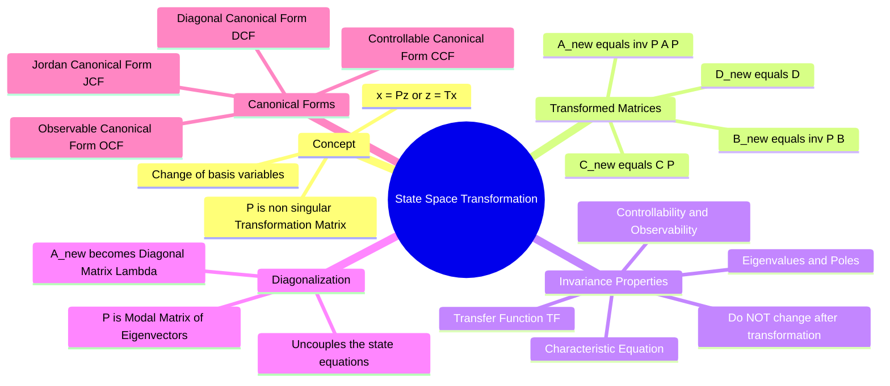

---
tags:
  - control-system
  - state-space
  - linear-algebra
  - gate
  - mathematical-modeling
created: 2026-08-04T10:34:58
aliases:
  - Similarity Transformation
  - State Space Canonical Forms
  - Diagonalization of State Matrix
subject: "[[Control Systems]]"
parent: "[[State-Variable Analysis and Design]]"
trends:
  - "[[trends - State-Space Analysis]]"
error:
  - "[[error - State-Space Analysis]]"
modified: 2026-08-04T10:34:58
---
### State-Space Transformation
#control-system/state-space #linear-algebra/transformations

> **State-Space Transformation** (or Similarity Transformation) is ==a technique used to change the internal state variables of a system without altering its external input-output behavior==. It is primarily used to convert a complex, coupled state-space model into standard **Canonical Forms** (like Diagonal or Controllable forms) to simplify analysis, decouple equations, and facilitate controller/observer design.

---
#### The Transformation Mathematics
#state-space/similarity-transformation

Consider an original state-space model with state vector $x(t)$:
$$\dot{x} = Ax + Bu$$
$$y = Cx + Du$$

Let us define a new state vector $z(t)$ such that the old states are a linear combination of the new states, connected by a non-singular $n \times n$ **Transformation Matrix ($P$)**:
$$\boxed{\quad x(t) = P z(t) \quad}$$
Since $P$ is a constant matrix, $\dot{x}(t) = P \dot{z}(t)$. Substituting this into the state equation:
$$P \dot{z} = A (Pz) + Bu$$
Multiplying both sides by $P^{-1}$:
$$\dot{z} = (P^{-1}AP)z + (P^{-1}B)u$$

The output equation becomes:
$$y = C(Pz) + Du = (CP)z + Du$$

**The Transformed System Matrices ($\tilde{A}, \tilde{B}, \tilde{C}, \tilde{D}$):**
$$\boxed{\quad \tilde{A} = P^{-1}AP \quad}$$
$$\boxed{\quad \tilde{B} = P^{-1}B \quad}$$
$$\boxed{\quad \tilde{C} = CP \quad}$$
$$\boxed{\quad \tilde{D} = D \quad}$$

> [!danger] Two Transformation Conventions
> Depending on how the problem specifies the transformation matrix, use the corresponding set of equations:
> 
> **Convention 1: Given $x = Pz$ (Modal Matrix Approach)**
> * $\tilde{A} = P^{-1}AP$
> * $\tilde{B} = P^{-1}B$
> * $\tilde{C} = CP$
> 
> **Convention 2: Given $z = Tx$ (Direct Mapping Approach)**
> 
> > See [[ee_2026#^q53]]
> 
> * $\tilde{A} = TAT^{-1}$
> * $\tilde{B} = TB$
> * $\tilde{C} = CT^{-1}$

---
#### Invariance Properties (Crucial for GATE)
#state-space/properties #gate/high-yield

A similarity transformation changes the internal states but preserves the fundamental characteristics of the system. The following properties are **Invariant** (they DO NOT CHANGE):

1.  **Transfer Function:** The input-output relationship remains identical.
    $$G(s) = C(sI - A)^{-1}B + D = \tilde{C}(sI - \tilde{A})^{-1}\tilde{B} + \tilde{D}$$
2.  **Eigenvalues (Poles):** The matrices $A$ and $\tilde{A} = P^{-1}AP$ are *similar matrices* and have the exact same eigenvalues.
3.  **Characteristic Equation:** $|sI - A| = 0$ is exactly the same as $|sI - \tilde{A}| = 0$.
4.  **Trace and Determinant:** Since eigenvalues are identical, $\text{Trace}(A) = \text{Trace}(\tilde{A})$ and $|A| = |\tilde{A}|$.
5.  **Controllability and Observability:** If the original system is controllable/observable, the transformed system is also completely controllable/observable.

---
#### Diagonalization (Decoupling)
#state-space/diagonalization

If the system matrix $A$ has distinct eigenvalues ($\lambda_1, \lambda_2, \dots, \lambda_n$), we can completely uncouple the state equations.
We choose the transformation matrix $P$ to be the **Modal Matrix ($M$)**, whose columns are the **Eigenvectors** of $A$.
$$P = M = \begin{bmatrix} v_1 & v_2 & \dots & v_n \end{bmatrix}$$

Applying this transformation yields the **Diagonal Canonical Form**:
$$\tilde{A} = M^{-1}AM = \Lambda = \begin{bmatrix} \lambda_1 & 0 & \dots & 0 \\ 0 & \lambda_2 & \dots & 0 \\ \vdots & \vdots & \ddots & \vdots \\ 0 & 0 & \dots & \lambda_n \end{bmatrix}$$
*   **Significance:** The new state equations are $\dot{z}_i = \lambda_i z_i + \tilde{b}_i u$. Each state equation is a completely independent first-order differential equation.
*   **Jordan Form:** If $A$ has repeated eigenvalues and a shortage of independent eigenvectors, it cannot be strictly diagonalized. Instead, it transforms into the **Jordan Canonical Form** (blocks of eigenvalues on the diagonal with 1s on the superdiagonal).

---
#### Standard Canonical Forms
#control-system/canonical-forms

By choosing specific $P$ matrices, we force the state equations into standard forms directly derivable from the Transfer Function $G(s) = \frac{b_n s^n + \dots + b_1 s + b_0}{s^n + a_{n-1} s^{n-1} + \dots + a_1 s + a_0}$.

**A. Controllable Canonical Form (CCF):**
*   Directly exposes the coefficients of the characteristic equation in the last row of $A$.
*   The $B$ matrix is a vector of zeros ending in $1$ ($[0, \dots, 0, 1]^T$).
*   Guarantees the system is Controllable.

**B. Observable Canonical Form (OCF):**
*   The dual of CCF. The $A$ matrix in OCF is the transpose of the $A$ matrix in CCF ($A_{OCF} = A_{CCF}^T$).
*   The $C$ matrix is $[0, \dots, 0, 1]$.
*   Guarantees the system is Observable.

---
### Related Concepts
#topic/related-concepts

> [[State-Variable Analysis and Design]]

[[Eigenvalues and Eigenvectors]] (Used to form the Modal Matrix)
[[Transfer Function and Impulse Response|Transfer Function]] (Invariant under transformation)
[[Matrix Operations|Matrices]] (Matrix inversion and multiplication)
[[Controllers (P, PI, PD, PID)]]
[[Mathematical Modeling of Physical Systems (Mechanical, Electrical)]]
