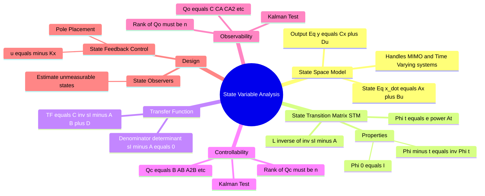

---
tags:
  - control-system
  - state-space
  - modern-control
  - gate
  - mathematical-modeling
created: 2026-08-04T10:35:18
aliases:
  - State Space Analysis
  - State Variable Model
  - Modern Control Theory
subject: "[[Control Systems]]"
parent: "[[Control Systems]]"
modified: 2026-08-04T10:35:18
---
###### Mind Map

---
### State Variable Analysis and Design
#control-system/state-space #modern-control 

> **State Variable Analysis** is a <u>modern control theory approach that describes a system using a set of first-order differential equations</u>. Unlike the classical Transfer Function approach (which is limited to Linear Time-Invariant, Single-Input Single-Output systems with zero initial conditions), <u>the state-space model can handle MIMO (Multiple-Input Multiple-Output), non-linear, time-varying systems, and incorporates non-zero initial conditions</u>.

#### The State Space Representation
#state-space/representation

A dynamic system of order $n$, with $m$ inputs and $p$ outputs, is represented by two equations:

**1. State Equation:**
$$\boxed{\quad \dot{x}(t) = A x(t) + B u(t) \quad}$$
**2. Output Equation:**
$$\boxed{\quad y(t) = C x(t) + D u(t) \quad}$$

Where:
*   $x(t)$: State vector $(n \times 1)$
*   $u(t)$: Input vector $(m \times 1)$
*   $y(t)$: Output vector $(p \times 1)$
*   $A$: System matrix $(n \times n)$
*   $B$: Input matrix $(n \times m)$
*   $C$: Output matrix $(p \times n)$
*   $D$: Direct transmission/Feedforward matrix $(p \times m)$, usually zero.

---
#### [[Transfer Function from State Space Model]]
#state-space/transfer-function

Taking the Laplace transform of the state equations (assuming zero initial conditions, $x(0) = 0$):
$sX(s) = AX(s) + BU(s) \implies X(s) = (sI - A)^{-1} BU(s)$
$Y(s) = CX(s) + DU(s) = [C(sI - A)^{-1}B + D] U(s)$

The **Transfer Function Matrix** $G(s) = \frac{Y(s)}{U(s)}$ is:
$$\boxed{\quad G(s) = C(sI - A)^{-1}B + D \quad}$$

*   **Characteristic Equation:** The poles of the system are the roots of the characteristic equation, derived from the denominator of $(sI - A)^{-1}$.
    $$\boxed{\quad |sI - A| = 0 \quad}$$
*   The roots of $|sI - A| = 0$ are the **Eigenvalues** of matrix $A$.

---
#### [[State Transition Matrix (STM)]]
#state-space/stm

The State Transition Matrix, denoted by $\Phi(t)$, describes the unforced (free) response of the system.
$$\boxed{\quad \Phi(t) = e^{At} = \mathcal{L}^{-1} \{ (sI - A)^{-1} \} \quad}$$

**Properties of STM (Highly tested in GATE):**
1.  $\Phi(0) = e^0 = I$ (Identity Matrix)
2.  $\Phi(-t) = [\Phi(t)]^{-1}$
3.  $\Phi(t_1 + t_2) = \Phi(t_1) \cdot \Phi(t_2)$
4.  $\Phi(t_2 - t_1) \cdot \Phi(t_1 - t_0) = \Phi(t_2 - t_0)$
5.  $[\Phi(t)]^k = \Phi(kt)$

---
#### [[Solution of State Equations]]
#state-space/solution

The complete time-domain solution for the state vector $x(t)$ consists of the Zero-Input Response (ZIR) and the Zero-State Response (ZSR).

$$\boxed{\quad x(t) = \Phi(t)x(0) + \int_{0}^{t} \Phi(t - \tau) B u(\tau) d\tau \quad}$$
*   **Term 1 ($\Phi(t)x(0)$):** Natural response due to initial conditions.
*   **Term 2 (Convolution Integral):** Forced response due to the input $u(t)$.

---
#### [[Controllability|Controllability Test]] and [[Observability|Observability Test]] (Kalman's Tests)
#state-space/controllability-observability #gate/high-yield

These properties determine if a system can be successfully controlled and monitored.

**A. Controllability:**
A system is entirely controllable if it is possible to transfer the system from any initial state to any desired final state in a finite time using an unconstrained control input $u(t)$.
*   **Kalman's Test:** Form the Controllability Matrix $Q_c$ (size $n \times nm$).
    $$\boxed{\quad Q_c = \begin{bmatrix} B & AB & A^2B & \dots & A^{n-1}B \end{bmatrix} \quad}$$
*   **Condition:** System is controllable if **$\text{Rank}(Q_c) = n$** (or $|Q_c| \neq 0$ for SISO).

**B. Observability:**
A system is completely observable if the initial state $x(0)$ can be determined from the observation of the output $y(t)$ and input $u(t)$ over a finite time interval.
*   **Kalman's Test:** Form the Observability Matrix $Q_o$ (size $pn \times n$).
    $$\boxed{\quad Q_o = \begin{bmatrix} C \\ CA \\ CA^2 \\ \vdots \\ CA^{n-1} \end{bmatrix} \quad}$$
*   **Condition:** System is observable if **$\text{Rank}(Q_o) = n$** (or $|Q_o| \neq 0$ for SISO).

---
#### State Variable Design (Pole Placement)
#control-system/design

If a system is completely controllable, its closed-loop poles (eigenvalues) can be placed at any desired locations using **State Feedback**.
*   **Control Law:** We feed back all the states multiplied by a gain matrix $K$.
    $$u(t) = -Kx(t) + r(t)$$
*   **New State Equation:**
    $\dot{x} = Ax + B(-Kx + r) = (A - BK)x + Br$
*   **Design Objective:** Find matrix $K$ such that the new characteristic equation $|sI - (A - BK)| = 0$ matches the desired characteristic polynomial. (Ackermann's formula is often used for this).

**State Observers:**
If some states are not directly measurable (but the system is observable), an **Observer** is designed to estimate the states $\hat{x}(t)$ based on the output $y(t)$ and input $u(t)$.

---
### Related Concepts
#topic/related-concepts

> [[Transfer Function and Impulse Response|Transfer Function]] (Classical alternative to State Space)

[[State-Space Transformation]]
[[Matrix Operations|Matrices]] (Fundamentals of Eigenvalues and Rank)
[[Eigenvalues and Eigenvectors]] (Poles and modes of the system)
[[The Laplace Transform]] (Used to find the STM)
[[characteristic equation]]
[[Controllers (P, PI, PD, PID)]] (Classical controller design vs Modern state feedback)
[[Mathematical Modeling of Physical Systems (Mechanical, Electrical)]]
