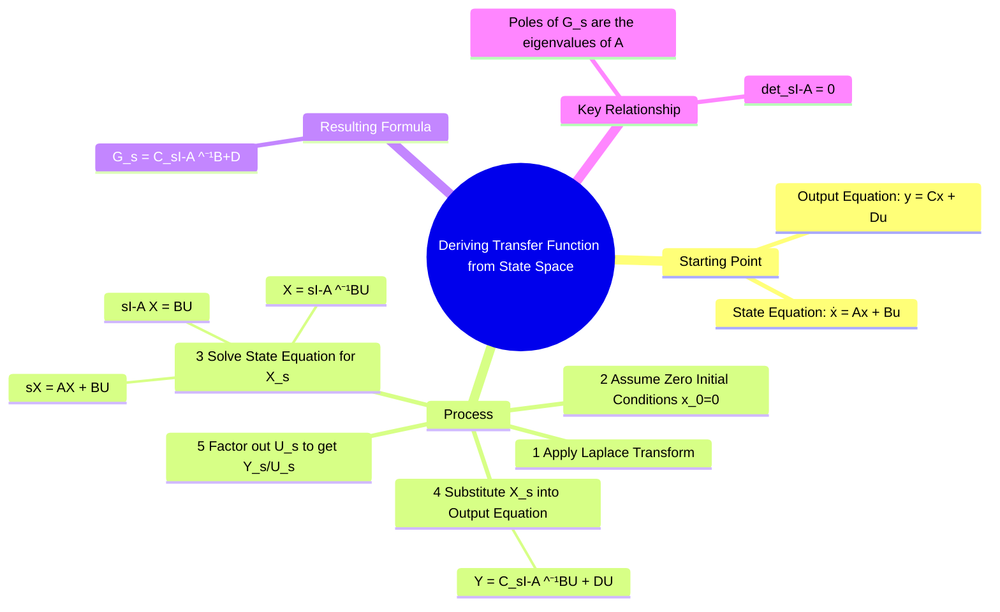

---
tags:
  - control-systems
  - state-space
  - transfer-function
  - modern-control
created: 2025-09-21
aliases:
  - State Space to Transfer Function
  - SS to TF
  - resolvent matrix
subject: "[[Control Systems]]"
parent:
  - "[[State-Variable Analysis and Design]]"
formula:
  - "State Space Model (Transfer Function) : $$G(s) = C(sI - A)^{-1}B + D$$"
modified: 2026-08-04T10:42:53
---
### Deriving Transfer Function from State Space Model
#control-systems/state-space #transfer-function

> The [[Transfer Function and Impulse Response|transfer function]], which describes the input-output relationship of a system, can be derived from its state-space model. This process converts the internal system description (state-space) into an external one (transfer function).

---
#### The Derivation
#state-space/derivation

The derivation starts with the standard LTI state-space equations:
1.  **State Equation**: $\dot{\mathbf{x}}(t) = A \mathbf{x}(t) + B \mathbf{u}(t)$
2.  **Output Equation**: $\mathbf{y}(t) = C \mathbf{x}(t) + D \mathbf{u}(t)$

> [!info]
> $A$ is an $n \times n$ matrix, $B$ is $n \times m$, $C$ is $p \times n$, and $D$ is $p \times m$.

---

##### Step 1: Apply the Laplace Transform
#step-1 

We apply the Laplace Transform to both equations. For the state equation, the transform of the derivative $\dot{\mathbf{x}}(t)$ is $s\mathbf{X}(s) - \mathbf{x}(0)$.
$$ s\mathbf{X}(s) - \mathbf{x}(0) = A\mathbf{X}(s) + B\mathbf{U}(s) $$
$$ \mathbf{Y}(s) = C\mathbf{X}(s) + D\mathbf{U}(s) $$

---
##### Step 2: Assume Zero Initial Conditions
#step-2 

The definition of a transfer function assumes that the system is initially at rest. Therefore, we set the initial conditions to zero: $\mathbf{x}(0) = \mathbf{0}$.
The state equation simplifies to:
$$ s\mathbf{X}(s) = A\mathbf{X}(s) + B\mathbf{U}(s) $$

> [!answer] Always True
> Transfer function $G(s)$ is defined only under zero initial conditions; non-zero initial conditions produce additional terms not captured by $G(s)$.

> [!important] Important (Exam)
> Transfer function $G(s)=C(sI-A)^{-1}B+D$ is valid only when $x(0)=0$.
> If $x(0)\neq0$, output must be computed as: 
> $$Y(s)=\underbrace{C(sI-A)^{-1}x(0)}_{\text{Laplace of ZIR}} + \underbrace{C(sI-A)^{-1}BU(s)}_{\text{Laplace of ZSR}}$$
> Ignoring the first term gives a wrong answer. ^non-zero-ic
> 
> This is the exact Laplace transform of the **Complete Output Response** found in [[Solution of State Equations#^complete-output-response]].

---
##### Step 3: Solve for the State Vector $\mathbf{X}(s)$
#step-3 

We rearrange the equation to isolate $\mathbf{X}(s)$.
$$\begin{align}
s\mathbf{X}(s) - A\mathbf{X}(s) &= B\mathbf{U}(s) \\
(sI - A)\mathbf{X}(s) &= B\mathbf{U}(s)
\end{align}$$
Here, $I$ is the identity matrix with the same dimensions as $A$. Pre-multiplying by the inverse of $(sI - A)$ gives:
$$ \mathbf{X}(s) = (sI - A)^{-1} B \mathbf{U}(s) $$

---
##### Step 4: Substitute $\mathbf{X}(s)$ into the Output Equation
#step-4 

Now we substitute this expression for the state vector into the transformed output equation:
$$ \mathbf{Y}(s) = C \left[ (sI - A)^{-1} B \mathbf{U}(s) \right] + D \mathbf{U}(s) $$

---
##### Step 5: Determine the Transfer Function
#step-5 

By factoring out the input vector $\mathbf{U}(s)$, we get the final relationship:
$$ \mathbf{Y}(s) = \left[ C(sI - A)^{-1}B + D \right] \mathbf{U}(s) $$
The transfer function (or transfer function matrix for MIMO systems) $G(s)$ is the ratio $\mathbf{Y}(s) / \mathbf{U}(s)$.

---
#### The Transfer Function Formula

The transfer function $G(s)$ from the state-space model $(A, B, C, D)$ is:
$$ \boxed{\quad G(s) = C(sI - A)^{-1}B + D \quad} $$
- $(sI - A)^{-1}$ is the **resolvent matrix**. It is the [[The Laplace Transform|laplace transform]] of the [[State Transition Matrix (STM)#^laplace-stm|state transition matrix]], $\Phi(t)$.
- For a SISO system, $G(s)$ is a scalar transfer function.
- For a MIMO system, $G(s)$ is a matrix of transfer functions.

> [!pyq]- PYQ : 2019
> ![[ee_2019#^q31]]

> [!Navigation] Numerical Navigation
> Most used concepts during/after finding Transfer Function
> 
> - [[Inverse of a Matrix]]
> - [[Inverse Laplace Transform using Partial Fraction Expansion]] (to convert from $s$-domain to time domain)
> - [[Laplace Transform Standard Pairs Table]] (standard $s$-domain transformation from time domain, including step, ramp, polynomial, damped, sinusoidal, etc.)

##### Poles and the Characteristic Equation
#poles #characteristic-equation 

The poles of the transfer function are the values of $s$ for which the system's response can be non-zero even with zero input. They are determined by the denominator of the transfer function.
Since $(sI - A)^{-1} = \frac{\text{adj}(sI - A)}{\det(sI - A)}$, the denominator of $G(s)$ is given by the determinant of $(sI - A)$.
The equation that defines the poles is the **characteristic equation**:
$$ \boxed{\quad \det(sI - A) = 0 \quad} $$
The roots of this equation are the **[[Eigenvalues and Eigenvectors|eigenvalues]] of the system matrix A**. Therefore, the poles of the LTI system are the eigenvalues of its state matrix $A$.

---
### Related Concepts
#related-concepts

> [[State-Space Representation of LTI Systems]]

[[State-Space Model from Transfer Function]]
[[Concepts of State, State Variables, and State Model]]
[[State Transition Matrix (STM)]]
[[Eigenvalues and Eigenvectors|Eigenvalues and Eigenvectors]]
[[Transfer Function and Impulse Response]]
[[Inverse Laplace Transform using Partial Fraction Expansion]] (to convert from $s$-domain to time domain)
[[Second-Order System Response]]