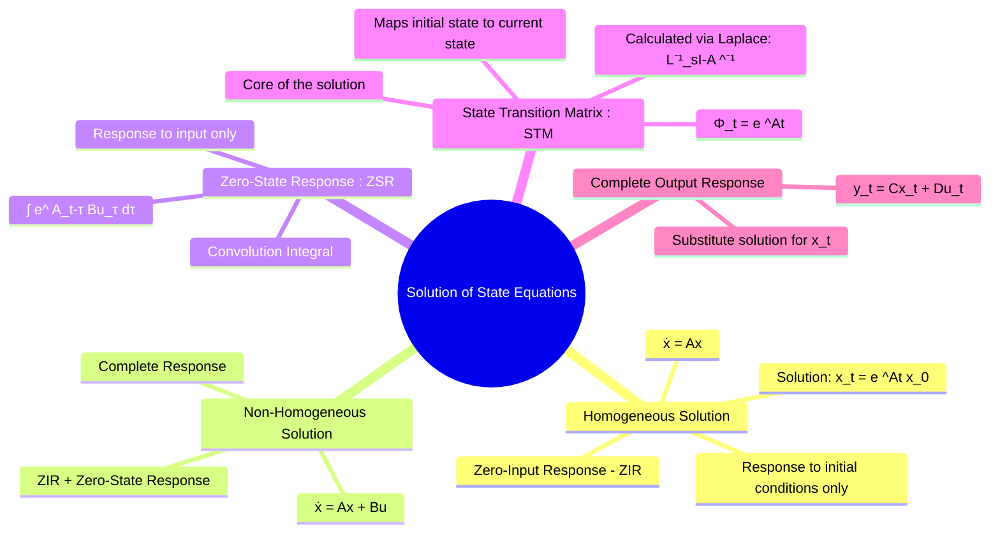

---
tags:
  - control-systems
  - state-space
  - modern-control
  - differential-equations
  - lti-systems
created: 2025-09-21
aliases:
  - State Equation Solution
  - Time Response of State Space Systems
  - Zero-Input Response (ZIR)
subject: "[[Control Systems]]"
parent:
  - "[[State-Variable Analysis and Design]]"
trends:
  - "[[trends - State-Space Analysis]]"
modified: 2026-08-04T10:31:40
---
### Solution of State Equations
#control-systems/state-space #state-space/solution

> Solving the [[State-Space Representation of LTI Systems|state equations]] means finding the time evolution of the state vector $\mathbf{x}(t)$ and the output vector $\mathbf{y}(t)$, given the system's initial state $\mathbf{x}(0)$ and the input $\mathbf{u}(t)$ for $t \ge 0$. The solution is composed of two parts: the response due to the initial conditions (zero-input response) and the response due to the external input (zero-state response).

---
#### 1. Homogeneous Solution (Zero-Input Response)
#zero-input-response

The zero-input response (ZIR) is the system's behavior when the input is zero ($\mathbf{u}(t) = 0$), driven only by its initial conditions $\mathbf{x}(0)$. The state equation becomes a homogeneous first-order matrix differential equation:
$$ \dot{\mathbf{x}}(t) = A\mathbf{x}(t) $$
Drawing an analogy with the scalar equation $\dot{x} = ax$ which has the solution $x(t) = e^{at}x(0)$, the matrix equivalent is:
$$ \boxed{\quad \mathbf{x}_{ZIR}(t) = e^{At} \mathbf{x}(0) \quad} $$
The term $e^{At}$ is a matrix exponential known as the **[[State Transition Matrix (STM)]]**.

---
#### 2. The [[State Transition Matrix (STM)]]
#state-transition-matrix

The State Transition Matrix, denoted $\Phi(t)$, is the fundamental matrix that relates the state of the system at one time to the state at another time in the absence of input.
$$ \boxed{\quad \Phi(t) = e^{At} \quad} $$

**Calculation:**
While it can be defined by its [[Taylor Series|infinite series expansion]] $e^{At} = I + At + \frac{A^2t^2}{2!} + \dots$, the most practical method for calculation is via the [[The Laplace Transform|Laplace Transform]] of the resolvent matrix:
$$ \boxed{\quad \Phi(t) = \mathcal{L}^{-1}\left[ (sI - A)^{-1} \right] \quad} $$

**Properties of the STM:**
1.  $\Phi(0) = e^{A \cdot 0} = I$ (Identity matrix)
2.  $\dot{\Phi}(t) = A \Phi(t)$ (The STM is a solution to the homogeneous state equation)
3.  $\Phi(t_1 + t_2) = \Phi(t_1) \Phi(t_2)$ (Composition property)
4.  $\Phi^{-1}(t) = \Phi(-t)$ (Inverse property)

---
#### 3. Complete Solution (Non-Homogeneous Equation)
#zero-state-response #convolution

The complete solution for the state equation $\dot{\mathbf{x}}(t) = A\mathbf{x}(t) + B\mathbf{u}(t)$ is the sum of the zero-input response and the zero-state response.

*   **Zero-Input Response (ZIR)**: Response to initial conditions alone.
    $\mathbf{x}_{ZIR}(t) = \Phi(t) \mathbf{x}(0)$
*   **Zero-State Response (ZSR)**: Response to input alone, with zero initial conditions. This is given by the convolution integral.
    $\mathbf{x}_{ZSR}(t) = \int_{0}^{t} e^{A(t-\tau)} B \mathbf{u}(\tau) d\tau = \int_{0}^{t} \Phi(t-\tau) B \mathbf{u}(\tau) d\tau$

Combining these gives the **complete state response**:
$$ \boxed{\quad \mathbf{x}(t) = \underbrace{e^{At} \mathbf{x}(0)}_{\text{Zero-Input Response}} + \underbrace{\int_{0}^{t} e^{A(t-\tau)} B \mathbf{u}(\tau) d\tau}_{\text{Zero-State Response}} \quad} $$

---
#### 4. Complete Output Response
To find the complete output response $\mathbf{y}(t)$, we simply substitute the solution for $\mathbf{x}(t)$ into the output equation $\mathbf{y}(t) = C\mathbf{x}(t) + D\mathbf{u}(t)$.

$$\boxed{\quad \mathbf{y}(t) = \underbrace{C e^{At} \mathbf{x}(0)}_{\text{Zero-Input Response (ZIR)}} + \underbrace{C \left[ \int_{0}^{t} e^{A(t-\tau)} B \mathbf{u}(\tau) d\tau \right] + D \mathbf{u}(t)}_{\text{Zero-State Response (ZSR)}} \quad}$$ ^complete-output-response

> [!tip] GATE Speed Hack
> If a GATE question asks for $\mathbf{y}(t)$ with non-zero initial conditions, it is often much faster to compute it in the s-domain using [[Transfer Function from State Space Model#^non-zero-ic]] and then take the [[Inverse Laplace Transform using Partial Fraction Expansion|Inverse Laplace Transform]], rather than solving the convolution integral manually!

---
### Related Concepts
#related-concepts

> [[State Transition Matrix (STM)]]

[[State-Space Representation of LTI Systems]]
[[Transfer Function from State Space Model]]
[[The Laplace Transform]]
[[Continuous-Time Convolution Integral]]
[[State Transition Matrix (STM)|Matrix Exponential]]
[[Diagonalization of a Matrix]]
[[Taylor Series]]

