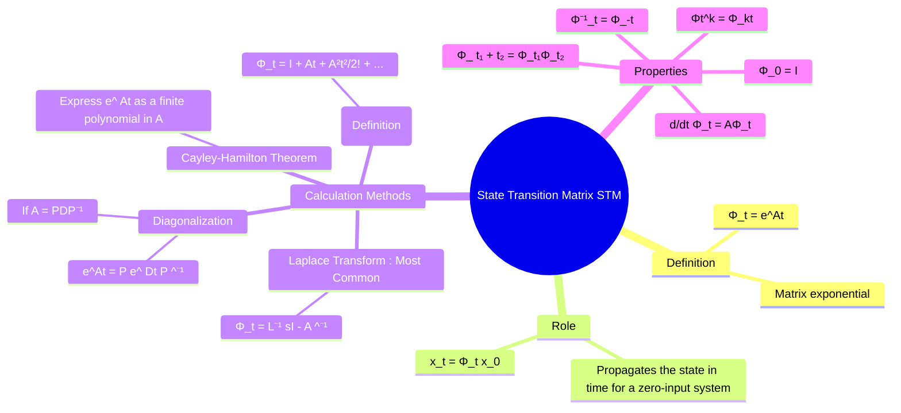

---
tags:
  - control-systems
  - state-space
  - modern-control
  - matrix-exponential
  - lti-systems
created: 2025-09-21
aliases:
  - STM
  - Matrix Exponential
  - State Transition Matrix (STM) and its Properties
  - "Properties : State Transition Matrix (STM)"
  - State Transition Matrix
subject: "[[Control Systems]]"
parent: "[[Solution of State Equations]]"
trends:
  - "[[trends - State-Space Analysis]]"
modified: 2026-08-04T10:33:58
---
### State Transition Matrix (STM)
#control-systems/state-space #state-transition-matrix

> The **State Transition Matrix (STM)**, denoted by $\Phi(t)$, is a fundamental concept in the [[solution of state equations]] for LTI systems. It is the matrix that relates the initial state of the system $\mathbf{x}(0)$ to the state $\mathbf{x}(t)$ at any time $t$, assuming zero input.

The STM is defined as the **matrix exponential** of $At$:
$$ \boxed{\quad \Phi(t) = e^{At} \quad} $$
Its role is to describe the system's natural evolution from its initial conditions. For the homogeneous (zero-input) state equation $\dot{\mathbf{x}} = A\mathbf{x}$, the solution is:
$$ \mathbf{x}(t) = \Phi(t) \mathbf{x}(0) $$

---
#### Methods for Calculation
#state-transition-matrix/method-for-calculation

> [!warning] Solving Zero-Input Response: Scalar vs. Matrix
> **Context:** Finding $x(t)$ or $y(t)$ given $x(0)$ and $u(t)=0$.
> 
> - **Method 1: Scalar Splitting (Laplace)**
> - <u>*When to use:* Only when the $A$ matrix is **diagonal**.</u>
>   - *Why:* The equations are decoupled ($\dot{x}_1$ only depends on $x_1$). You can treat them as independent 1st-order systems, apply Laplace, and take the inverse easily.
> - **Method 2: Matrix Laplace $(sI - A)^{-1}x(0)$ or Matrix Exponential $e^{At}x(0)$**
> - <u>*When to use:* When the $A$ matrix has non-zero off-diagonal elements.</u>
>   - *Why:* The variables are **coupled**. Matrix inversion naturally resolves the simultaneous algebraic equations in the $s$-domain. Manually splitting coupled differential equations is inefficient.

There are several methods to compute the State Transition Matrix $\Phi(t)$.

##### 1. Laplace Transform Method (Most Common)
#state-transition-matrix/method-for-calculation/laplace-transform

This is <u>the most direct and widely used method in control systems</u>. The STM is the inverse Laplace transform of the **resolvent matrix** $(sI-A)^{-1}$.
$$\boxed{\quad \Phi(t) = \mathcal{L}^{-1}\left[ (sI - A)^{-1} \right] \quad}$$ ^laplace-stm

> [!tip] GATE Connection
> This exact resolvent matrix $(sI - A)^{-1}$ forms the core engine of the system's [[Transfer Function from State Space Model#The Transfer Function Formula|Transfer Function Matrix]].

**Procedure**:
1.  Form the matrix $(sI - A)$.
2.  Calculate its inverse, $(sI - A)^{-1} = \frac{\text{adj}(sI - A)}{\det(sI - A)}$.
3.  Find the inverse Laplace transform of each element of the resulting matrix.

---
##### 2. Infinite Series Expansion
#state-transition-matrix/method-for-calculation/infinite-series-expansion

> [!refer]
> [[Taylor Series#Standard Maclaurin Series Expansions|Maclaurin Expansion]]

This method comes directly from the definition of the matrix exponential.
$$ \Phi(t) = e^{At} = I + At + \frac{A^2t^2}{2!} + \frac{A^3t^3}{3!} + \dots = \sum_{k=0}^{\infty} \frac{(At)^k}{k!} $$
This is computationally intensive and is practical only for simple or nilpotent matrices (where $A^k = 0$ for some $k$).

---
##### 3. Diagonalization Method
#state-transition-matrix/method-for-calculation/diagonalization-method

If the state matrix $A$ is diagonalizable (i.e., has n linearly independent eigenvectors), it can be written as $A = PDP^{-1}$, where $D$ is a diagonal matrix of eigenvalues and $P$ is the matrix of corresponding eigenvectors.
$$ \Phi(t) = e^{At} = P e^{Dt} P^{-1} $$
The matrix $e^{Dt}$ is easy to compute:
$$ e^{Dt} = \begin{bmatrix} e^{\lambda_1 t} & 0 & \dots & 0 \\ 0 & e^{\lambda_2 t} & \dots & 0 \\ \vdots & \vdots & \ddots & \vdots \\ 0 & 0 & \dots & e^{\lambda_n t} \end{bmatrix} $$

---
##### 4. Cayley-Hamilton Theorem Method
#state-transition-matrix/method-for-calculation/cayley-hamilton-theorem-method

The Cayley-Hamilton theorem states that a matrix satisfies its own characteristic equation, $\det(\lambda I - A) = 0$. This allows the matrix exponential $e^{At}$ to be expressed as a finite polynomial in $A$ of degree $n-1$:
$$ e^{At} = \alpha_0(t)I + \alpha_1(t)A + \dots + \alpha_{n-1}(t)A^{n-1} $$
The scalar functions $\alpha_i(t)$ are found by solving a system of equations formed by replacing $A$ with its eigenvalues $\lambda_i$.

---
#### Properties of the State Transition Matrix
#state-transition-matrix/properties

The STM has several important properties that follow directly from the properties of matrix exponentials.

##### 1. Identity at $t=0$
$$\Phi(0) = e^{A \cdot 0} = I$$

> [!tip] GATE MCQ Elimination Hack
> If asked to find $\Phi(t)$ for a given matrix $A$, substitute $t=0$ into the four options. The correct matrix option MUST reduce to the Identity Matrix $I$. If it doesn't, eliminate it immediately. 

---
##### 2. Eigenvalue Check
The exponents in the entries of $\Phi(t)$ (e.g., $e^{\lambda_1 t}, e^{\lambda_2 t}$) correspond exactly to the roots of the characteristic equation $\det(sI-A)=0$, which are the **poles** of the system's [[Transfer Function from State Space Model#Poles and the Characteristic Equation|Transfer Function]].

---
##### 3. Inverse Property

$$ \Phi^{-1}(t) = e^{-At} = \Phi(-t) $$
(The inverse STM propagates the state backward in time).

---
##### 4. Composition (Transition) Property

$$ \Phi(t_2 - t_1) = \Phi(t_2)\Phi^{-1}(t_1) $$
More simply, for cascaded time intervals:
$$ \Phi(t_1 + t_2) = \Phi(t_1)\Phi(t_2) $$

---
##### 5. Differential Equation Property

$$ \frac{d}{dt}\Phi(t) = A \cdot e^{At} = A \Phi(t) $$
(The STM itself is a solution to the homogeneous state equation).

---
##### 6. Power Property

$$ [\Phi(t)]^k = \Phi(kt) \quad (\text{for integer k}) $$

---
### Related Concepts
#stm/related-concepts 

> [[Solution of State Equations]]

[[Concepts of State, State Variables, and State Model]]
[[Transfer Function from State Space Model]]
[[Eigenvalues and Eigenvectors|Eigenvalues and Eigenvectors]]
[[The Laplace Transform]]
[[Taylor Series]]
