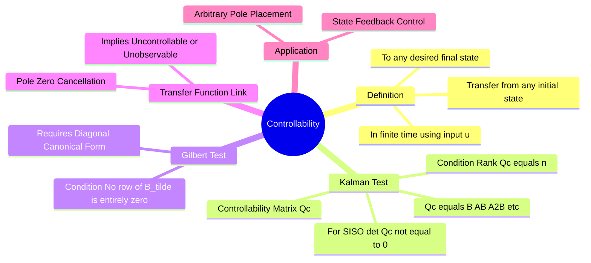

---
tags:
  - control-system
  - state-space
  - mathematical-modeling
  - gate
aliases:
  - Complete Controllability
  - Kalman's Controllability Test
  - Gilbert's Test
created: 2026-08-04T09:28:06
subject: "[[Control Systems]]"
parent: "[[State-Variable Analysis and Design]]"
modified: 2026-08-04T09:28:06
---
### Controllability
#control-system/state-space #controllability

> A system is said to be **completely state controllable** if it is possible to transfer the system state from any initial state $x(t_0)$ to any other desired state $x(t_f)$ in a finite time interval $(t_f - t_0)$ by applying an unconstrained control input $u(t)$. In simpler terms, it means the input has an effect on all the internal states of the system.

---

#### Kalman's Test for Controllability
#state-space/kalman-test #gate/formulas

This is the most universal and frequently tested method in GATE for checking controllability of a Linear Time-Invariant (LTI) system defined by $\mathbf{\dot{x}} = Ax + Bu$.

We construct the **Controllability Matrix ($Q_c$)**:
$$\boxed{\quad Q_c = \begin{bmatrix} B & AB & A^2B & \dots & A^{n-1}B \end{bmatrix} \quad}$$
Where:
*   $A$ is the system matrix of size $n \times n$.
*   $B$ is the input matrix of size $n \times m$ ($m$ is the number of inputs).
*   $Q_c$ will have dimensions $n \times nm$.

**Condition for Controllability:**
The system is completely state controllable if and only if the rank of the controllability matrix is equal to the order of the system ($n$).
$$\boxed{\quad \text{Rank}(Q_c) = n \quad}$$

**For SISO Systems (Single Input, Single Output):**
In a SISO system, $B$ is a column vector ($n \times 1$), so $Q_c$ becomes a square matrix ($n \times n$). The rank condition simplifies to checking the determinant:
$$\boxed{\quad |Q_c| \neq 0 \implies \text{Controllable} \quad}$$
If $|Q_c| = 0$, the system is uncontrollable.

> See [[ee_2010#^q37]]

---
#### Gilbert's Test for Controllability
#state-space/gilbert-test

Gilbert's test is applicable when the system matrix $A$ has **distinct eigenvalues** and the system has been transformed into the **Diagonal Canonical Form** via a [[State-Space Transformation]] using the modal matrix.

Let the transformed system be:
$$\mathbf{\dot{z}} = \Lambda z + \tilde{B}u$$
(where $\Lambda$ is a diagonal matrix of eigenvalues and $\tilde{B} = M^{-1}B$).

**Condition:**
The system is completely controllable if and only if **no row of the transformed input matrix $\tilde{B}$ is entirely zero**.
*   *Interpretation:* If a row in $\tilde{B}$ is zero, the corresponding state variable $z_i$ is governed by $\dot{z}_i = \lambda_i z_i + 0 \cdot u$. The input $u$ has no connection to this state, making it uncontrollable.

---
#### Transfer Function and Pole-Zero Cancellation
#control-system/transfer-function #gate/concept

There is a profound relationship between the State-Space model and the classical Transfer Function $G(s) = \frac{Y(s)}{U(s)}$.

If you calculate the Transfer Function from a state-space model:
$$G(s) = C(sI - A)^{-1}B + D$$
And you find that a **Pole-Zero Cancellation** occurs in $G(s)$, it strictly implies that the underlying state-space model is **either Uncontrollable, Unobservable, or both**.
*   The canceled pole corresponds to a mode (state) of the system that is "hidden" from the input (uncontrollable) or "hidden" from the output (unobservable).
*   A system is both Controllable and Observable (a "Minimal Realization") if and only if there are no pole-zero cancellations in its transfer function.

---
#### Application: Pole Placement
#control-system/design

The primary practical importance of controllability is for controller design.
If a system is completely controllable, it is possible to place the closed-loop poles (eigenvalues) of the system at **any arbitrary desired locations** using linear **State Feedback** ($u = -Kx$).
*   If the system is uncontrollable, the uncontrollable modes (eigenvalues) cannot be shifted by state feedback. If an uncontrollable mode is unstable, the entire system cannot be stabilized.

---
### Related Concepts
#topic/related-concepts

> [[Observability]] (The dual concept of controllability)

[[State-Variable Analysis and Design]]
[[State-Space Transformation]] (Diagonalization required for Gilbert's Test)
[[Transfer Function]]
[[Linear Algebra - Matrices]] (Rank and Determinant calculations)
[[Controllers (P, PI, PD, PID)]] (Contrast with state-feedback controllers)
