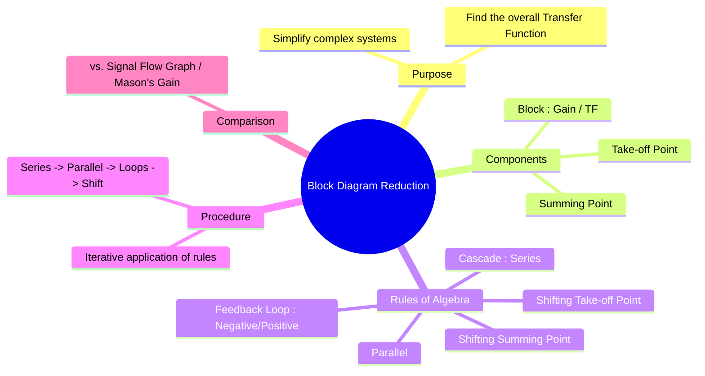

---
tags:
  - control-systems
  - block-diagram
  - transfer-function
  - system-representation
created: 2025-09-21
aliases:
  - Block Diagram Algebra
  - Block Diagram Simplification
subject:
  - "[[Control Systems]]"
parent:
  - "[[Control Systems]]"
modified: 2026-07-22T21:29:57
---
### Block Diagram Reduction
#block-diagram-reduction

> **Block Diagram Reduction**, also known as block diagram algebra, is ==a graphical technique for simplifying a complex system's block diagram into a single equivalent block==. The goal is to determine the overall [[Transfer Function and Impulse Response|transfer function]] of the system, which is the ratio of the [[The Laplace Transform|Laplace transform]] of the output to the Laplace transform of the input, assuming zero initial conditions.

---
#### Basic Components of a Block Diagram
#block-diagram/components

1. **Block**: Represents a component or subsystem. The transfer function of the component, $G(s)$, is written inside the block.
2. **Summing Point**: A circle used to represent the algebraic sum of two or more signals.
3. **Take-off (or Pickoff) Point**: A point from which a signal is taken and fed to another block or summing point.

---
#### Rules of Block Diagram Algebra
#block-diagram/rules

The reduction process involves applying a set of rules iteratively to simplify the diagram.

1. **Blocks in Cascade (Series)**: The gains of blocks connected in series are multiplied.
    $R(s) \rightarrow [G_1(s)] \rightarrow [G_2(s)] \rightarrow C(s)$ becomes $R(s) \rightarrow [G_1(s)G_2(s)] \rightarrow C(s)$

2. **Blocks in Parallel**: The gains of blocks connected in parallel are added or subtracted algebraically.
    $G_{eq}(s) = G_1(s) \pm G_2(s)$

3. **Eliminating a Feedback Loop**: This is the most important rule. For a standard negative feedback loop:
	![[Second-Order Standard Negative Block Diagram.png]]
    The equivalent transfer function is:
    $$\boxed{\quad \frac{C(s)}{R(s)} = \frac{G(s)}{1 + G(s)H(s)} \quad}$$
    For **positive feedback**, the denominator sign becomes negative: $\frac{G(s)}{1 - G(s)H(s)}$.

4. **Shifting a Summing Point**:
    * **Behind a Block**: To move a summing point from *after* a block to *before* it, add a block with gain $G(s)$ to the other signal path entering the summing point.
    * **Ahead of a Block**: To move a summing point from *before* a block to *after* it, add a block with gain $1/G(s)$ to the other signal path entering the summing point.

5. **Shifting a Take-off Point**:
    * **Behind a Block**: To move a take-off point from *after* a block to *before* it, add a block with gain $1/G(s)$ to the take-off path.
    * **Ahead of a Block**: To move a take-off point from *before* a block to *after* it, add a block with gain $G(s)$ to the take-off path.

---
#### General Procedure for Reduction
A systematic approach is key to avoiding errors.
1. Reduce blocks connected in **cascade (series)**.
2. Reduce blocks connected in **parallel**.
3. Reduce the innermost **feedback loops**.
4. If the diagram is still complex, try **shifting summing points or take-off points** to create new opportunities for series, parallel, or feedback loop reduction.
5. Repeat steps 1-4 until the diagram is reduced to a single block.

---
### Related Concepts
#related-concepts

> [[Control Systems]]

[[The Transfer Function H(s)|Transfer Function]] (The goal of the reduction process)
[[Signal Flow Graph (SFG)|Signal Flow Graphs]] (The alternative graphical representation)
[[Mason's Gain Formula]] (The method used for SFG reduction, often faster for complex systems)
[[Open-Loop and Closed-Loop (Feedback) Control Systems|Feedback Control Systems]]
