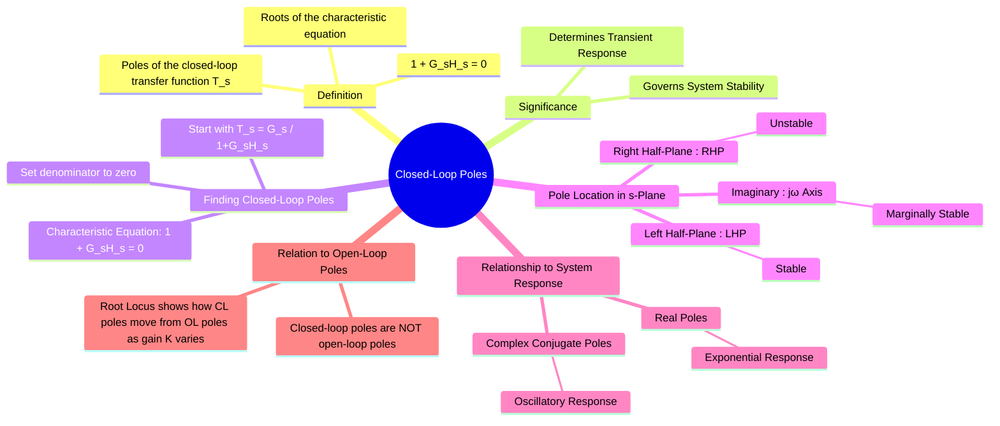

---
tags:
  - control-systems
  - stability
  - poles
  - transfer-function
  - root-locus
  - feedback-systems
created: 2025-09-08
aliases:
  - Closed Loop Poles
  - System Poles
subject:
  - "[[Control Systems]]"
parent:
  - "[[Transfer Function and Impulse Response]]"
modified: 2026-07-16
---
### Closed-Loop Poles
#closed-loop-poles #stability #characteristic-equation

> The closed-loop poles of a [[Open-Loop and Closed-Loop (Feedback) Control Systems|feedback control system]] are the roots of the system's [[characteristic equation]]. Their location in the complex $s$-plane is the single most important factor determining the system's stability and the nature of its transient response.

For a system to be stable, all of its closed-loop poles must lie in the **left half of the $s$-plane (LHP)**.

---
#### The Characteristic Equation
#characteristic-equation

Consider a standard negative feedback system with a forward path transfer function $G(s)$ and a feedback path transfer function $H(s)$.

![[Standard Negative Feedback Control System Model.png]]

The overall [[Closed-Loop Transfer Function (CLTF)|closed-loop transfer function]] $T(s)$ is:
$$\boxed{\quad T(s) = \frac{Y(s)}{R(s)} = \frac{G(s)}{1 + G(s)H(s)} \quad}$$
The poles of a transfer function are the values of $s$ that make the denominator equal to zero. Therefore, the closed-loop poles are the solutions to the equation:
$$\boxed{\quad 1 + G(s)H(s) = 0 \quad}$$
This is known as the **characteristic equation** of the system.

If $G(s) = \frac{N_G(s)}{D_G(s)}$ and $H(s) = \frac{N_H(s)}{D_H(s)}$, the characteristic equation can be rewritten as:
$$1 + \frac{N_G(s)N_H(s)}{D_G(s)D_H(s)} = 0$$
$$\implies \boxed{\quad D_G(s)D_H(s) + N_G(s)N_H(s) = 0 \quad}$$
The roots of this resulting polynomial are the closed-loop poles.

---
#### Significance of Pole Location in the s-Plane
#s-plane #system-response

The location of the closed-loop poles dictates the time-domain behavior of the system's transient response.

1. **Stability**:
    * **Left Half-Plane (LHP)**: Poles with a negative real part ($\text{Re}(s) < 0$) correspond to decaying time-domain terms. **The system is stable.**
    * **Right Half-Plane (RHP)**: Poles with a positive real part ($\text{Re}(s) > 0$) correspond to growing time-domain terms. **The system is unstable.**
    * **Imaginary Axis ($j\omega$)**: Poles with a zero real part ($\text{Re}(s) = 0$) correspond to sustained oscillations or terms that neither decay nor grow. **The system is marginally stable.** (Repeated poles on the $j\omega$ axis lead to instability).

2. **Nature of Transient Response**:
    * **Poles on the real axis** ($s = -\sigma$): Result in an exponential response of the form $e^{-\sigma t}$. The further left the pole, the faster the decay.
    * **Complex conjugate poles** ($s = -\sigma \pm j\omega_d$): Result in a damped sinusoidal (oscillatory) response.
        $$\boxed{\quad \text{Response term} \propto e^{-\sigma t} \sin(\omega_d t + \phi) \quad}$$
        * $-\sigma$ is the **damping factor**, determining the rate of decay of the oscillations.
        * $\omega_d$ is the **damped natural frequency** of the oscillations.

---
#### Closed-Loop Poles vs. Open-Loop Poles
#open-loop-poles #root-locus

It is crucial to distinguish between open-loop and closed-loop poles.
* **Open-Loop Poles**: The poles of the [[Open-Loop Transfer Function (OLTF)|open-loop transfer function]], $G(s)H(s)$. They are the roots of the denominator of $G(s)H(s)$, i.e., $D_G(s)D_H(s)=0$. They describe the characteristics of the forward and feedback paths *before* the loop is closed.
* **Closed-Loop Poles**: The poles of the overall system transfer function $T(s)$. They are the roots of the characteristic equation $1 + G(s)H(s) = 0$. They describe the behavior of the *entire system with feedback*.

The [[Concept and Definition of Root Locus|Root Locus]] method is a powerful graphical tool that shows how the closed-loop poles of a system move in the s-plane as a system parameter (typically gain, $K$) is varied from 0 to $\infty$. The locus starts at the open-loop poles (for $K=0$) and terminates at the open-loop zeros (for $K=\infty$).

---
### Related Concepts
#related-concepts

> [[Relationship between Pole Location and System Stability]] (The primary property determined by closed-loop poles)

[[Transfer Function and Impulse Response]]
[[Concept and Definition of Root Locus|Root Locus]] (A method to plot the location of closed-loop poles)
[[Routh-Hurwitz Stability Criterion]] (An analytical method to determine if any closed-loop poles are in the RHP without actually solving for them)
[[Transient Response Analysis]] (The system behavior described by the poles)
[[Zeros]] (The counterpart to poles)