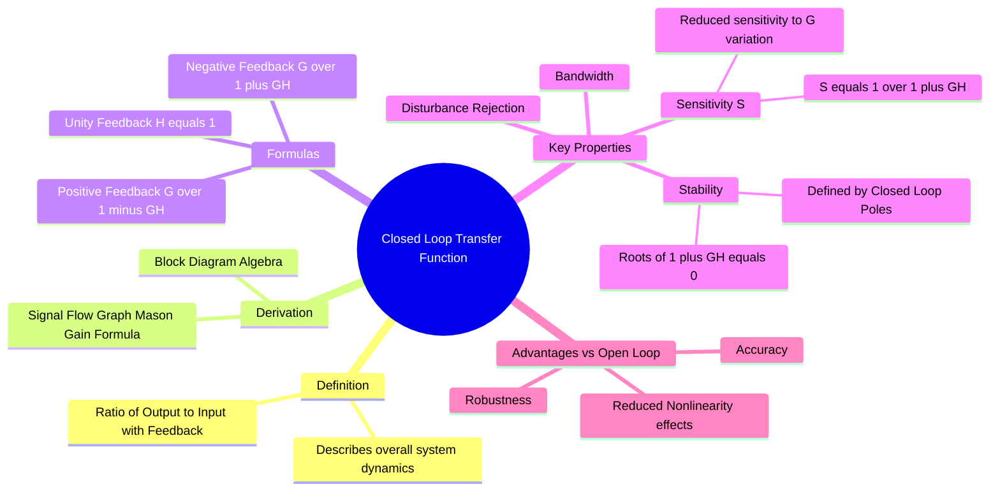

---
tags:
  - control-system
  - transfer-function
  - feedback
  - gate
created: 2026-07-23T07:40:03
aliases:
  - CLTF
  - Feedback Transfer Function
  - Overall Transfer Function
  - Closed-Loop Transfer Function
  - closed-loop transfer function
subject:
  - "[[Control Systems]]"
parent:
  - "[[Transfer Function and Impulse Response]]"
modified: 2026-07-15
---
### Closed-Loop Transfer Function (CLTF)
#control-system/transfer-function #feedback

> The Closed-Loop Transfer Function is the overall transfer function of a control system that relates the output signal to the input reference signal, accounting for the feedback loop. It dictates the transient response, [[steady-state error]], and stability of the practical control system.

---

#### Canonical Block Diagram and Formula
#cltf/derivation

Consider a standard feedback control system where:
* $R(s)$: Reference Input
* $C(s)$: Controlled Output
* $G(s)$: Forward Path Transfer Function
* $H(s)$: Feedback Path Transfer Function
* $E(s)$: Error Signal ($R(s) \mp B(s)$)
* $B(s)$: Feedback Signal ($C(s)H(s)$)

##### Derivation

1. $C(s) = G(s)E(s)$
2. $E(s) = R(s) \mp H(s)C(s)$ (Minus for negative feedback, Plus for positive feedback)
3. Substituting (2) into (1):
    $$C(s) = G(s) [R(s) \mp H(s)C(s)]$$
    $$C(s) [1 \pm G(s)H(s)] = G(s)R(s)$$

##### The Standard Formula
#cltf/standard-formulas #negative-feedback #positive-feedback #unity-feedback 

For a **Negative Feedback** System:

$$\boxed{\quad T(s) = \frac{C(s)}{R(s)} = \frac{G(s)}{1 + G(s)H(s)} \quad}$$
^negative-feedback-tf

For a **Positive Feedback** System:

$$\boxed{\quad T(s) = \frac{C(s)}{R(s)} = \frac{G(s)}{1 - G(s)H(s)} \quad}$$
^positive-feedback-tf

For a **Unity Feedback** System: $(H(s) = 1)$

$$\boxed{\quad T(s) = \frac{G(s)}{1 + G(s)}\quad}$$
^unity-feedback-tf

---
#### Sensitivity Analysis
#control-system/sensitivity

One of the primary reasons for using closed-loop control is to reduce the system's sensitivity to parameter variations in the forward path ($G(s)$).

**Sensitivity of $T$ with respect to $G$ ($S^T_G$):**
$$S^T_G = \frac{\partial T/T}{\partial G/G} = \frac{\partial T}{\partial G} \cdot \frac{G}{T}$$
Differentiating the CLTF expression:
$$\boxed{\quad S^T_G = \frac{1}{1 + G(s)H(s)} \quad}$$
* Since $|1 + G(s)H(s)|$ is usually designed to be large, the sensitivity is very small ($S \ll 1$). This means variations in plant parameters ($G$) have little effect on the overall output ($T$).

**Sensitivity of $T$ with respect to Feedback $H$ ($S^T_H$):**
$$\boxed{\quad S^T_H = \frac{-G(s)H(s)}{1 + G(s)H(s)} \approx -1 \quad}$$
* The system is highly sensitive to variations in the feedback sensor ($H$). Therefore, feedback sensors must be highly precise and stable.

---
#### Effect on Disturbances and Noise
#cltf/disturbance

Closed-loop systems are superior at rejecting external disturbances.
If a disturbance $D(s)$ enters the forward path between controller $G_1$ and plant $G_2$:
* Output due to Reference $R$: $C_R = \frac{G_1 G_2}{1 + G_1 G_2 H} R$
* Output due to Disturbance $D$: $C_D = \frac{G_2}{1 + G_1 G_2 H} D$

The **Signal-to-Noise Ratio** (output contribution of $R$ vs $D$) is improved by the factor of the loop gain.

---
#### Bandwidth and Speed of Response
#cltf/bandwidth

There is a trade-off between gain and bandwidth.
* Feedback generally **decreases the overall gain** of the system by a factor of $(1+GH)$.
* Feedback **increases the bandwidth** of the system by the same factor $(1+GH)$.
* Since Bandwidth $\propto$ Speed, a closed-loop system typically has a **faster response** than an open-loop system with the same plant.

---
#### Stability (Closed-Loop Poles)
#stability/closed-loop

The stability of the CLTF is determined by the roots of its denominator, known as the **Characteristic Equation**:
$$\boxed{\quad 1 + G(s)H(s) = 0 \quad}$$
* The roots of this equation are the **Closed-Loop Poles**.
* For the system to be stable, all closed-loop poles must lie in the left half of the s-plane.
* Note: An unstable open-loop system ($G(s)$ has RHP poles) can often be stabilized by an appropriate feedback loop ($T(s)$ has only LHP poles).

---
### Related Concepts
#topic/related-concepts

> [[Open-Loop Transfer Function (OLTF)|Open-Loop Transfer Function (OLTF)]]

[[Transfer Function and Impulse Response]]
[[Block Diagram Reduction Techniques]]
[[Signal Flow Graph (SFG)]] ([[Mason's Gain Formula]] provides a general way to find CLTF)
[[Sensitivity of Control Systems]]
[[characteristic equation]]
[[Proportional (P) Controller|P Controller]] , [[Proportional-Integral (PI) Controller|PI Controller]] , [[Proportional-Derivative (PD) Controller|PD Controller]] & [[Proportional-Integral-Derivative (PID) Controller|PID Controller]]
[[Time Response Analysis]]
[[Type and Order of Control Systems]]
