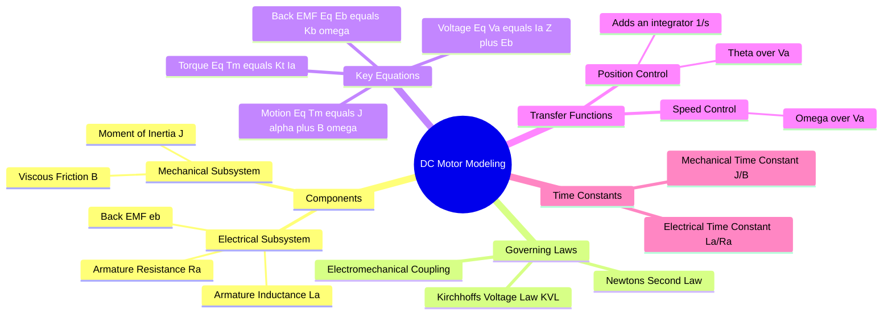

---
tags:
  - control-system
  - electrical-machines
  - mathematical-modeling
  - gate
created: 2025-07-16
aliases:
  - Armature Controlled DC Motor
  - DC Motor Transfer Function
  - Transfer Function Derivation
subject: "[[Control Systems]]"
parent:
  - "[[Mathematical Modeling of Physical Systems (Mechanical, Electrical)]]"
modified: 2026-07-16
---
### DC Motor Modeling (Armature Controlled)
#control-system/modeling #dc-motor

> A DC Motor is a common electromechanical actuator used in [[Control Systems]]. ==Modeling involves deriving the mathematical relationship between the input voltage (Armature Voltage) and the output mechanical variable (Speed or Position).== We typically analyze the **Armature Controlled DC Motor** where the field current is kept constant.

---
#### System Equations (Time Domain)
#modeling/differential-equations

The system is divided into the electrical armature circuit and the mechanical rotor load.
##### A. Electrical Circuit (Armature)
Applying KVL to the armature loop:
$$e_a(t) = R_a i_a(t) + L_a \frac{di_a(t)}{dt} + e_b(t)$$
Where:
*   $e_a(t)$ = Applied armature voltage (Input).
*   $i_a(t)$ = Armature current.
*   $e_b(t)$ = Back EMF.
*   $R_a, L_a$ = Armature resistance and inductance.

---
##### B. Mechanical System (Rotor)

Applying Newton's Law for rotation:
$$T_m(t) = J \frac{d^2\theta(t)}{dt^2} + B \frac{d\theta(t)}{dt} + T_L(t)$$
Where:
*   $T_m(t)$ = Motor torque.
*   $T_L(t)$ = Load torque (usually assumed 0 for Transfer Function derivation).
*   $\theta(t)$ = Angular displacement.
*   $J$ = Moment of inertia.
*   $B$ = Viscous friction coefficient.

---
##### C. Electromechanical Coupling

The link between electrical and mechanical domains:
1.  **Back EMF** is proportional to angular velocity $\omega(t) = \frac{d\theta}{dt}$:
    $$e_b(t) = K_b \frac{d\theta(t)}{dt} = K_b \omega(t)$$
2.  **Motor Torque** is proportional to armature current:
    $$T_m(t) = K_t i_a(t)$$
    *(Note: In SI units, $K_t = K_b$ numerically)*.

---
#### Laplace Domain Representation
#modeling/laplace

Taking the Laplace transform of the governing equations (assuming zero initial conditions):

1.  $V_a(s) - E_b(s) = (R_a + sL_a)I_a(s)$
2.  $T_m(s) = (Js + B)\Omega(s)$ (Assuming $T_L=0$)
3.  $E_b(s) = K_b \Omega(s)$
4.  $T_m(s) = K_t I_a(s)$

---
#### Block Diagram
#control-system/block-diagram

From the Laplace equations, we can construct the block diagram. The DC motor inherently contains a **negative feedback loop** due to the Back EMF.

*   Forward path: Voltage $\to$ Current $\to$ Torque $\to$ Speed.
*   Feedback path: Speed $\to$ Back EMF $\to$ Subtracts from Input Voltage.

---
#### Transfer Function Derivation
#transfer-function/derivation

We aim to find the Transfer Function $G(s) = \frac{\Omega(s)}{V_a(s)}$ (Speed/Voltage).

From the electrical equation:
$$I_a(s) = \frac{V_a(s) - K_b \Omega(s)}{R_a + sL_a}$$
Substitute $I_a(s)$ into the mechanical equation ($T_m = K_t I_a$):
$$\begin{align}
(Js + B)\Omega(s) &= K_t \left[ \frac{V_a(s) - K_b \Omega(s)}{R_a + sL_a} \right] \\
(Js + B)(R_a + sL_a)\Omega(s) &= K_t V_a(s) - K_t K_b \Omega(s) \\
\left[ (Js + B)(R_a + sL_a) + K_t K_b \right] \Omega(s) &= K_t V_a(s)
\end{align}$$

**Speed Transfer Function:**
$$\boxed{\quad \frac{\Omega(s)}{V_a(s)} = \frac{K_t}{(R_a + sL_a)(Js + B) + K_t K_b} \quad}$$

**Position Transfer Function:**
Since $\Omega(s) = s\Theta(s)$, we divide by $s$:
$$\boxed{\quad \frac{\Theta(s)}{V_a(s)} = \frac{K_t}{s \left[ (R_a + sL_a)(Js + B) + K_t K_b \right]} \quad}$$

---
#### Time Constants and Simplification
#modeling/simplification

The denominator represents a second-order system.
*   **Electrical Time Constant:** $\tau_e = \frac{L_a}{R_a}$
*   **Mechanical Time Constant:** $\tau_m = \frac{J}{B}$

**Approximation:**
Usually, the electrical time constant is much smaller than the mechanical time constant ($\tau_e \ll \tau_m$). If we neglect $L_a$ (set $L_a \approx 0$):
$$\frac{\Omega(s)}{V_a(s)} \approx \frac{K_t}{R_a(Js + B) + K_t K_b} = \frac{K_t/R_a}{Js + (B + \frac{K_t K_b}{R_a})}$$
This simplifies the motor to a **first-order system** regarding speed. The term $\frac{K_t K_b}{R_a}$ acts as "electrical damping".

---
### Related Concepts
#topic/related-concepts

> [[The Transfer Function H(s)]]

[[The Laplace Transform|Laplace Transforms]]
[[Block Diagram Reduction Techniques]]
[[Signal Flow Graph (SFG)]]
[[State-Space Representation of LTI Systems|State-Space Analysis]]
[[Transient Analysis|Transient Response Analysis]]