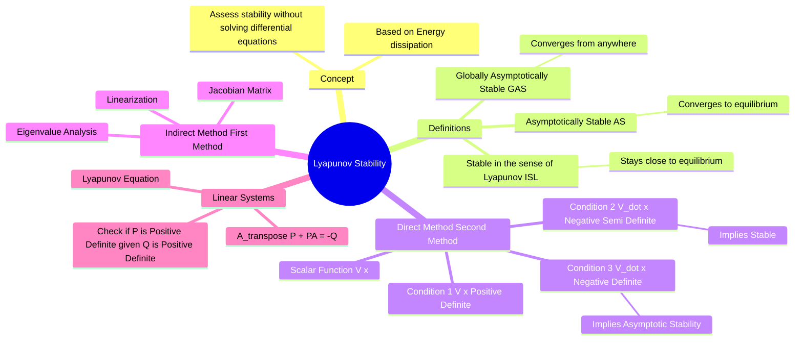

---
tags:
  - control-system
  - stability
  - non-linear-control
  - mathematics
  - gate
created: 2026-08-04T09:57:00
aliases:
  - Lyapunov's Second Method
  - Direct Method of Lyapunov
  - Energy Function Method
  - Lyapunov Equation
subject: "[[Control Systems]]"
parent:
  - Stability Analysis
modified: 2026-08-04T09:57:00
---
### Lyapunov Stability
#control-system/stability #non-linear-control

> **Lyapunov Stability Theory** provides tools to analyze the stability of dynamical systems (both linear and non-linear) without explicitly solving the differential equations. The core idea is based on energy: if a system has a continuously dissipating "energy-like" function, it will eventually settle down to an equilibrium point.

---
#### Definitions of Stability
#stability/definitions

Consider an autonomous system $\dot{x} = f(x)$ with an equilibrium point at the origin ($x_e = 0$).

1.  **Stable (in the sense of Lyapunov):** If we start "close" to the origin, we stay "close" forever. The state is bounded.
2.  **Asymptotically Stable:** The system is Stable **AND** the state converges to the origin as $t \to \infty$.
3.  **Globally Asymptotically Stable (GAS):** The system is Asymptotically Stable for **any** initial condition, no matter how far from the origin.

---
#### Lyapunov's Direct Method (Second Method)
#lyapunov/direct-method

This method involves constructing a scalar "energy-like" function $V(x)$ called a **Lyapunov Function**.

**Conditions:**
Let $V(x): \mathbb{R}^n \to \mathbb{R}$ be a continuously differentiable function such that:
1.  $V(0) = 0$.
2.  $V(x) > 0$ for all $x \neq 0$ (**Positive Definite**).
3.  **Radial Unboundedness:** $V(x) \to \infty$ as $\|x\| \to \infty$ (Required for Global stability).

**Stability Theorems based on $\dot{V}(x)$:**
The time derivative of $V$ along the system trajectories is:
$$\dot{V}(x) = \frac{\partial V}{\partial x} \cdot \dot{x} = (\nabla V)^T f(x)$$

*   **Theorem 1 (Stability):**
    If $\dot{V}(x) \le 0$ (**Negative Semi-Definite**), the origin is **Stable**.
    *(Energy is not increasing).*
*   **Theorem 2 (Asymptotic Stability):**
    If $\dot{V}(x) < 0$ for all $x \neq 0$ (**Negative Definite**), the origin is **Asymptotically Stable**.
    *(Energy is strictly dissipating).*
*   **Theorem 3 (Instability):**
    If $\dot{V}(x) > 0$ (**Positive Definite**), the origin is **Unstable**.

> **Note:** Finding a $V(x)$ is often trial and error. A common choice is the quadratic form $V(x) = x^T P x$.

---
#### Lyapunov's Indirect Method (Linearization)
#lyapunov/indirect-method

For a non-linear system $\dot{x} = f(x)$, we can analyze the **local stability** by linearizing it around the equilibrium point.
1.  Calculate the **Jacobian Matrix** $A = \frac{\partial f}{\partial x}\big|_{x=0}$.
2.  Check eigenvalues of $A$:
    *   All $Re(\lambda) < 0 \implies$ **Asymptotically Stable**.
    *   At least one $Re(\lambda) > 0 \implies$ **Unstable**.
    *   Some $Re(\lambda) = 0$ (imaginary axis) $\implies$ **Inconclusive** (Linearization fails; must use Direct Method).

---
#### Stability of Linear Systems (The Lyapunov Equation)
#lyapunov/linear-systems

For a linear system $\dot{x} = Ax$, we can use the Direct Method systematically.
Proposed Lyapunov Function: $V(x) = x^T P x$, where $P$ is a symmetric positive definite matrix.
Then $\dot{V}(x) = x^T (A^T P + PA) x$.

To ensure $\dot{V}(x)$ is negative definite, we equate the term in parentheses to a negative definite matrix $-Q$.

**Theorem:**
The matrix $A$ is stable (all eigenvalues in LHP) **if and only if** for any given Symmetric Positive Definite Matrix $Q$, there exists a unique Symmetric Positive Definite Matrix $P$ satisfying the **Lyapunov Equation**:

$$\boxed{\quad A^T P + P A = -Q \quad}$$

**Procedure:**
1.  Choose $Q = I$ (Identity matrix, which is Positive Definite).
2.  Solve $A^T P + P A = -I$ for matrix $P$.
3.  Check if $P$ is **Positive Definite** (using Sylvester's Criterion/Principal Minors).
    *   If $P > 0$, the system is Stable.
    *   If $P$ is not PD, the system is Unstable.

---
### Related Concepts
#topic/related-concepts

> [[Quadratic Forms]] (Essential for understanding Positive Definite matrices)

[[Stability Analysis]]
[[Eigenvalues and Eigenvectors|Eigenvalues and Eigenvectors]]
[[Hessian Matrix]] (Used for definiteness checks)
[[State Space Analysis]]
[[Routh-Hurwitz Stability Criterion]] (Alternative for Linear Systems)
